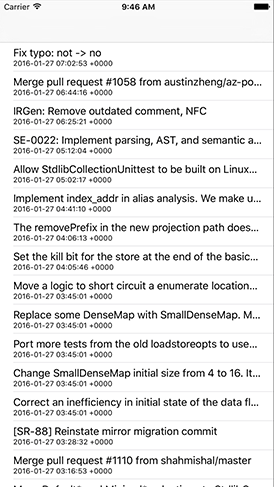

# Loading Core Data objects using NSFetchRequest and NSSortDescriptor

This is where Core Data starts to become interesting and perhaps – gasp! – even fun. Yes, I know it's taken quite a lot of work to get this far, but I *did* warn you, remember?

Step four is where we finally get to put to use all three previous steps by showing data to users. After the huge amount of work you've put in, particularly in the previous step, I'm sure you'll be grateful to see everything pay off at last!

In our project, we know we're using `Commit` objects to represent individual GitHub commits, so we need to store those objects in an array property. Add this to the `ViewController` class now:

    var commits = [Commit]()

We now need to write the usual table view methods, `numberOfRowsInSection` and `cellForRowAt`. The former will just return the size of the `commits` array, and the latter will place each commit’s message and date into the cell’s `textLabel` and `detailTextLabel`. There are lots of ways to convert dates to and from strings – you already saw `ISO8601DateFormatter`, for example – but here we’re just going to use the simplest: every `Date` object has a `description` property that converts it to a human-readable string.

For a change, we’re also going to write a third method that reports how many sections are in the table view. This returns 1 by default, and our new method will also return 1, but this will become useful later on.

Add these three methods now:

    override func numberOfSections(in tableView: UITableView) -> Int {
        return 1
    }

    override func tableView(_ tableView: UITableView, numberOfRowsInSection section: Int) -> Int {
        return commits.count
    }

    override func tableView(_ tableView: UITableView, cellForRowAt indexPath: IndexPath) -> UITableViewCell {
        let cell = tableView.dequeueReusableCell(withIdentifier: "Commit", for: indexPath)

        let commit = commits[indexPath.row]
        cell.textLabel!.text = commit.message
        cell.detailTextLabel!.text = commit.date.description

        return cell
    }

With that change made, we need to write one new method in order to make our entire app spring into life. But before we jump into the code, you need to learn about one of the most important classes in Core Data: `NSFetchRequest`. This is the class that performs a query on your data, and returns a list of objects that match.

We're going to use `NSFetchRequest` in a really basic form for now, then add more functionality later. In this first version, we're going to ask it to give us an array of all `Commit` objects that we have created, sorted by date descending so that the newest commits come first.

The way fetch requests work is very simple: you create one from the `NSManagedObject` subclass you’re using for your entity, then pass it to managed object context’s `fetch()` method. If the fetch request worked then you'll get back an array of objects matching the query; if not, an exception will be thrown that you need to catch.

The sorting is done through a special data type called `NSSortDescriptor`, which is a trivial wrapper around the name of what you want to sort (in our case "date"), then a boolean setting whether the sort should be ascending (oldest first for dates) or descending (newest first). You pass an array of these, so you can say "sort by date descending, then by message ascending," for example.

OK, time for some code, and I hope you'll be pleasantly surprised by how easy it is:

    func loadSavedData() {
        let request = Commit.createFetchRequest()
        let sort = NSSortDescriptor(key: "date", ascending: false)
        request.sortDescriptors = [sort]

        do {
            commits = try container.viewContext.fetch(request)
            print("Got \(commits.count) commits")
            tableView.reloadData()
        } catch {
            print("Fetch failed")
        }
    }

So, that creates the `NSFetchRequest`, gives it a sort descriptor to arrange the newest commits first, then uses the `fetch()` method to fetch the actual objects. That method returns an array of all `Commit` objects that exist in the data store. Once that's done, it's just a matter of calling `reloadData()` on the table to have the data appear.

To make the app work, we need to call this new `loadSavedData()` method in two places. First, add a call at the end of the `viewDidLoad()` method. Second, add a call in the `fetchCommits()` method, just after where we have `self.saveContext()`. You will, of course, need to use `self.loadSavedData()` in that instance.

Again, I've written a simple `print()` statement when errors occur, but in your own production apps you will need to show something useful to your user.

Good news: that completes all four basic bootstrapping steps for Core Data. We have defined our model, loaded the data store and managed object context, fetched some example data and saved it, and loaded the resulting objects. You should now be able to run your project and see it all working!

