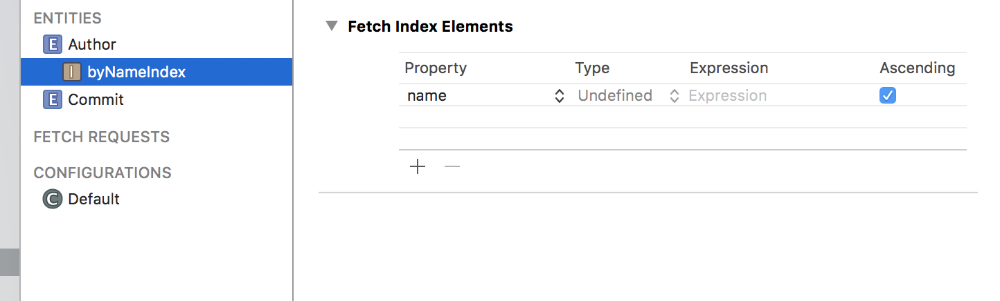
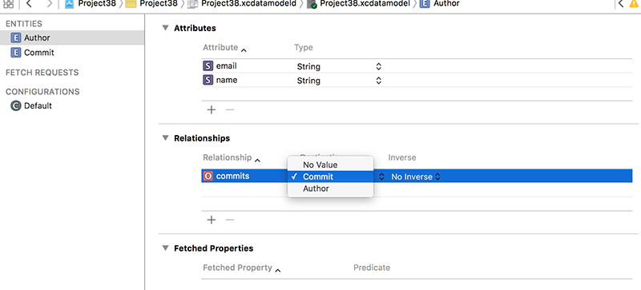
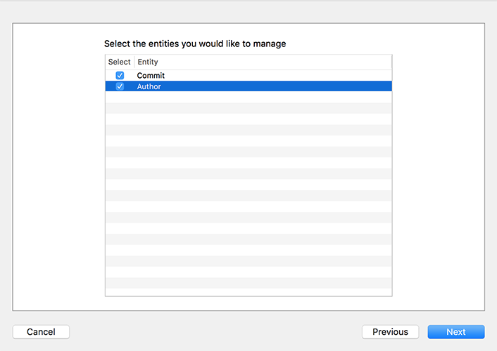

# Adding Core Data entity relationships: lightweight vs heavyweight migration

It's time to take your Core Data skills up a notch: we're going to add a second entity called Author, and link that entity to our existing Commit entity. This will allow us to attach an author to every commit, but also to find all commits that belong to a specific author.

Open the data model (Project38.xcdatamodeld) for editing, then click the Add Entity button. Name the entity Author, then give it two attributes: "name" and "email". Please make both strings, and make sure both are not marked as optional. This time we're also going to make one further change: we’re going to make “name” indexed.

To do that, long press on the Add Entity button and choose Add Fetch Index from the menu that appears. Name it “byNameIndex”, because this indexes our items by name. You’ll see a small + button under Fetch Index Elements in the main editor – click that to add a new index element, then change its property from “Expression” to “name”.

An indexed attribute is one that is optimized for fast searching. There is a cost to creating and maintaining each index, which means you need to choose carefully which attributes should be index. But when you find a particular fetch request is happening slowly, chances are it's because you need to index an attribute.

We want every Author to have a list of commits that belong to them, and every Commit to have the Author that created it. In Core Data, this is represented using relationships, which are a bit like calculated properties except Core Data adds extra functionality to handle the situation when part of a relationship gets deleted.

With the Author entity selected, click the + button under the Relationships section – it's just below the Attributes section. Name the new relationship "commits" and choose "commit" for its destination. In the Data Model inspector, change Type to be "To Many", which tells Core Data that each author has many Commits attached to it.

Now choose the Commit entity we created earlier and add a relationship named "author". Choose Author for the destination then change "No Inverse" to be "commits". In the Data Model inspector, change Type to be "To One", because each commit has exactly one author).

That's it for our model changes, so press Cmd+S to save then Cmd+R now to build and run the app. What you’ll see is… well, exactly what you saw before: the same list of commits. What changed?

You’ve already seen how `NSPersistentContainer` does a huge amount of set up work on your behalf. Well, it’s also doing something remarkably clever here too because we just changed our data model. By default Core Data doesn't know how to handle that – it considers any variation in its data model an unwelcome surprise, so we need to tell Core Data how to handle the changed model or we need to tell it to figure out the differences itself.

These two options are called "heavyweight migrations" and "lightweight migrations." The latter is usually preferable, and is what we'll be doing here, but it's only possible when your changes are small enough that Core Data can perform the conversion correctly. We added a new "authors" relationship, so if we tell Core Data to perform a lightweight migration it will simply set that value to be empty.

The magic of `NSPersistentContainer` is that it automatically configures Core Data to perform a lightweight migration if it’s needed and if it’s possible – that is, if the changes are small enough to be figured out by the system. So, as long as your changes are strictly additive, `NSPersistentContainer` will take care of all the work. Awesome, right?

Of course, all this cleverness doesn't actually use our new Author entity. To do *that* we first need to do something rather tedious: we need to re-use the NSManagedObject generator, which, if you remember, also means having to re-add our custom changes such as removing optionality from its properties.

So, go back to the data model, and choose Editor > Create NSManagedObject Subclass again. This time I want you to choose both Author and Commit, but don't forget to change Group from the blue project icon to the yellow folder icon – Xcode does love to keep resetting that particular option.

Once the files are generated you'll now have four files: two each for Author and Commit. We need to make a few changes to clean them up for use, starting with Commit+CoreDataProperties.swift:

1. Remove optionality from all five properties.
2. Change `NSDate` to `Date`.
3. Change `fetchRequest()` to `createFetchRequest()`.

Now in Author+CoreDataProperties.swift:

1. Remove optionality from all three properties.
2. Change `fetchRequest()` to `createFetchRequest()`.

Notice that Author+CoreDataProperties.swift includes some extra methods for adding and removing commits.

In order to attach authors to commits, I want to show you how to look for a specific named author, or create it if they don't exist already. Remember, we made the "name" attribute indexed, which makes it lightning fast for search. This needs to set up and execute a new `NSFetchRequest` (using an == `NSPredicate` to match the name), then use the result if there is one. If no matching author is found we'll create and configure a new author, and use that instead.

Put this new code just before the end of the `configure(commit:)` method:

    var commitAuthor: Author!

    // see if this author exists already
    let authorRequest = Author.createFetchRequest()
    authorRequest.predicate = NSPredicate(format: "name == %@", json["commit"]["committer"]["name"].stringValue)

    if let authors = try? container.viewContext.fetch(authorRequest) {
        if authors.count > 0 {
            // we have this author already
            commitAuthor = authors[0]
        }
    }

    if commitAuthor == nil {
        // we didn't find a saved author - create a new one!
        let author = Author(context: container.viewContext)
        author.name = json["commit"]["committer"]["name"].stringValue
        author.email = json["commit"]["committer"]["email"].stringValue
        commitAuthor = author
    }

    // use the author, either saved or new
    commit.author = commitAuthor

You'll note that I used `try?` for `fetch()` this time, because we don't really care if the request failed: it will still fall through and get caught by the `if commitAuthor == nil` check later on.

To show that this worked, change your `cellForRowAt` method so that the detail text label contains the author name as well as the commit date, like this:

    cell.detailTextLabel!.text = "By \(commit.author.name) on \(commit.date.description)"

You should be able to run the app now and see the author name appear after a moment, as Core Data merges the new data with the old.

Broadly speaking you don’t want to make these kinds of model changes while you’re still learning Core Data, so once you’ve verified that it works I would suggest you use “Erase All Content and Settings" again in the simulator to make sure you have a clean foundation again.

We can also show that the inverse relationship works, so it’s time to make the detail view controller do something. Open DetailViewController.swift and give it this property:

    var detailItem: Commit?

Now change its `viewDidLoad()` method to this:

    override func viewDidLoad() {
        super.viewDidLoad()

        if let detail = self.detailItem {
            detailLabel.text = detail.message
            // navigationItem.rightBarButtonItem = UIBarButtonItem(title: "Commit 1/\(detail.author.commits.count)", style: .plain, target: self, action: #selector(showAuthorCommits))
        }
    }

I commented out one of the lines that will make a tappable button in the top-right corner showing how many other commits we have stored from this author. We haven't written a `showAuthorCommits()` method yet, but don't worry: that will be your homework later on!

Now that every commit has an author attached to it, I want to add one last filter to our `changeFilter()` method to show you just how clever `NSPredicate` is. Add this just before the "Show all commits" action:

    ac.addAction(UIAlertAction(title: "Show only Durian commits", style: .default) { [unowned self] _ in
        self.commitPredicate = NSPredicate(format: "author.name == 'Joe Groff'")
        self.loadSavedData()
    })

There are three things that bear explaining in that code:

- By using `author.name` the predicate will perform two steps: it will find the "author" relation for our commit, then look up the "name" attribute of the matching object.
- Joe is one of Apple's Swift engineers. Although it's fairly likely you'll see commits by him, it can't be guaranteed – I'm pretty sure that Apple give him a couple of days vacation each year. Maybe.
- Durian is a fruit that's very popular in south-east Asia, particularly Malaysia, Singapore and Thailand. Although most locals are big fans, the majority of foreigners find that it really, really stinks, so I'm sure there's some psychological reason why Joe Groff chose it for his website: [duriansoftware.com](http://duriansoftware.com/).

Run your app now and the new filter should work. Remember, it might not return any objects, depending on just how many commits Joe has done recently. No pressure, Joe! In those changes, I also modified the detail view controller so that it shows the commit message in full, or at least as full as it can given the limited space.

To test out that change, we need to write the `didSelectRowAt` method so that it loads a detail view controller from the storyboard, assigns it the selected commit, then pushes it onto the navigation stack. Add this method to `ViewController`:

    override func tableView(_ tableView: UITableView, didSelectRowAt indexPath: IndexPath) {
        if let vc = storyboard?.instantiateViewController(withIdentifier: "Detail") as? DetailViewController {
            vc.detailItem = commits[indexPath.row]
            navigationController?.pushViewController(vc, animated: true)
        }
    }

You should be able to run the app now and see it start to come together!
