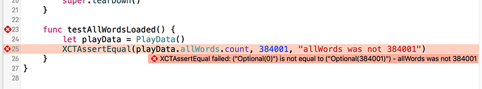
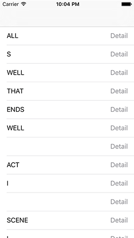
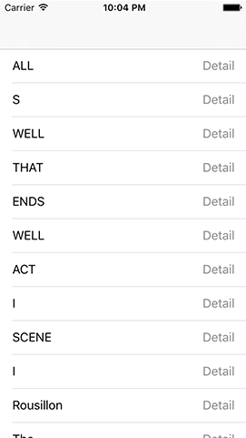

# Loading our data and splitting up words: filter()

The next step in our project is to get our app working a little bit, which means writing a method that loads the input text and splits it up into words. Sticking with TDD for now, this means we first need to write a test that fails before updating our code to fix it.

Right now we're checking `allWords` contains 0 items, which needs to change: there are in fact 384,001 words in the input text (based on the character splitting criteria we'll get to shortly), so please update your `testAllWordsLoaded()` method to this:

    XCTAssertEqual(playData.allWords.count, 384001, "allWords was not 384001")

This number, 384,001, is of course entirely arbitrary because it depends on the input data. But that's not the point: we need to tell XCTest what "correct" looks like, because it has no way of knowing what constitutes a pass or a fail unless we give it specific criteria.

If you click the green checkmark next to the test now, it will be run again and will fail this time because we haven't written the loading code – XCTest expects `allWords` to contain 384,001 strings, but it contains 0. This is good, honest!

Let's put testing to one side for now and fill in some of our program – we'll be back with the testing soon enough, don't worry.

Add this to PlayData.swift:

    init() {
        if let path = Bundle.main.path(forResource: "plays", ofType: "txt") {
            if let plays = try? String(contentsOfFile: path) {
                allWords = plays.components(separatedBy: CharacterSet.alphanumerics.inverted)
            }
        }
    }

The only new line there is the one that sets `allWords`, which uses two new things at once. Previously we used `components(separatedBy:)` to convert a string into an array, but this time the method is different because we pass in a character set rather than  string. This new method splits a string by any number of characters rather than a single string, which is important because we want to split on periods, question marks, exclamation marks, quote marks and more.

There are a number of ways of specifying character sets, including a helpful `CharacterSet(charactersIn:)` initializer that we could have used to specify the full list of characters we want to break on. But the simplest approach is to split on anything that isn't a letter or number, which can be achieved by inverting the alphanumeric character set as seen in the code.

That's all it takes to load enough data for us to move on with, but we can't tell that it works unless we also update the user interface to show our data. So, open ViewController.swift and add this property:

    var playData = PlayData()

That gives the `ViewController` class its own `PlayData` object to work with. That one line also creates the object immediately, which in turn will call the `init()` method we just wrote to load the word data – not bad for a single line of code!

All that's left in this step is to add the basic table view code to show some cells. Please add these two methods to `ViewController`:

    override func tableView(_ tableView: UITableView, numberOfRowsInSection section: Int) -> Int {
        return playData.allWords.count
    }

    override func tableView(_ tableView: UITableView, cellForRowAt indexPath: IndexPath) -> UITableViewCell {
        let cell = tableView.dequeueReusableCell(withIdentifier: "Cell", for: indexPath)

        let word = playData.allWords[indexPath.row]
        cell.textLabel!.text = word
        return cell
    }

There is nothing new there, so I hope it posed no challenge for you.

Press Cmd+R to run the app and you'll see a long table full of words – it works! It's a long way from perfect, though: it's breaking on apostrophes (so ALL and S are on different lines), there are blank lines, there are duplicate words (the I after ACT and SCENE is repeated), and the detail text label just says "Detail" again and again.

We're going to fix all those except the first one, which is a text issue rather than a coding issue. In fact, we need to fix the second one straight away because my calculation of 384,001 words excludes empty strings – we need to modify our `init()` method so that empty strings are removed if we want our test to pass.

As promised, I'm going to use this project to teach you a little bit of functional programming, in particular the `filter()` method. This creates a new array from an existing one, selecting from it only items that match a function you provide. Stick with me for a moment, because this is important: a function that accepts a function as a parameter, like `filter()`, is called a *higher-order function*, and allows you to write extremely concise, expressive code that is efficient to run.

Let's take a look at `filter()` now. Please add this to `init()`, just after the call to `components(separatedBy:)`:

    allWords = allWords.filter { $0 != "" }

That one line is all it takes to remove empty lines from the `allWords` array. However, this syntax can look like line noise if you're new to Swift, so I want to deconstruct what it does by first rewriting that code in a way you're more familiar with. I don't want you to put any of this into your code – this is just to help you understand what's going on.

Here is that one line written out more verbosely:

    allWords = allWords.filter({ (testString: String) -> Bool in
        if testString != "" {
            return true
        } else {
            return false
        }
    })

In that form, you can see that `filter()` is a method that takes a single parameter, which is a closure. That closure must accept a string, named `testString`, and return a `Bool`. The code then checks whether `testString` is empty or not, and returns either true or false.

Swift lives up to its name not only in that Swift code executes quickly, but it's also quick to write. So, there are a few shortcuts it offers to help reduce that long code down in size. For example, all that `(testString: String) -> Bool` definition isn't really needed: Swift can see that `filter()` wants a closure that accepts a string and returns true or false, so we don't need to repeat ourselves. So, let's take it out:

    allWords = allWords.filter({ testString in
        if testString != "" {
            return true
        } else {
            return false
        }
    })

Next, we can collapse that `if/else` block into one line of code: `return testString != ""`.

When Swift runs `testString != ""` it will either find that statement to be true (yes, `testString` is not empty) or false (no, `testString` is empty), and pass that straight to `return`. So, this will return true if `testString` has any text, which is exactly what we want.

With that change, here's the code now:

    allWords = allWords.filter({ testString in
        return testString != ""
    })

Moving on, we can take advantage of Swift's trailing closure syntax, because `filter()`'s only parameter is a closure. If you remember, that means the parentheses aren't needed. So, the code can become this:

    allWords = allWords.filter { testString in
        return testString != ""
    }

Next, if your closure has only one expression – which ours does – and the closure must return a value, Swift lets you omit the `return` keyword entirely. This is because it knows the closure must return a value, and it can see you're only providing one line of code, so that must be the one that returns something. So, you can write this:

    allWords = allWords.filter { testString in
        testString != ""
    }

And now for the bit that usually confuses people: shorthand parameter names. When you use a closure like this, Swift automatically creates anonymous parameter names that start with a dollar sign then have a number: `$0`, `$1`, `$2`, `$3` and so on. This unique naming really helps them stand out, so if you see them in code you immediately know they are shorthand parameter names – you literally cannot use names like this yourself, so they only have one meaning.

Swift gives you one of these shorthand parameters for every parameter that your closure accepts. In this case, our filter closure accepts exactly one parameter, which is `testString`. If we want to use Swift's shorthand parameter names instead, we don't need `testString` any more because `testString` and `$0`, so that whole `testString in` part can go away:

    allWords = allWords.filter {
        $0 != ""
    }

Now all that's left is to put that on a single line, and we're done:

    allWords = allWords.filter { $0 != "" }

Now, even though I've explained the thinning process that goes from long code to tiny code, you might still look at that one line and find it confusing. That's OK: you should write code however you want to write code. But in this instance, I hope you'll agree that having one simple, clutter-free line of code is easier to read, understand, and maintain than five or six lines.

Now that empty lines are being stripped out, you should be able to return back to `testAllWordsLoaded()` and have it pass.

