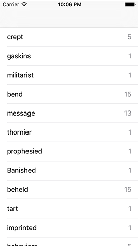

# Counting unique strings in an array

Running the `allWords` array through `filter()` solved the problem of empty lines in the array, but there are still two more problems we need to address: duplicate words, and that pesky "Detail" text in the detail text label.

Well, we're going to fix two of them right now, at the same time. And, for the first time in this series, I'm going to have you write some bad code. Trust me: this will all become clear shortly, and it will be corrected.

Our app is going to show the number of times each word is used inside Shakespeare's comedies. To do that, we need to calculate how often each word appears, so we're going to add a new property to `PlayData` to store that calculation. Please add this now:

    var wordCounts = [String: Int]()

That dictionary will hold a string as its key (e.g. "yonder") and a number as its value (e.g. 14), so that we can check the frequency of any word whenever we need to.

Our `init()` method already splits all the text up into words, but we need to add some new code to add the counting. This is fairly straightforward to write: loop through every word in the `allWords` array, add one to its `wordCounts` count if we have it, or set its count to 1 if we don't have it.

Modify the `init()` method in PlayData.swift so that this code appears after the call to `filter()`:

    for word in allWords {
        wordCounts[word, default: 0] += 1
    }

That uses an important dictionary subscript method that provides the default value of 0 if the key doesn’t exist. When reading keys it’s common to use nil coalescing instead – e.g. `let count = wordCount[word] ?? 0` – but when *modifying* like we’re doing here having that default value is useful.

Once that loop completes, `wordCounts` will contain every word that is used in the plays, as well as its frequency. Because we're using words as the dictionary keys, each word can appear only once in the dictionary. This means we can instantly remove duplicates from `wordCounts` by creating a new array from its keys.

Add this code just after the previous loop:

    allWords = Array(wordCounts.keys)

Our app has taken a leap towards its end goal, but we also just broke our test: now that we show each word only once, our `testAllWordsLoaded()` test will fail because there are substantially fewer strings in the `allWords`. So, please go to Project39Tests.swift and amend it one last time:

    XCTAssertEqual(playData.allWords.count, 18440, "allWords was not 18440")

That's the first of two problems down: every word now appears only once in the table, and you can run the app now to verify that.

The last problem is to fix the detail text label so that it says how many times a word is used rather than just "Detail". With our new `wordCounts` dictionary we can fix this in just one line of code in ViewController.swift – add this line to `cellForRowAt` just before the return line:

    cell.detailTextLabel!.text = "\(playData.wordCounts[word]!)"

If you run the app now you'll see every word now has its count next to it – that wasn't so hard, was it?

Before we're done, let's add another test to make sure our word counting code doesn't break in the future. Have a look through the table to find some words that interest you, and note down their frequencies. I chose "home" (174 times), "fun" (4 times), and "mortal" (41 times), but you're welcome to choose any words that interest you. Switch to Project39Tests.swift and add a new test:

    func testWordCountsAreCorrect() {
        let playData = PlayData()
        XCTAssertEqual(playData.wordCounts["home"], 174, "Home does not appear 174 times")
        XCTAssertEqual(playData.wordCounts["fun"], 4, "Fun does not appear 4 times")
        XCTAssertEqual(playData.wordCounts["mortal"], 41, "Mortal does not appear 41 times")
    }

That test should pass, which is great. But more importantly it provides a fail-safe for future work: in the next chapter we're going to rewrite our word counting code, and this test will ensure we don't break anything while we work.
