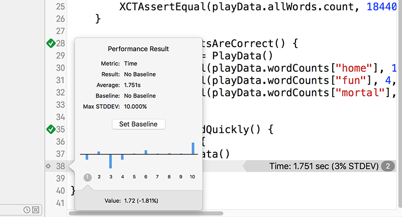
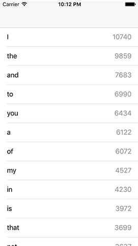

# measure(): How to optimize our slow code and adjust the baseline

You might have noticed there's a pre-written method called `setup()` in our unit tests, which contains this comment: "Put setup code here. This method is called before the invocation of each test method in the class." Why, then, do we have `let playData = PlayData()` in both our tests – couldn't that go into `setup()` to avoid repetition?

Well, no, and you're about to see why. You will probably have noticed that our new word frequency code has slowed down our app quite a bit. Even when running in the iOS Simulator, using the full power of your Mac, this code now takes about two seconds to run – try to imagine how much slower it would be on a real device!

Of course, this is all a clever ruse to teach you more things, and here I want to teach you how to use XCTest to check performance. Our new word counting code is slow, but the only reliable way to ensure it gets faster when we make changes is to create a new test that times how long it takes for our `PlayData` object to be created. This is why we can't create it inside the `setup()` method: we need to create it as part of a measurement in this next test, as you'll see.

XCTest makes performance testing extraordinarily easy: you give it a closure to run, and it will execute that code 10 times in a row. You'll then get a report back of how long the call took on average, what the standard deviation was (how much variance there was between runs), and even how fast each of those 10 runs performed if you want the details.

Let's write a performance test now – please add this to Project39Tests.swift:

    func testWordsLoadQuickly() {
        measure {
            _ = PlayData()
        }
    }

Were you expecting something more complicated? I told you it was easy and I meant it! That tiny amount of code is all it takes: assigning a new `PlayData` object to `_` will load the file, split it up by lines and count the unique words, so our test couldn't be any simpler.

Click the diamond in the gutter to run this performance test now, but be warned: it will take a little while because that closure is run 10 times. For me, each run took about 2 seconds, so the whole thing took about 20 seconds. If you have a slower computer, you might need to wait for a minute or two.

Once the test finishes you'll see a green arrow to show it succeeded, but that doesn't mean much right now because the test can't ever fail. But you'll also see something new: a gray line that tells you the results. On the right of the line it will say something like "Time: 2.060 sec (3% STDDEV)" so you can see the mean average time it took to run the code and also the standard deviation.

On the left of the line, in the gutter next to the line number, is a small gray diamond – clicking that will show you pop up information about all 10 runs. Also in that pop up is an important button that I want you to click now: Set Baseline. That marks your previous test run as the baseline against which future test runs should be compared to see whether performance has improved or worsened.

Now that you've set a baseline, run the test again and wait for it to complete. When it finishes, you should see another green checkmark and you might also see a slight natural variance in the performance results. But now the checkmark *means* something: it means your code executed within a reasonable variance of the baseline, which in Xcode's eyes means that the deviation from the baseline was under 10%. If your code becomes a great deal slower, Xcode will warn you because it means something major has changed.

I promised earlier that I was going to make you write some bad code, and that it was going to be fixed. I hope you can see why: even though our loading code is very simple, it takes an extremely long time to load and we need to make it faster. In doing so you'll also get to see how XCTest helps you identify major performance changes and adjust your baseline as needed.

As a reminder, here's the slow code:

    for word in allWords {
        wordCounts[word, default: 0] += 1
    }

    allWords = Array(wordCounts.keys)

You might wonder how we could optimize something so trivial, but it turns out we can take out most of the code while also making it run significantly faster. This is possible thanks to one of my favorite iOS classes: `NSCountedSet`. This is a set data type, which means that items can only be added once. But it's a *specialized* set object: it keeps track of how many times items you tried to add and remove each item, which means it can handle de-duplicating our words while storing how often they are used. Did I also mention it's fast?

To use `NSCountedSet` we need to make a few changes. First, change the wordCounts property of PlayData to this:

    var wordCounts: NSCountedSet!

Now remove all the slow code (the nine lines I showed you above) and put these two in their place:

    wordCounts = NSCountedSet(array: allWords)
    allWords = wordCounts.allObjects as! [String]

The first line creates a counted set from all the words, which immediately de-duplicates and counts them all. The second line updates the `allWords` array to be the words from the counted set, thus ensuring they are unique.

Two more changes. First, in the `cellForRowAt` method of ViewController.swift we need to use the `count(for:)` method to find out how often a word was used:

    cell.detailTextLabel!.text = "\(playData.wordCounts.count(for: word))"

Then we need to make the same change in the `testWordCountsAreCorrect()` method of Project39Tests.swift:

    func testWordCountsAreCorrect() {
        let playData = PlayData()
        XCTAssertEqual(playData.wordCounts.count(for: "home"), 174, "Home does not appear 174 times")
        XCTAssertEqual(playData.wordCounts.count(for: "fun"), 4, "Fun does not appear 4 times")
        XCTAssertEqual(playData.wordCounts.count(for: "mortal"), 41, "Mortal does not appear 41 times")
    }

That's it: click the green checkmark next to `testWordsLoadQuickly()` to re-run the performance test, and you'll see it now runs two or even three times faster. Xcode won't mark this test as a failure, though: Xcode only considers a test to be failed if it performs at least 10% *slower* than the baseline.

Our new code is significantly faster, and works just as well, so we're going to update our measurement baseline so it's used in the future. To do that, click the small gray diamond in the gutter at the end of `testWordsLoadQuickly()`, then click its Edit button. An Accept button will appear, which you should click to transfer the latest result to the baseline, then finally click Save.

If you were wondering, Xcode does two neat things with these benchmarks. First, they are checked into source control, which means they are shared with other team members. Second, they are stored against specific device configurations, which means Xcode won't warn you when your iPhone 5s performs slower than an iPhone 8.

Before we're done with this chapter, there's one more thing I want to do: sort the array so that the most frequent words appear at the top of the table. This can be done with the `sort()` method, which takes a closure describing how objects should be sorted. Swift will call this closure with a pair of words, and the closure should return true if the first word is sorted before the second. Using all the shorthand techniques you learned earlier, this means returning true if `$0` should be sorted before `$1`.

Replace these two lines:

    wordCounts = NSCountedSet(array: allWords)
    allWords = wordCounts.allObjects as! [String]

…with these:

    wordCounts = NSCountedSet(array: allWords)
    let sorted = wordCounts.allObjects.sorted { wordCounts.count(for: $0) > wordCounts.count(for: $1) }
    allWords = sorted as! [String]

Remember, that closure needs to accept two strings (`$0` and `$1`) and needs to return true if the first string comes before the second. We call `count(for:)` on each of those strings, so this code will return true ("sort before") if the count for `$0` is higher than the code for `$1` – perfect.

If you run the app now you'll see the most frequently used words appear at the top – good job! Note, though, that running this sort takes a little time, so make sure you update the baseline for `testWordsLoadQuickly()` to reflect that change.

