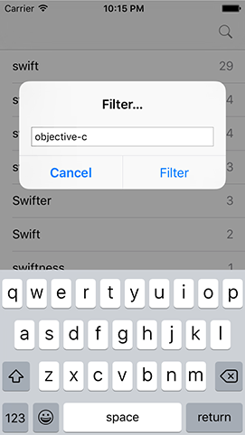

# Updating the user interface with filtering

We've written the tests to prove that filtering works, but those filters don't do anything in the user interface just yet. We're going to make a few small changes so that our view controller uses `filteredWords` rather than `allWords`, then we'll add an alert controller so that users can enter a filter by hand.

First: using `filteredWords`. This is done in three changes, two of which are trivial: open ViewController.swift, and replace the two instances of `allWords` with `filteredWords`. If you run the app now you'll see no text in the table view, which is where we need to make the third change.

By default, `filteredWords` contains nothing, which is why the table is empty. It's only when a filter is applied that words are added, so our fix is just a matter of adding one line of code immediately before the end of `init()` in `PlayData`:

    applyUserFilter("swift")

That will run an initial filter looking for the word "swift". If you want to show all words when the app first runs, use this code instead:

    filteredWords = allWords

For now, though, please stick with `applyUserFilter("swift")` – the reason for this will become clear soon.

Now onto the interesting stuff: letting the user enter a filter value. This needs to show a `UIAlertController` with a text field and two buttons, Filter and Cancel. When the user taps Filter, whatever they entered in the text field needs to be sent to the `applyUserFilter()` method of `PlayData`, and the table reloaded to reflect their changes.

We've covered how to do all this before, but I'll give you a few reminders once you've read the code. Please add this new method to ViewController.swift:

    @objc func searchTapped() {
        let ac = UIAlertController(title: "Filter…", message: nil, preferredStyle: .alert)
        ac.addTextField()

        ac.addAction(UIAlertAction(title: "Filter", style: .default) { [unowned self] _ in
            let userInput = ac.textFields?[0].text ?? "0"
            self.playData.applyUserFilter(userInput)
            self.tableView.reloadData()
        })

        ac.addAction(UIAlertAction(title: "Cancel", style: .cancel))

        present(ac, animated: true)
    }

The one line your brain might have stalled on is this one:

    let userInput = ac.textFields?[0].text ?? "0"

That contains two optionals: the `textFields` property might be `nil` (i.e., if there aren't any text fields) and even if we pull out the first text field from the array it might not have any text. Rather than try to fight our way through the maze of optionals, this code takes an easier approach: if either of the two optionals return `nil`, the nil coalescing operator (`??`) kicks in, and ensures that "0" is returned instead. This means `userInput` will always be a `String` and not a `String?`: it will either be something the user entered, or "0".

To finish up the user interface, we need to add a right bar button item to the navigation bar that will trigger the `searchTapped()` method – add this line to `viewDidLoad()`:

    navigationItem.rightBarButtonItem = UIBarButtonItem(barButtonSystemItem: .search, target: self, action: #selector(searchTapped))

With that new line of code in place, please run the app now and try using the search button in the top-right corner. Thanks to us having a clear separation of our data model and our view controller, doing all the user interface work was pretty quick!

