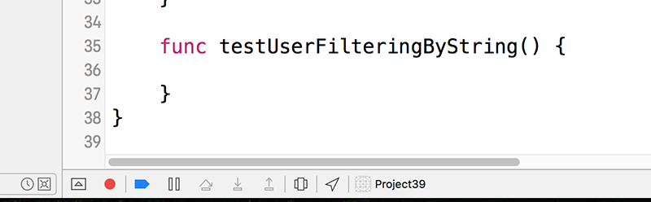
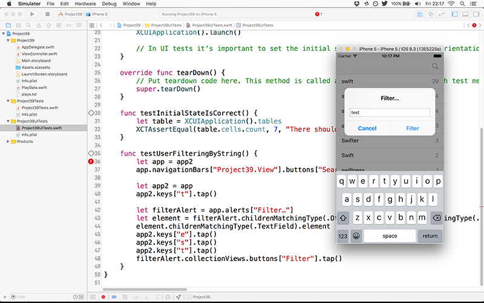

# User interface testing with XCTest

There's one more trick XCTest has up its sleeve, and if you're not already impressed then I think this will finally win you over.

We've written tests for our data model: are the words loaded correctly? Are the word counts correct? Did the words get counted in an appropriate time? Does our user filtering work? These are all useful tests, and help make sure our code works now and in the future when further changes are made.

But none of those tests tell us whether our user interface is working as expected, so it's possible that the app could still be broken even though our model is in perfect condition.

XCTest has a solution, and it's a beautiful one: integrated user interface tests that manipulate your app as if there were a real user in control. XCTest is smart enough to understand how the system works, so it will automatically wait for things like animations to complete before trying to check your assertions.

When we created our project we added both unit tests (Project39Tests.swift) and also UI tests (Project39UITests.swift), and we'll be working with the latter now so please open Project39UITests.swift for editing.

You'll see Xcode has written `setup()` and `tearDown()` methods again, although this time the `setup()` method actually has some code in to get things started. You'll also see a `testExample()` method, but please just delete that – we'll be writing our own.

We're going to start with a very simple test: when the view controller loads, does it show the correct number of words? If you remember, our app applies an immediate filter for the word "swift", which appears 7 times in Shakespeare's comedies. So, to test that our initial app state is correct, we need to write this test:

    func testInitialStateIsCorrect() {
        let table = XCUIApplication().tables
        XCTAssertEqual(table.cells.count, 7, "There should be 7 rows initially")
    }

Please go ahead and run that test now to make sure it works correctly.

OK, so how does that code work? There are only two lines, but it masks a whole lot of complexity:

- Calling `XCUIApplication()` gets you access to the test harness for your running application. This lets you query its user interface and perform actions as if you were a user.
- Calling `.tables` will return an `XCUIElementQuery`, which in our situation would point to our table.
- If there were more than one table visible, this would point to an array of tables, and we'd need to query them further to narrow it down to one table before acting on it. Trying to manipulate a query that points to more than one thing will crash your test.
- This is the really mind-bending bit: the results of queries aren't fixed. So in our code the `let table` will point to a single table, but if the app adds two more tables for whatever reason, that `table` constant will now point to three tables – trying to manipulate it will crash your test.
- Xcode uses the iOS accessibility system to navigate around these user interface tests. This is good because it means any application that is accessibility aware is ready for UI testing, but also because it encourages developers to add accessibility to their apps – which makes the world a better place for everyone. However, it's *bad* because the accessibility system has to read things from the screen rather than making API calls.
- In our app, we start by applying a filter for the word "swift", which was for a reason: without this filter there are 18,000+ rows in our table, and the accessibility system seems to try to scan them all to perform our test. This is so slow that it simply wouldn't work, which is why the initial filter is applied.

So: user interface testing might look simple, but it's actually surprisingly hard. Fortunately, Xcode has a smart, simple and *almost* magical solution: test recording. Let's try it now – please create this empty method in your user interface tests:

    func testUserFilteringByString() {

    }

Click inside that method, so that if you were to type you would be typing inside the method. Now click the red circle button just below your editing window: this will build and launch your app, but place it in record mode. It's a small button, but you can see it in the screenshot below.

When your app is recording a UI test, any taps, swipes, or other actions you perform in the app will automatically be converted to code inside your test – Xcode will literally write your test for you. However, there are three catches: first, it will usually write some fairly unpleasant code, and certainly rarely writes what a trained developer would do; second, it still doesn't know what a pass or fail looks like, so you need to add your own assertions at the end; third, sometimes it won't even write valid code, although recent Xcode versions have reduced the chance of that happening.

So, it's a long way from perfect, but it does at least give you something to start with that you can easily rewrite. Your app is already in record mode, because you clicked the red circle to start it off. I want you to switch to the simulator, click the search button, then use the on-screen keyboard to type "test". Finally, click the Filter button to dismiss the alert view, then go back to Xcode and click the red circle button again to end recording.

**Note:** Xcode sometimes fails to work with the iOS Simulator's hardware keyboard option – you may need to use the on-screen keyboard.

If everything worked correctly, Xcode will have written some code for you. Here's what I got:

    func testUserFilteringByString() {
        let app = XCUIApplication()
        app.navigationBars["Project39.View"].buttons["Search"].tap()
        
        let filterAlert = app.alerts["Filter…"]
        filterAlert.collectionViews.children(matching: .other).element.children(matching: .other).element.children(matching: .other).element.children(matching: .other).element.children(matching: .other).element(boundBy: 1).children(matching: .textField).element.typeText("test")
        filterAlert.buttons["Filter"].tap()
    }

Even though this is a very simple test, Xcode’s record feature managed to write some complex code. It doesn’t *need* to be complex, but at least Xcode's attempt does give us something to build on:

- The line `app.navigationBars["Project39.View"].buttons["Search"].tap()` can be simplified to `app.buttons["Search"].tap()` because there's only one search button in view.
- The line `let filterAlert = app.alerts["Filter…"]` can be simplified to `let filterAlert = app.alerts`, again because there's only one of them.
- The massive long line that starts with `filterAlert.collectionViews.children` can be collapsed down into `let textField = filterAlert.textFields.element`, which is significantly shorter.
- To finish things off, we need to tell Xcode what a passing test looks like, so we'll add `XCTAssertEqual(app.tables.cells.count, 56, "There should be 56 words matching 'test'")` to match the "test" string that was entered.

With all that in mind, here's a vastly improved version of the test:

    func testUserFilteringString() {
        let app = XCUIApplication()
        app.buttons["Search"].tap()

        let filterAlert = app.alerts
        let textField = filterAlert.textFields.element
        textField.typeText("test")

        filterAlert.buttons["Filter"].tap()

        XCTAssertEqual(app.tables.cells.count, 56, "There should be 56 words matching 'test'")
    }

Now, you might wonder why it's worth using Xcode's UI recording system only to rewrite literally everything it produced. And I'll be honest: once you understand how Xcode UI testing works you'll probably write all your tests by hand, and you'll even add things like comments and shared code to make them a valuable part of your project.

However, Xcode's UI recordings *are* useful when you're learning because it becomes significantly easier to get started when Xcode gives you something basic to work with.

Go ahead and run the test now, and you should see Xcode behaving like a real user. All being well, the assertion will prove true, and you'll get a green checkmark for your hard work – well done!
