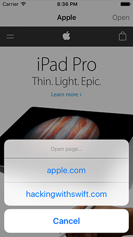

# Choosing a website: UIAlertController action sheets

<!-- YOUTUBE: LkqYPTSk3aQ -->

We're going to lock this app down so that it opens websites selected by the user. The first step to doing this is to give the user the option to choose from one of our selected websites, and that means adding a button to the navigation bar.

Somewhere in `viewDidLoad()` (but always after it has called `super.viewDidLoad()`), add this:

    navigationItem.rightBarButtonItem = UIBarButtonItem(title: "Open", style: .plain, target: self, action: #selector(openTapped))

We did exactly this in the previous project, except here we're using a custom title for our bar button rather than a system icon. It’s going to call the `openTapped()` method when the button is tapped, so let's add that now. Put this method below `viewDidLoad()`:

    @objc func openTapped() {
        let ac = UIAlertController(title: "Open page…", message: nil, preferredStyle: .actionSheet)
        ac.addAction(UIAlertAction(title: "apple.com", style: .default, handler: openPage))
        ac.addAction(UIAlertAction(title: "hackingwithswift.com", style: .default, handler: openPage))
        ac.addAction(UIAlertAction(title: "Cancel", style: .cancel))
        ac.popoverPresentationController?.barButtonItem = self.navigationItem.rightBarButtonItem
        present(ac, animated: true)
    }

We haven’t written the `openPage()` method yet, so ignore any warnings you see about it for the time being. Just like in project 3 we’re calling `openTapped()` from Apple’s own Objective-C code in `UIBarButtonItem`, so the method must be marked `@objc`.

Just like in project 3, setting the alert controller’s `popoverPresentationController?.barButtonItem` property is used only on iPad, and tells iOS where it should make the action sheet be anchored.

We used the `UIAlertController` class in project 2, but here it's slightly different for three reason:

1.  We're using `nil` for the message, because this alert doesn't need one.
2.  We're using the `preferredStyle` of `.actionSheet` because we're prompting the user for more information.
3.  We're adding a dedicated Cancel button using style `.cancel`. It doesn’t provide a `handler` parameter, which means iOS will just dismiss the alert controller if it’s tapped.

Both our website buttons point to the `openPage()` method, which, again, doesn't exist yet. This is going to be very similar to how we loaded the web page before, but now you will at least see why the handler method of `UIAlertAction` takes a parameter telling you which action was selected!

Add this method directly beneath the `openTapped()` method you just made:

    func openPage(action: UIAlertAction) {
        let url = URL(string: "https://" + action.title!)!
        webView.load(URLRequest(url: url))
    }

This method takes one parameter, which is the `UIAlertAction` object that was selected by the user. Obviously it won't be called if Cancel was tapped, because that had a `nil` handler rather than `openPage`.

What the method does is use the `title` property of the action (apple.com, hackingwithswift.com), put "https://" in front of it to satisfy App Transport Security, then construct a `URL` out of it. It then wraps that inside an `URLRequest`, and gives it to the web view to load. All you need to do is make sure the websites in the `UIAlertController` are correct, and this method will load anything.

You can go ahead and test the app now, but there's one small change we can add to make the whole experience more pleasant: setting the title in the navigation bar. Now, we are the web view's navigation delegate, which means we will be told when any interesting navigation happens, such as when the web page has finished loading. We're going to use this to set the navigation bar title.

As soon as we told Swift that our `ViewController` class conformed to the `WKNavigationDelegate` protocol, Xcode updated its code completion system to support all the `WKNavigationDelegate` methods that can be called. As a result, if you go below the `openPage()` method and start typing "web" you'll see a list of all the `WKNavigationDelegate` methods we can use.

Scroll through the list of options until you see `didFinish` and press return to have Xcode fill in the method for you. Now modify it to this:

    func webView(_ webView: WKWebView, didFinish navigation: WKNavigation!) {
        title = webView.title
    }

All this method does is update our view controller's `title` property to be the title of the web view, which will automatically be set to the page title of the web page that was most recently loaded.

Press Cmd+R now to run the app, and you'll see things are starting to come together: your initial web page will load, and when the load finishes you'll see its page title in the navigation bar.

