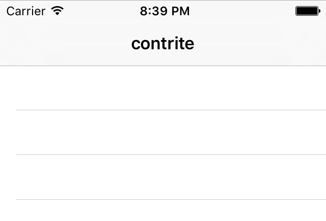

# Reading from disk: contentsOf

<!-- YOUTUBE: bOURBKBRR3A -->

We're going to make an anagram game, where the user is asked to make words out of a larger word. We're going to put together a list of possible starter words for the game, and that list will be stored in a separate file. But how do we get the text from the file into the app? Well, it turns out that Swift's `String` data type makes it a cinch – thanks, Apple!

If you haven't already downloaded the assets for this project from GitHub (<https://github.com/twostraws/HackingWithSwift>), please do so now. In the project5-files folder you'll find the file start.txt – please drag that into your Xcode project, making sure that "Copy items if needed" is checked.

The start.txt file contains over 12,000 eight-letter words we can use for our game, all stored one word per line. We need to turn that into an array of words we can play with. Behind the scenes, those line breaks are marked with a special line break character that is usually expressed as `\n`. So, we need to load that word list into a string, then split it into an array by breaking up wherever we see `\n`.

First, go to the start of your class and make two new arrays. We’re going to use the first one to hold all the words in the input file, and the second one will hold all the words the player has currently used in the game.

So, open ViewController.swift and add these two properties:

    var allWords = [String]()
    var usedWords = [String]()

Second, loading our array. This is done in three parts: finding the path to our start.txt file, loading the contents of that file, then splitting it into an array.

Finding a path to a file is something you'll do a lot, because even though you know the file is called "start.txt" you don't know where it might be on the filesystem. So, we use a built-in method of `Bundle` to find it: `path(forResource:)`. This takes as its parameters the name of the file and its path extension, and returns a `String?` – i.e., you either get the path back or you get `nil` if it didn’t exist.

Loading a file into a string is also something you'll need to get familiar with, and again there's an easy way to do it: when you create a `String` instance, you can ask it to create itself from the contents of a file at a particular path.

Finally, we need to split our single string into an array of strings based on wherever we find a line break (`\n`). This is as simple as another method call on `String`: `components(separatedBy:)`. Tell it what string you want to use as a separator (for us, that's `\n`), and you'll get back an array.

Before we get onto the code, there are two things you should know: `path(forResource:)` and creating a `String` from the contents of a file both return `String?`, which means we need to check and unwrap the optional using `if let` syntax.

OK, time for some code. Put this into `viewDidLoad()`, after the `super` call:

    if let startWordsURL = Bundle.main.url(forResource: "start", withExtension: "txt") {
        if let startWords = try? String(contentsOf: startWordsURL) {
            allWords = startWords.components(separatedBy: "\n")
        }
    }
    
    if allWords.isEmpty {
        allWords = ["silkworm"]
    }

If you look carefully, there's a new keyword in there: `try?`. You already saw `try!` previously, and really we could use that here too because we're loading a file from our app's bundle so any failure is likely to be catastrophic. However, this way I have a chance to teach you something new: `try?` means "call this code, and if it throws an error just send me back `nil` instead." This means the code you call will always work, but you need to unwrap the result carefully.

I also added in a new and useful property of arrays: `isEmpty`. This returns true if the array is empty, and is effectively equal to writing `allWords.count == 0`. The reason we use `isEmpty` is because some collection types, such as string, have to calculate their size by counting over all the elements they contain, so reading `count == 0` can be significantly slower than using `isEmpty`.

As you can see, that code carefully checks for and unwraps the contents of our start file, then converts it to an array. When it has finished, `allWords` will contain 12,000+ strings ready for us to use in our game.

To prove that everything is working before we continue, let's create a new method called `startGame()`. This will be called every time we want to generate a new word for the player to work with, and it will use the `randomElement()` method of Swift’s arrays to choose one random item from all the strings.

Here’s the code:

    func startGame() {
        title = allWords.randomElement()
        usedWords.removeAll(keepingCapacity: true)
        tableView.reloadData()
    }

Line 1 sets our view controller's title to be a random word in the array, which will be the word the player has to find.

Line 2 removes all values from the `usedWords` array, which we'll be using to store the player's answers so far. We aren't adding anything to it right now, so `removeAll()` won't do anything just yet.

Line 3 is the interesting part: it calls the `reloadData()` method of `tableView`. That table view is given to us as a property because our `ViewController` class comes from `UITableViewController`, and calling `reloadData()` forces it to call `numberOfRowsInSection` again, as well as calling `cellForRowAt` repeatedly. Our table view doesn't have any rows yet, so this won't do anything for a few moments. However, the method is ready to be used, and allows us to check we've loaded all the data correctly, so add this just before the end of `viewDidLoad()`:

    startGame()

Now press Cmd+R to run the app, and you ought to see an eight-letter word at the top, ready for play to begin.

Before we’re done, we need to add a few methods to handle the table view data: `numberOfRowsInSection` and `cellForRowAt`. These are identical to the implementations in project 1, except now we’re drawing on the `usedWords` array and the “Word” cell identifier. Add these two methods now:

    override func tableView(_ tableView: UITableView, numberOfRowsInSection section: Int) -> Int {
        return usedWords.count
    }

    override func tableView(_ tableView: UITableView, cellForRowAt indexPath: IndexPath) -> UITableViewCell {
        let cell = tableView.dequeueReusableCell(withIdentifier: "Word", for: indexPath)
        cell.textLabel?.text = usedWords[indexPath.row]
        return cell
    }

They won’t have any effect just yet because the `usedWords` array never changes, but at least the foundation is in place now.
