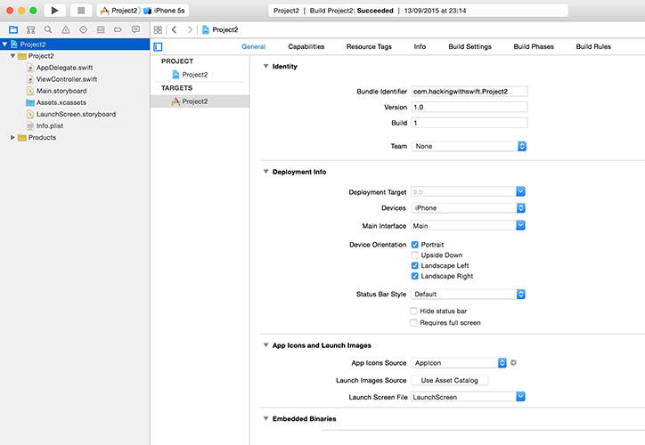

# Advanced Auto Layout

<!-- YOUTUBE: OxIQZciPHdY -->

When you run the project, it looks fine in portrait, but is unplayable on landscape because some of the buttons are hidden. You have two options: either disable landscape mode, or make your layout work across both orientations.

Disabling orientations isn't a great solution, but sometimes it's the *right* solution. Most games, for example, fix their orientation because it just doesn't make sense to support both. If you want to do this, press Cmd+1 to show the project navigator on the left of your Xcode window, select your project (it's the first item in the pane), then to the right of where you just clicked will appear another pane showing "PROJECT" and "TARGETS", along with some more information in the center.

**Please note:** This project and targets list can be hidden by clicking the disclosure button in the top-left of the project editor (directly beneath the icon with four squares), and you may find yours is already hidden. I strongly recommend you show this list – hiding it will only make things harder to find, so please make sure it's visible!

In the picture below you can see the project editor, with the device orientations at the bottom. This is the collapsed view of projects and targets, so there's a dropdown arrow at the top that says "Project2" (just above where it says Identity in bold), and to the left of that is the button to show the projects and targets list.

This view is called the project editor, and contains a huge number of options that affect the way your app works. You'll be using this a lot in the future, so remember how to get here! Select Project 2 under TARGETS, then choose the General tab, and scroll down until you see four checkboxes called Device Orientation. You can select only the ones you want to support.

You'll need to support selective orientations in some later projects, but for now let's take the smart solution: add extra rules to Auto Layout so it can make the layout work great in landscape mode.

Open Main.storyboard in Interface Builder, select the bottom flag, then Ctrl-drag from the flag to the white space directly below the flag – in the view controller itself. The direction you drag is important, so please drag straight down.

When you release your mouse button, a popup will appear that includes the option “Bottom Space to Safe Area” – please select that. This creates a new Auto Layout constraint that the bottom of the flag must be at least X points away from the bottom of the view controller, where X is equal to whatever space there is in there now.

Although this is a valid rule, it will screw up your layout because we now have a complete set of exact vertical rules: the top flag should be 36 points from the top, the second 30 from the first, the third 30 from the second, and the third X away from the bottom. It's 207 for me, but yours might be different.

Because we've told Auto Layout exactly how big all the spaces should be, it will add them up and divide the remaining space among the three flags however it thinks best. That is, the flags must now be stretched vertically in order to fill the space, which is almost certainly what we don't want.

Instead, we're going to tell Auto Layout where there is some flexibility, and that's in the new bottom rule we just created. The bottom flag doesn't need to be precisely 207 points away from the bottom of the safe area – it just needs to be *some* distance away, so that it doesn't touch the edge. If there is more space, great, Auto Layout should use it, but all we care about is the minimum.

Select the third flag to see its list of constraints drawn in blue, then (carefully!) select the bottom constraint we just added. In the utilities view on the right, choose the attributes inspector (Alt+Cmd+4), and you should see Relation set to Equal and Constant set to 207 (or some other value, depending on your layout).

What you need to do is change Equal to be "Greater Than or Equal", then change the Constant value to be 20. This sets the rule "make it at least 20, but you can make it more to fill up space." The layout won't change visually while you're doing this, because the end result is the same. But at least now that Auto Layout knows it has some flexibility beyond just stretching the flags!

Our problem is still not fixed, though: in landscape, an iPhone SE has just 320 points of space to work with, so Auto Layout is going to make our flags fit by squashing one or maybe even two of them. Squashed flags aren't good, and having uneven sizes of flags isn't good either, so we're going to add some more rules.

Select the second button, then Ctrl-drag to the first button. When given the list of options, choose Equal Heights. Now do the same from the third button to the second button. This rule ensures that at all times the three flags have the same height, so Auto Layout can no longer squash one button to make it all fit and instead has to squash all three equally.

That fixes part of the problem, but in some respects it has made things worse. Rather than having one squashed flag, we now have three! But with one more rule, we can stop the flags from being squashed ever. Select the first button, then Ctrl-drag a little bit upwards – but stay within the button! When you release your mouse button, you'll see the option "Aspect Ratio", so please choose it.

The Aspect Ratio constraint solves the squashing once and for all: it means that if Auto Layout is forced to reduce the height of the flag, it will reduce its width by the same proportion, meaning that the flag will always look correct. Add the Aspect Ratio constraint to the other two flags, and run your app again. It should work great in portrait and landscape, all thanks to Auto Layout!
