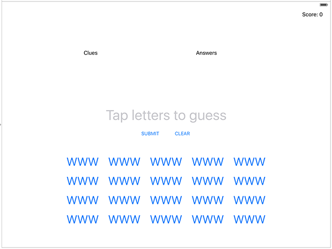

# Building a UIKit user interface programmatically

<!-- YOUTUBE: yhxhKpyyQzE -->

Our user interface for this game is going to be fairly complicated, but we can assemble it piece by piece and have Auto Layout do most of the work for us.

The main part of the UI will be two large labels: one containing the clues the user needs to figure out, and one showing how many letters are in the word for each clue. So, it might say “A cow in a tornado” in one label and “9 Letters” in the other – with the answer being “milkshake”. As the player solves each clue, the letter count will be replaced with that answer, so they can see at a glance which ones they have solved.

Just above and to the right of those two labels will be one extra label, nice and small, which will show the user’s score. 

In the middle of the screen will be a `UITextField` where we’ll store the user’s current answer, plus buttons below to submit the answer or clear it.

Finally, at the bottom we’re going to make 20 (yes, twenty!) buttons, each containing different parts of the clues. So, there will be one with MIL, one with KSH, and one with AKE – the user needs to tap all three to spell MILKSHAKE. To make our layout a little easier, we’re going to place those buttons inside another `UIView` that we can position centered on the screen.

The picture below shows how your finished layout should look if you've followed all the instructions. If you're seeing something slightly different, that's OK. If you're seeing something *very* different, you should probably try again!

Our game is designed for iPads because we’ve got a lot of information we want to cram in. Later on, you’re welcome to try creating a second layout specifically for iPhone, and it *is* possible – it just takes a lot more thinking!

The first thing we’re going to do is create five properties to store the important parts of our user interface: the clues label, the answers label, the player’s current answer (the word they are spelling), their score, and all the buttons showing word pieces.

So, open ViewController.swift and add these five properties to the `ViewController` class:

    var cluesLabel: UILabel!
    var answersLabel: UILabel!
    var currentAnswer: UITextField!
    var scoreLabel: UILabel!
    var letterButtons = [UIButton]()

Just like in projects 4 and 7, we’re going to write a custom `loadView()` method that creates our user interface in code. This will involve much more work than just creating a `WKWebView`, though – we have lots of UI to create! So, we’ll tackle it piece by piece so you can see it coming together as we go.

Let’s start nice and easy: we’re going to create the main view itself as a big and white empty space. This is just a matter of creating a new instance of `UIView`, giving it a white background color, and assigning that to our view controller’s `view` property:

    override func loadView() {
        view = UIView()
        view.backgroundColor = .white

        // more code to come!
    }

`UIView` is the parent class of all of UIKit’s view types: labels, buttons, progress views, and more. Previously we assigned a `WKWebView` instance directly as our view, meaning that it automatically took up all the space. Here, though, we’re going to be adding lots of child views and positioning them by hand, so we need a big, empty canvas to work with.

## Placing three labels at the top

Next, let’s create and add the score label. This uses similar code to what you learned in project 6, although now we’re going to set the label’s `textAlignment` property so the text is right-aligned.

Add this below the previous code, in place of the `// more code to come!` comment:

    scoreLabel = UILabel()
    scoreLabel.translatesAutoresizingMaskIntoConstraints = false
    scoreLabel.textAlignment = .right
    scoreLabel.text = "Score: 0"
    view.addSubview(scoreLabel)

We need to add some Auto Layout constraints to make that label be positioned neatly on the screen, and we’re going to be using *anchors* just like we did in project 6. These let us very clearly and descriptively place views relative to each other, however this time I want to show you one important difference: because we’ll be creating lots of constraints at the same time, we’ll be activating them all at once rather than setting `isActive = true` multiple times.

This is done using the `NSLayoutConstraint.activate()` method, which accepts an array of constraints. It will put them all together at once, so we’ll be adding more constraints to this call over time.

UIKit gives us several guides that we can anchor our views to. One of the most common is the `safeAreaLayoutGuide` of our main view, which is the space available once you subtract any rounded corners or notches. Inside that is the `layoutMarginsGuide`, which adds some extra margin so that views don’t run to the left and right edges of the screen.

In this app we’re going to be using the `layoutMarginsGuide` so that our views are indented a little on each edge, but we’ll also be adding some extra indenting to make the whole thing look better on-screen.

So, add this below the previous code:

    NSLayoutConstraint.activate([
        scoreLabel.topAnchor.constraint(equalTo: view.layoutMarginsGuide.topAnchor),
        scoreLabel.trailingAnchor.constraint(equalTo: view.layoutMarginsGuide.trailingAnchor),
        
        // more constraints to be added here!
    ])

Notice the way I’m pinning the label to `view.layoutMarginsGuide` – that will make the score label have a little distance from the right edge of the screen.

**Tip:** Remember that you’re setting anchors as an array, so make sure you include a comma after each one.

To avoid confusion, here’s what you should have so far:

    override func loadView() {
        view = UIView()
        view.backgroundColor = .white

        scoreLabel = UILabel()
        scoreLabel.translatesAutoresizingMaskIntoConstraints = false
        scoreLabel.textAlignment = .right
        scoreLabel.text = "Score: 0"
        view.addSubview(scoreLabel)

        NSLayoutConstraint.activate([
            scoreLabel.topAnchor.constraint(equalTo: view.layoutMarginsGuide.topAnchor),
            scoreLabel.trailingAnchor.constraint(equalTo: view.layoutMarginsGuide.trailingAnchor, constant: 0),
        ])
    }

We’ll be adding lots more view code *before* the call to `NSLayoutConstraint.activate()`, and lots more constraints code *inside* that array being passed to `NSLayoutConstraint.activate()`.

If you run the app now you should see “Score: 0” nestled in the top-right corner. If you *don’t* see that, please check your code otherwise the rest of this project will be very confusing indeed!

Next we’re going to add the clues and answers labels. This will involve similar code to the score label, except we’re going to set two extra properties: `font` and `numberOfLines`. The `font` property describes what kind of text font is used to render the label, and is provided as a dedicated type that describes a font face and size: `UIFont`. `numberOfLines` is an integer that sets how many lines the text can wrap over, but we’re going to set it to 0 – a magic value that means “as many lines as it takes.”

Add this code below the code to create the label, but *before* the Auto Layout code:

    cluesLabel = UILabel()
    cluesLabel.translatesAutoresizingMaskIntoConstraints = false
    cluesLabel.font = UIFont.systemFont(ofSize: 24)
    cluesLabel.text = "CLUES"
    cluesLabel.numberOfLines = 0
    view.addSubview(cluesLabel)

    answersLabel = UILabel()
    answersLabel.translatesAutoresizingMaskIntoConstraints = false
    answersLabel.font = UIFont.systemFont(ofSize: 24)
    answersLabel.text = "ANSWERS"
    answersLabel.numberOfLines = 0
    answersLabel.textAlignment = .right
    view.addSubview(answersLabel)

Using `UIFont.systemFont(ofSize: 24)` will give us a 24-point font in whatever font is currently being used by iOS. This was Helvetica in the early days of iOS, then moved to Helvetica Neue and finally San Francisco. Asking for the system font means we’ll get whatever is the standard today, but our UI will update automatically if Apple makes more changes in the future.

To position those in such a way that they look great on a variety of iPad sizes – from iPad Mini up to the 12.9-inch iPad Pro – we’re going to set some anchors:

- The tops of the clues and answers labels will be pinned to the bottom of the score label.
- The clues label will be pinned to the leading edge of the screen, indented by 100 points so that it looks neater.
- The clues label will have a width anchor set to 0.6 of the width of the main view, so that it takes up 60% of the screen. We need to subtract 100 from this to account for the indent.
- The answers label will be pinned to the *trailing* edge of the screen, then also indented by 100 points to match the clues label.
- The answers label will have a width anchor of 0.4 of the width of the main view, so that it takes up the remaining 40% of the screen. Again, that needs to have 100 taken away to account for the indent.
- Finally, we’re going to make the height of the answers label match the height of the clues label.

I realize that might sound like a lot of work, but this kind of thing is where Auto Layout anchors really shine. Just remember: it takes the multiplier into account first, then the constant.

Add these constraints to the array we’re activating – I’ve added comments just to be sure:

    // pin the top of the clues label to the bottom of the score label
    cluesLabel.topAnchor.constraint(equalTo: scoreLabel.bottomAnchor),
    
    // pin the leading edge of the clues label to the leading edge of our layout margins, adding 100 for some space
    cluesLabel.leadingAnchor.constraint(equalTo: view.layoutMarginsGuide.leadingAnchor, constant: 100),
    
    // make the clues label 60% of the width of our layout margins, minus 100
    cluesLabel.widthAnchor.constraint(equalTo: view.layoutMarginsGuide.widthAnchor, multiplier: 0.6, constant: -100),

    // also pin the top of the answers label to the bottom of the score label
    answersLabel.topAnchor.constraint(equalTo: scoreLabel.bottomAnchor),
    
    // make the answers label stick to the trailing edge of our layout margins, minus 100
    answersLabel.trailingAnchor.constraint(equalTo: view.layoutMarginsGuide.trailingAnchor, constant: -100),
    
    // make the answers label take up 40% of the available space, minus 100
    answersLabel.widthAnchor.constraint(equalTo: view.layoutMarginsGuide.widthAnchor, multiplier: 0.4, constant: -100),
    
    // make the answers label match the height of the clues label
    answersLabel.heightAnchor.constraint(equalTo: cluesLabel.heightAnchor),

If you run the code now you’ll see “CLUES” and “ANSWERS” near the top of the screen.

Temporarily – just so you can follow along and see how everything works! – try adding this code after the call to `activateConstraints()`:

    cluesLabel.backgroundColor = .red
    answersLabel.backgroundColor = .blue

That will make our two big labels stand out more clearly, which will be helpful while we’re building our UI.

## Entering answers

Next we’re going to add a `UITextField` that will show the user’s answer as they are building it. You might think this is a good place to use another `UILabel` particularly because we want players to build words by tapping letter buttons rather than typing into a box. However, this lets me introduce you to the `placeholder` property of text fields, which draws gray prompt text that the user can type over – it looks really nice, and gives us space to provide some instructions to users.

As with our labels we’re also going to adjust the font and alignment of the text field, but we’re also going to disable user interaction so the user can’t tap on it – we don’t want the iOS keyboard to appear.

Add this code alongside the other views:

    currentAnswer = UITextField()
    currentAnswer.translatesAutoresizingMaskIntoConstraints = false
    currentAnswer.placeholder = "Tap letters to guess"
    currentAnswer.textAlignment = .center
    currentAnswer.font = UIFont.systemFont(ofSize: 44)
    currentAnswer.isUserInteractionEnabled = false
    view.addSubview(currentAnswer)

The only new part is setting `isUserInteractionEnabled` to false, which is what stops the user from activating the text field and typing into it.

As for constraints, we’re going to make this text field centered in our view, but only 50% its width – given how many characters it will hold, this is more than enough. We’re also going to place it below the clues label, with 20 points of spacing so the two don’t touch.

Add this to your constraints array:

    currentAnswer.centerXAnchor.constraint(equalTo: view.centerXAnchor),
    currentAnswer.widthAnchor.constraint(equalTo: view.widthAnchor, multiplier: 0.5),
    currentAnswer.topAnchor.constraint(equalTo: cluesLabel.bottomAnchor, constant: 20),

Run the app again, and you’ll see “Tap letters to guess” in gray underneath the red and blue labels – this is coming together slowly!

Below the text field we’re going to add two buttons: one for the user to submit their answer (when they’ve entered all the letters they want), and one to clear their answer so they can try something else.

To create a `UIButton` in code you need to know two things:

1. Buttons have various built-in styles, but the ones you’ll most commonly use are `.custom` and `.system`. We want the default button style here, so we’ll use `.system`.
2. We need to use `setTitle()` to adjust the title on the button, just like we did with `setImage()` in project 2.

Add this to our view creation code:

    let submit = UIButton(type: .system)
    submit.translatesAutoresizingMaskIntoConstraints = false
    submit.setTitle("SUBMIT", for: .normal)
    view.addSubview(submit)

    let clear = UIButton(type: .system)
    clear.translatesAutoresizingMaskIntoConstraints = false
    clear.setTitle("CLEAR", for: .normal)
    view.addSubview(clear)

**Note:** We don’t need to store those as properties on the view controller, because we don’t need to adjust them later.

In terms of the constraints to add for those buttons, they need three each:

1. One to set their vertical position. For the submit button we’ll be using the bottom of the current answer text field, but for the clear button we’ll be setting its Y anchor so that its stays aligned with the Y position of the submit button. This means both buttons will remain aligned even if we move one.
2. We’re going to center them both horizontally in our main view. To stop them overlapping, we’ll subtract 100 from the submit button’s X position, and add 100 to the clear button’s X position. “100” isn’t any sort of special number – you can experiment with different values and see what looks good to you.
3. We’re going to force both buttons to have a height of 44 points. iOS likes to make its buttons really small by default, but at the same time Apple’s human interface guidelines recommends buttons be at least 44x44 so they can be tapped easily.

Here are the constraints required to bring those rules to life – please add this to your constraints list:

    submit.topAnchor.constraint(equalTo: currentAnswer.bottomAnchor),
    submit.centerXAnchor.constraint(equalTo: view.centerXAnchor, constant: -100),
    submit.heightAnchor.constraint(equalToConstant: 44),

    clear.centerXAnchor.constraint(equalTo: view.centerXAnchor, constant: 100),
    clear.centerYAnchor.constraint(equalTo: submit.centerYAnchor),
    clear.heightAnchor.constraint(equalToConstant: 44),

## Buttons… buttons everywhere!

Are you feeling tired yet? It’s hard work, isn’t it? Don’t get me wrong – building user interface programmatically has many advantages, but it is certainly *verbose*.

Fortunately we’re near the end now, and all that remains is to add letter buttons at the bottom of the user interface. We need a lot of these – 20, to be precise – and we need to make sure they are positioned neatly on the screen.

With complicated layouts like this one the smart thing to do is wrap things in a container view. In our case this means we’re going to create one container view that will house all the buttons, then give *that* view constraints so that it’s positioned correctly on the screen.

This is just going to be a plain `UIView` – it does nothing special other than host our buttons. So, add this code below our previous view creation code:

    let buttonsView = UIView()
    buttonsView.translatesAutoresizingMaskIntoConstraints = false
    view.addSubview(buttonsView)

As this thing is the last view in our view (excluding the buttons inside it, but they don’t play a part in our Auto Layout constraints), we need to give it more constraints so that Auto Layout knows our hierarchy is complete:

1. We’re going to give it a width and height of 750x320 so that it precisely contains the buttons inside it.
2. It will be centered horizontally.
3. We’ll set its top anchor to be the bottom of the submit button, plus 20 points to add a little spacing.
4. We’ll pin it to the bottom of our layout margins, -20 so that it doesn’t run quite to the edge.

Add these final constraints to our constraints array:

    buttonsView.widthAnchor.constraint(equalToConstant: 750),
    buttonsView.heightAnchor.constraint(equalToConstant: 320),
    buttonsView.centerXAnchor.constraint(equalTo: view.centerXAnchor),
    buttonsView.topAnchor.constraint(equalTo: submit.bottomAnchor, constant: 20),
    buttonsView.bottomAnchor.constraint(equalTo: view.layoutMarginsGuide.bottomAnchor, constant: -20)

Just for testing purposes, give that new view a green background color:

    buttonsView.backgroundColor = .green

We haven’t added the buttons inside that view just yet, but please run the app now – I think you’ll find the result interesting.

What you’ll see is that our layout has changed quite dramatically: everything that used to be pinned to the top has now been pulled downwards. This isn’t a mistake, or an Auto Layout bug, but is the natural result of all the rules we’ve laid down:

- Our buttons view should be pinned to the bottom and be exactly 320 points high.
- The submit button should be above the buttons view.
- The current answer text field should be above the submit button.
- The answers label should be above the current answer text field.
- The score label should be above the answers label.
- The score label should be pinned to the top of our view.

In short, we have the buttons view pinned to the bottom and the score label pinned to the top, with all our other views in between.

Before we added the final buttons view, Auto Layout had no special idea of how big any of the views should be, so it used something called the *intrinsic content size* – how big each view needs to be to show its content. This resulted in our views being neatly arranged at the top. But now we have a complete vertical stack, pinned at the top and bottom, so UIKit needs to fill the space in between by stretching one or more of the views.

Every view in all our UIKit layouts has two important properties that tell UIKit how it can squash or stretch them in order to satisfy constraints:

- **Content hugging priority** determines how likely this view is to be made larger than its intrinsic content size. If this priority is high it means Auto Layout prefers not to stretch it; if it’s low, it will be more likely to be stretched.
- **Content compression resistance priority** determines how happy we are for this view to be made smaller than its intrinsic content size.

Both of those values have a default: 250 for content hugging, and 750 for content compression resistance. Remember, higher priorities mean Auto Layout works harder to satisfy them, so you can see that views are usually fairly happy to be stretched, but prefer not to be squashed. Because all views have the same priorities for these two values, Auto Layout is forced to pick one to stretch – the score at the top.

Now, all this matters because we’re going to adjust the content hugging priority for our clues and answers labels. More specifically, we’re going to give them a priority of 1, so that when Auto Layout has to decide which view to stretch they are first in line.

Add these two lines of code after the code that creates `cluesLabel` and `answersLabel`:

    cluesLabel.setContentHuggingPriority(UILayoutPriority(1), for: .vertical)
    answersLabel.setContentHuggingPriority(UILayoutPriority(1), for: .vertical)

Run the app *now* and you’ll see a big difference: the two labels now take up much more space, and the rest of our user interface looks more normal.

Now that our user interface looks as it should, let’s create the final piece of our layout: the letter buttons that sit inside `buttonsView`.

We have 20 buttons to create across four rows and five columns, which is the perfect time to use some nested loops: create and configure each button, then position it inside the buttons view.

However, we’re going to rely on a lovely feature of Auto Layout to make this whole process much easier: we’re *not* going to set `translatesAutoresizingMaskIntoConstraints` to false for these buttons, which means we can give them a specific position and size and have UIKit figure out the constraints for us.

So, this actual button creation isn’t as hard as you might think:

1. Set constants to represent the width and height of our buttons for easier reference.
2. Loop through rows 0, 1, 2, and 3.
3. Loop through columns 0, 1, 2, 3, and 4.
4. Create a new button with a nice and large font – we can adjust the font of a button’s label using its `titleLabel` property.
5. Calculate the X position of the button as being our column number multiplied by the button width.
6. Calculate the Y position of the button as being our row number multiplied by the button height.
7. Add the button to our `buttonsView` rather than the main view.

As a bonus, we’re going to add each button to our `letterButtons` array as we create them, so that we can control them later in the game.

Calculating positions of views by hand isn’t something we’ve done before, because we’ve been relying on Auto Layout for everything. However, it’s no harder than sketching something out on graph paper: we create a rectangular frame that has X and Y coordinates plus width and height, then assign that to the `frame` property of our view. These rectangles have a special type called `CGRect`, because they come from Core Graphics.

As an example, we’ll be calculating the X position for a button by multiplying our fixed button width (150) by its column position. So, for column 0 that will give an X coordinate of 150x0, which is 0, and for column 1 that will give an X coordinate of 150x1, which is 150 – they will line up neatly.

Add this code after the call to `NSLayoutConstraint.activate()`:

    // set some values for the width and height of each button
    let width = 150
    let height = 80

    // create 20 buttons as a 4x5 grid
    for row in 0..<4 {
        for col in 0..<5 {
            // create a new button and give it a big font size
            let letterButton = UIButton(type: .system)
            letterButton.titleLabel?.font = UIFont.systemFont(ofSize: 36)
            
            // give the button some temporary text so we can see it on-screen
            letterButton.setTitle("WWW", for: .normal)

            // calculate the frame of this button using its column and row
            let frame = CGRect(x: col * width, y: row * height, width: width, height: height)
            letterButton.frame = frame
            
            // add it to the buttons view
            buttonsView.addSubview(letterButton)

            // and also to our letterButtons array
            letterButtons.append(letterButton)
        }
    }

That’s the last of our code complete, so please remove the temporary background colors we gave to `cluesLabel`, `answersLabel`, and `buttonsView`, then run your code to see how it all looks.

## Was it worth it?

While building this UI, it’s possible you stopped more than once and thought to yourself “is this really worth it?” It’s certainly true that building this user interface in a storyboard would have been easier, but learning to build user interfaces in code is a really important skill.
