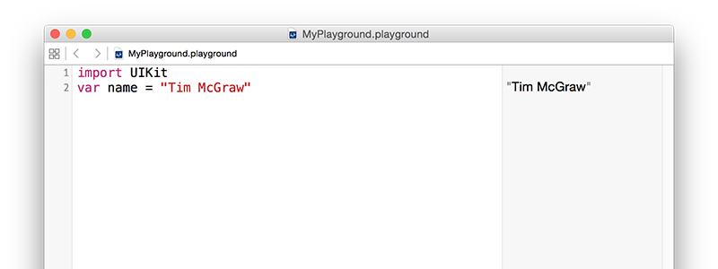

# Variables y constantes

Toda aplicación eventualmente necesitara almacenar datos y Swift ofrece dos formas de hacerlo: variables y constantes. Una variable almacena datos que pueden cambiar cuando sea necesario; una constante almacena datos que no cambian una vez que han sido almacenados. Entonces, las variables almacenan datos que puede variar y las constantes valores que son constantes - fácil, ¿verdad?

Tener estas dos opciones de almacenamiento parece no tener sentido, después de todo podrías crear una variable y nunca cambiar su valor - ¿por qué necesitaría convertirla en una constante?. Bien, resulta que muchos programadores están, sorprendentemente, lejos de ser perfectos desarrolladores y cometemos errores.

Una de las ventajas de separar constantes y variables es que Xcode nos indica si hemos cometido un error. Si decimos, por ejemplo, "esta fecha es constante, porque sé que no cambiará nunca" y 10 líneas más abajo intentamos cambiarla, Xcode no podrá construir o compilar la aplicación y nos indicará que hay un error.

Las constantes son importantes porque permiten a Xcode tomar decisiones acerca de la forma en la que construye o compila la aplicación. Si le indicamos que un valor no cambiará nunca, es capaz de optimizar el código para que se ejecute más rápido.

En Swift, se declaran las variables usando la palabra reservada `var` delante del nombre que queremos asignar a la variable, de la siguiente forma:

	var name = "Tim McGraw"

Utilicemos *playgrounds* para hacer esto de forma más interactiva. Elimina todo excepto la línea `import UIKit` (esta línea nos permite utilizar la librería principal de desarrollo de iOS de Apple que vamos a necesitar luego); y ahora agrega esta variable. Debería ver algo como lo siguiente.

Debido a que es una variable puedes cambiar su valor cuando así lo desees, sin embargo, no se debe utilizar `var` siempre - esto solo se utiliza cuando declaras nuevas variables. Intenta escribir esto:

    var name = "Tim McGraw"
    name = "Romeo"

Entonces, la primera línea, crea la variable `name` y asigna un valor inicial, la segunda línea actualiza la variable `name` de forma que su valor ahora es "Romeo". Verás ambos valores mostrados en el área de resultados de *playground*.

Ahora, ¿qué habría sucedido si hubiésemos declarado una constante en vez de una variable?. Bien, para declarar una constante se utiliza la palabra reservada `let` en vez de `var`, intenta cambiando la primera línea del ejemplo anterior a `let name` en vez de `var name` resultando algo como:

    import UIKit
    let name = "Tim McGraw"
    name = "Romeo"

Pero ahora hay un problema: Xcode muestra un símbolo rojo de advertencia justo a la línea tres y debería dibujar una línea ondulada debajo de `name`. Si haces click en el símbolo de advertencia rojo, Xcode te indicará el problema: "Cannot assign to 'let' value 'name'" que es la forma en la Xcode dice "estás tratando de cambiar una constante y no puede hacer eso".

Entonces, constante son una muy buena forma de comprometerte con Swift y contigo mismo que el valor no va a cambiar porque si lo intentas Xcode no ejecutará la aplicación. Los desarrolladores de Swift prefieren utilizar constantes siempre que sea posible porque hace que el código se entienda más fácilmente. De hecho, en la última versión de Swift, Xcode es capaz de decirte: si declaras una variable, nunca la cambies!.

**Nota importante:** los nombres de las variables y constantes deben ser unicos en tu código. Verás un error si intentas usar el mismo nombre en dos variables, por ejemplo, intenta esto:

    var name = "Tim McGraw"
    var name = "Romeo"

Si *playgound* encuentra un error en tu código, mostrará una advertencia color rojo o, simplemente, no ejecutará la el código. Si esto último sucede lo sabrás porque el texto en el panel de resultados se tornará gris en vez del negro usual.
