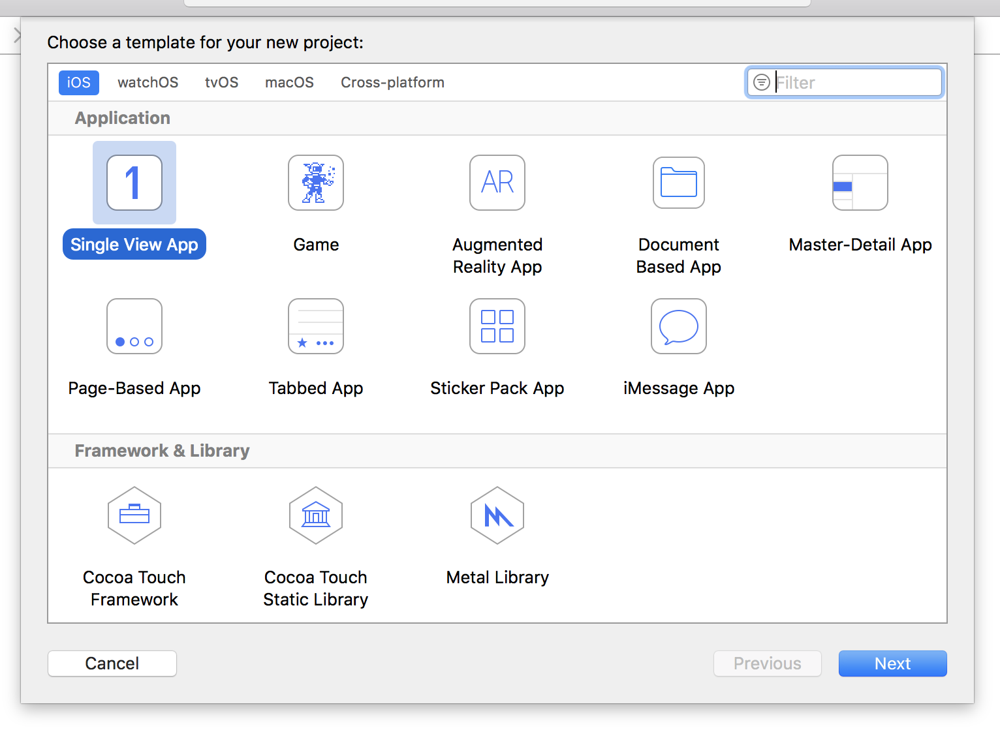
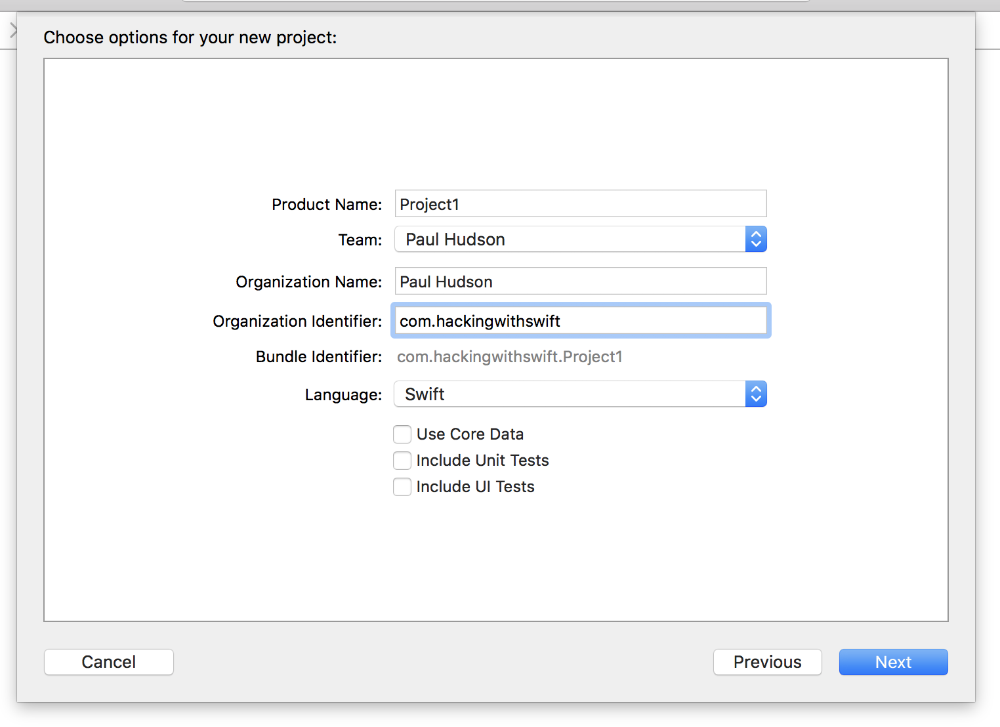

# Mise en place

<!-- YOUTUBE: lCHpZjERVdY -->

Dans ce projet, vous allez créer une application qui permet aux utilisateurs de faire défiler une liste d'images, puis d'en sélectionner une pour l'afficher. C'est intentionnellement simple, car vous allez devoir apprendre beaucoup d'autres choses en cours de route, alors attachez-vous - car cela va être long !

Lancez Xcode, et choisissez "Create a new Xcode project" (Créer un nouveau projet Xcode) sur l'écran d'accueil. Choisissez "Single View App" (Application avec une seule vue) dans la liste et cliquez sur Next (Suivant). Pour le nom du produit (Product Name), entrez Project1, puis assurez-vous de bien sélectionner Swift pour le langage utilisé.

Le champ "Organization Identifier" (Identifiant de l'organisation), est un identifiant unique qui correspond généralement au nom de domaine de votre site internet personnel, à l'envers. Si je faisais une application, j'utiliserais **com.hackingwithswift**. Vous devrez indiquer un identifiant valide si vous voulez déployer votre application sur de vrais appareils, sinon vous pouvez simplement utiliser **com.example**.

**Remarque importante :** certains modèles de projets de Xcode comportent des cases à cocher "Use Core Data" (Utiliser Core Data), "Include Unit Tests" (Inclure les tests unitaires) et "Include UI Tests" (Inclure les tests d'interface graphique). Assurez-vous que ces cases ne sont pas cochées pour ce projet et pour presque tous ceux de la série – il n'y en a qu'un seul où ce n'est pas le cas, et ça sera clairement indiqué !

Cliquez à nouveau sur Next et Xcode va vous demander où vous souhaitez enregistrer le projet – votre bureau fera l'affaire. Une fois que tout cela est fait, vous accédez à l'exemple de projet que Xcode a crée pour vous. La première chose à faire est d'exécuter le projet tel quel, afin de s'assurer que tout est correctement configuré.

Lorsque vous exécutez un projet, vous devez choisir à quel type d'appareil doit correspondre le Simulateur iOS, ou vous pouvez également sélectionner un appareil physique si vous en avez connecté un. Ces options sont accessibles dans le menu Product > Destination, où vous devriez voir iPad Air, iPhone 8, etc.

Il y a également un raccourci pour ce menu : en haut à gauche de la fenêtre de Xcode se trouvent les boutons lecture et stop, et juste à droite de ceux-ci est indiqué Project1 suivi d'un type d'appareil. Vous pouvez cliquer sur son nom pour sélectionner un apareil différent.

**Pour le moment, choisissez iPhone XR, puis cliquez sur le bouton Lecture, symbolisé par un triange, situé dans le coin supérieur gauche.** Ceci va compiler votre code, processus qui consiste à le convertir en instructions que les iPhones peuvent comprendre, puis lancer le simulateur et exécuter l'application. Comme vous allez le voir en intéragissant avec elle, notre "app" affiche simplement un grand écran blanc – elle ne fait rien du tout, du moins pas encore.

Vous aurez souvent l'occasion d'exécuter et stopper des projets au fur et à mesure de votre apprentissage, il y a donc trois astuces de base que vous devez connaître :

- Vous pouvez exécuter votre projet en appuyant sur Cmd+R. Ceci revient à cliquer sur le bouton de lecture.
- Vous pouvez stopper un projet en cours d'exécution en appuyant sur Cmd+. quand Xcode est sélectionné.
- Si vous avez apporté des modifications à un projet en cours d'exécution, appuyez à nouveau sur Cmd+R. Xcode va vous inviter à interrompre l'exécution en cours avant d'en débuter une autre. Assurez-vous de bien cocher la case "Do not show this message again" (Ne plus afficher ce message) pour éviter d'être dérangé à l'avenir.

Ce projet consiste à sélectionner des images pour les afficher, donc vous allez avoir besoin d'importer quelques images. Téléchargez les fichiers de ce projet sur Github (<https://github.com/twostraws/HackingWithSwift>), et allez dans le répertoire “project1-files”. Vous y verrez un autre répertoire appelé "Content", et je souhaiterais que vous glissiez ce répertoire "Content" directement dans votre projet Xcode, juste en-dessous de "Info.plist".

**Astuce :** si vous ne savez pas quoi télécharger, utilisez le lien suivant : <https://github.com/twostraws/HackingWithSwift/archive/master.zip> - c’est l'archive zip contenant tous les fichiers de mes projets.

Une fenêtre apparaît vous demandant comment vous souhaitez ajouter les fichiers : assurez-vous de bien cocher "Copy items if needed" (Copier les éléments si nécessaire), et "Create groups" (Créer des groupes). **Important : ne cochez pas "Create folder references" (Créer des références de dossiers) sinon votre projet ne fonctionnera pas.**

Cliquez sur Finish (Terminer) et vous voyez apparaître un répertoire de couleur jaune nommé "Content" dans Xcode. Si le répertoire est de couleur bleue, vous n'avez pas coché l'option "Create groups" (Créer des groupes) et vous allez avoir des problèmes pour continuer à suivre ce tutoriel !
