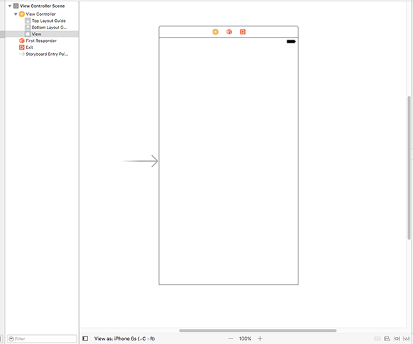

# Concevoir notre interface

Notre application charge correctement toutes les images de tempête, mais elle ne fait rien d’intéressant avec elles - les afficher dans la console de Xcode est utile pour le débogage, mais je peux vous promettre que ça ne ne fera pas une application que tout le monde a envi d'avoir !

Pour résoudre ce problème, notre prochain objectif est de créer une interface graphique affichant la liste des images afin que les utilisateurs puissent en sélectionner une. UIKit - le framework dédié à l'interface utilisateur d'iOS - dispose de nombreux outils intégrés sur lesquels nous allons pouvoir nous appuyer pour créer des applications évoluées qui ont l'apparence et le fonctionnement auxquels les utilisateurs s'attendent.

Pour cette application, le composant principal de notre interface utilisateur s'appelle `UITableViewController`. Il est basé sur `UIViewController` - le type d’écran de base fourni par Apple - mais qui ajoute la possibilité d’afficher des lignes de données qui pouvent défiler et être sélectionnées. `UITableViewController` est visible dans les applications Réglages, Mail, Notes, Santé et bien d’autres encore. Il est puissant, flexible et extrêmement rapide. Il n’est donc pas surprenant qu’il soit utilisé dans de nombreuses applications.

Notre écran `ViewController` existant est basé sur `UIViewController`, mais nous souhaitons qu'il soit plutôt basé sur `UITableViewController`. Il y a très peu de choses à faire pour cela, mais vous allez découvrir une nouvelle partie de Xcode appelée Interface Builder (le constructeur d'interface).

Nous allons passer à Interface Builder dans un instant. Mais tout d’abord, nous devons apporter un changement minime au fichier ViewController.swift. Trouvez cette ligne:

    class ViewController: UIViewController {

C’est la ligne qui dit "crée un nouvel écran appelé `ViewController` et construis-le à partir de `UIViewController`, l'écran de base fourni par Apple". Je souhaite que vous modifiez cette ligne comme suit:

    class ViewController: UITableViewController {

Ce n'est qu'une petite différence, mais elle est importante : cela signifie que "ViewController" hérite désormais des fonctionnalités de "UITableViewController" et non plus de "UIViewController", ce qui nous permet d'accéder librement à de très nombreuses nouvelles fonctionnalités , comme vous allez le voir dans un instant.

En coulisses, `UITableViewController` est toujours basé sur `UIViewController` - c'est ce qu'on appelle une "hiérarchie de classes" et ça constitue un moyen courant de créer rapidement des fonctionnalités.

Nous avons modifié le code de `ViewController` afin qu'il soit basé sur `UITableViewController`, mais nous devons également modifier l'interface utilisateur pour qu'elle corresponde à ce changement. Les interfaces graphiques peuvent entièrement être écrites avec du code si vous le désirez - et de nombreux développeurs le font - mais elles sont généralement créées à l'aide d'un éditeur graphique appelé Interface Builder. Nous devons dire à Interface Builder (généralement appelé "IB") que `ViewController` est un contrôleur de vue sous forme de tableau, de sorte qu'il corresponde à la modification que nous venons d'apporter dans à code.

Jusqu'à présent, nous avons uniquement travaillé dans le fichier ViewController.swift, mais j'aimerais maintenant que vous utilisiez le navigateur de projet (le volet de gauche) pour sélectionner le fichier Main.storyboard. Les storyboards contiennent l'interface utilisateur de votre application et vous permettent de visualiser une partie ou l'intégralité de celle-ci sur un seul écran.

Lorsque vous sélectionnez Main.storyboard, vous passez automatiquement sur Interface Builder et vous devriez voir apparaître l’image ci-dessous :

L'écran blanc correspond à celui qui s'affiche dans le simulateur ou un vrai appareil lorsque l'application est exécutée. Si vous déposez de nouveaux composants dans cet écran, ils seront visibles lors de l'exécution de l'application. Cependant, nous ne voulons pas faire cela - en fait, nous ne voulons pas du tout de cet écran, nous allons donc le supprimer.

Le meilleur moyen d’afficher, de sélectionner, de modifier et de supprimer des éléments dans Interface Builder est d’utiliser document outline (structure du document). Toutefois, il est fort probable qu’elle soit masquée. La première chose à faire est donc de l’afficher. Dans la barre des menus, cliquez sur Editor puis Show Document Outline (afficher la structure du document) - c’est normalement la troisième option en partant du haut. Si vous voyez à la place Hide Document Outline (Masquer la structure du document), cela signifie qu'elle est déjà visible.

La structure du document affiche tous les éléments présents tous les écrans de votre storyboard. Vous devriez déjà voir "View Controller Scene", alors veuillez le sélectionner puis appuyer sur la touche Backspace de votre clavier pour supprimer cet élément.

Au lieu de l'ancien `UIViewController` complètement vide, nous voulons un nouveau `UITableViewController` plus élaboré qui va correspondre aux modifications que nous avons apportées à notre code. Pour en créer un, appuyez sur Cmd + Maj + L pour afficher la bibliothèque d'objets (Object Library). Si vous n'aimez pas les raccourcis clavier, vous pouvez à la place aller dans le menu View et choisir Libraries > Show Library.

La bibliothèque d’objets flotte au-dessus de la fenêtre de Xcode et contient une sélection d'éléments graphiques que vous pouvez faire glisser et réorganiser selon votre envie. Il contient un grand nombre d'éléments, il peut donc être utile de saisir quelques lettres dans le champ de recherche "Objects" pour affiner la sélection.

**Conseil :** Si vous souhaitez que la bibliothèque d'objets reste ouverte après avoir fait glisser quelque chose, appuyez sur les touches Alt + Cmd + Maj + L pour créer une fenêtre amovible et redimensionnable quand elle apparaît à l'écran.

Pour le moment, l'élément que nous voulons s'appelle Table View Controller (Contrôleur de vue de type tableau). Si vous tapez "table" dans le champ de recherche, vous verrez Table View Controller, Table View et Table View Cell. Ce sont tous des éléments différents, alors assurez-vous de choisir Table View Controller - son icône est identifiable par son fond jaune.

Cliquez sur Table View Controller, puis faites-le glisser dans le grand espace où se trouvait le contrôleur de vue précédent. Lorsque vous lâchez le contrôleur de vue dans l'espace vide du storyboard, il se transforme en un écran qui ressemble à ce qui suit :

## Touches finales pour l'interface utilisateur

Avant d'en avoir fini avec Interface Builder, nous devons faire quelques petits changements.

Premièrement, nous devons dire à Xcode que le Table View Controller du storyboard est le même que celui que nous avons dans le code du fichier ViewController.swift. Pour ce faire, appuyez sur Alt + Cmd + 3 pour activer Identity Inspector ou, dans la barre des menus, allez dans View > Inspectors > Show Identity Inspector. Recherchez tout en haut la liste déroulante nommée "Class". "UITableViewController" est sélectionné par défaut et est écrit en gris clair. Sélectionnez "ViewController" en cliquant sur la flèche du menu déroulant.

Deuxièmement, nous devons dire à Xcode que ce Table View Controller est celui qui doit être affiché en premier lorsque l'application est exécutée. Pour ce faire, appuyez sur Alt + Cmd + 4 pour activer Attributes Inspector ou, dans la barre des menus, sélectionnez View > Inspectors > Show Attributes Inspector. Recherchez la case à cocher “Is Initial View Controller” et assurez-vous qu'elle est cochée.

Troisièmement, je veux que vous utilisiez le volet affichant la structure du document (Document Outline) pour regarder à l'intérieur de notre nouveau Table View Controller. À l'intérieur, vous devriez voir qu'il contient l'élément "Table View", qui à son tour contient "Table View Cell". Une cellule est chargée d’afficher une ligne de données dans un tableau et nous allons afficher le nom d'une image dans chaque cellule.

Veuillez sélectionner "Table Vie Cell" puis, dans Attributes Inspector, entrez le texte "Picture" dans la zone de texte marquée Identifier. Pendant que vous y êtes, changez l'option Custom du menu déroulant Style situé juste au dessus en Basic.

Enfin, nous allons placer le Table View Controller dans un autre controller. Il s'agit de quelque chose que nous n’avons pas besoin de configurer et dont nous n'avons pas à nous inquiéter, mais c’est un élément d’interface utilisateur que nous rencontrons fréquemment sur iOS et je pense que vous allez le reconnaître immédiatement. C'est ce qu'on appelle un Navigation Controller (contrôleur de navigation) et vous pouvez le voir en action dans les applications Réglages et Mail. C'est lui qui fournit la fine barre grise en haut de l'écran et est responsable de l'animation qui fait glisser l'écran de droite à gauche qui se produit lorsque vous vous déplacez entre plusieurs écrans sur iOS.

Pour placer notre Table View Controller dans un Navigation Controller, il nous suffit d'accéder au menu Editor et de choisir Embed In > Navigation Controller. Interface Builder va déplacer votre contrôleur de vue existant vers la droite et ajouter un Navigation Controller juste à côté - vous devriez maintenant voir une barre grise au-dessus de la Table View. Il déplacera également la propriété "Is Initial View Controller" sur le Navigation Controller.

À ce stade, vous en avez assez fait pour jeter un oeil sur les résultats de votre travail : appuyez maintenant sur le bouton Play de Xcode ou appuyez sur les touches Cmd + R si vous voulez vous sentir un peu élite. Une fois que votre code s'exécute, vous verrez maintenant l'écran blanc tout vide remplacé par une vue avec une Table View vide. Si vous cliquez et faites glisser votre souris, vous verrez apparaître des bares de défilement et des rebonds comme on peut s'y attendre, même si de toute évidence il n’y a pas encore de données. Vous devriez également voir une barre de navigation grise en haut ; ça sera important pour plus tard.

## Showing lots of rows

The next step is to make the table view show some data. Specifically, we want it to show the list of “nssl” pictures, one per row. Apple’s `UITableViewController` data type provides default behaviors for a lot of things, but by default it says there are zero rows.

Our `ViewController` screen builds on `UITableViewController` and gets to override the default behavior of Apple’s table view to provide customization where needed. You only need to override the bits you want; the default values are all sensible.

To make the table show our rows, we need to override two behaviors: how many rows should be shown, and what each row should contain. This is done by writing two specially named methods, but when you’re new to Swift they might look a little strange at first. To make sure everyone can follow along, I’m going to take this slowly – this is the very first project, after all!

Let’s start with the method that sets how many rows should appear in the table. Add this code just after the *end* of `viewDidLoad()` – if you start typing “numberof” then you can use Xcode’s code completion to do most of the work for you:

    override func tableView(_ tableView: UITableView, numberOfRowsInSection section: Int) -> Int {
        return pictures.count
    }

Note: that needs to be *after* the *end* of `viewDidLoad()`, which means after its closing brace.

That method contains the word “table view” three times, which is deeply confusing at first, so let’s break down what it means.

-   The `override` keyword means the method has been defined already, and we want to override the existing behavior with this new behavior. If you didn't override it, then the previously defined method would execute, and in this instance it would say there are no rows.
-   The `func` keyword starts a new function or a new method; Swift uses the same keyword for both. Technically speaking a method is a function that appears inside a class, just like our `ViewController`, but otherwise there’s no difference.
-   The method’s name comes next: `tableView`. That doesn't sound very useful, but the way Apple defines methods is to ensure that the information that gets passed into them – the parameters – are named usefully, and in this case the very first thing that gets passed in is the table view that triggered the code. A table view, as you might have gathered, is the scrolling thing that will contain all our image names, and is a core component in iOS.
-   As promised, the next thing to come is `tableView: UITableView`, which is the table view that triggered the code. But this contains two pieces of information at once: `tableView` is the name that we can use to reference the table view inside the method, and `UITableView` is the data type – the bit that describes what it is.
-   The most important part of the method comes next: `numberOfRowsInSection section: Int`. This describes what the method actually does. We know it involves a table view because that's the name of the method, but the `numberOfRowsInSection` part is the actual action: this code will be triggered when iOS wants to know how many rows are in the table view. The `section` part is there because table views can be split into sections, like the way the Contacts app separates names by first letter. We only have one section, so we can ignore this number. The `Int` part means “this will be an integer,” which means a whole number like 3, 30, or 35678 number.”
-   Finally, `-> Int` means “this method must return an integer”, which ought to be the number of rows to show in the table.

There was one more thing I missed out, and I missed it out for a reason: it’s a bit confusing at this point in your Swift career. Did you notice that `_` in there? That’s an underscore. It changes the way the method is called. To illustrate this, here’s a very simple function:

    func doStuff(thing: String) {
        // do stuff with "thing"
    }

It’s empty, because its contents don’t matter. Instead, let’s focus on how it’s called. Right now, it’s called like this:

    doStuff(thing: "Hello")

You need to write the name of the `thing` parameter when you call the `doStuff()` function. This is a feature of Swift, and helps make your code easier to read. Sometimes, though, it doesn’t really make sense to have a name for the first parameter, usually because it’s built into the method name.

When that happens, you use the underscore character like this:

    func doStuff(_ thing: String) {
        // do stuff with "thing"
    }

That means “when I call this function I don’t want to write `thing`, but inside the function I want to use `thing` to refer to the value that was passed in.

This is what’s happening with our table view method. The method is called `tableView()` because its first parameter is the table view that you’re working with. It wouldn’t make much sense to write `tableView(tableView: someTableView)`, so using the underscore means you would write `tableView(someTableView)` instead.

I'm not going to pretend it's easy to understand how Swift methods look and work, but the best thing to do is not worry too much if you don't understand right now because after a few hours of coding they will be second nature.

At the very least you do need to know that these methods are referred to using their name (`tableView`) and any named parameters. Parameters without names are just referenced as underscores: `_`. So, to give it its full name, the method you just wrote is referred to as `tableView(_:numberOfRowsInSection:)` – clumsy, I know, which is why most people usually just talk about the important bit, for example, "in the `numberOfRowsInSection` method."

We wrote only one line of code in the method, which was `return pictures.count`. That means “send back the number of pictures in our array,” so we’re asking that there be as many table rows as there are pictures.

## Dequeuing cells

That’s the first of two methods we need to write to complete this stage of the app. The second is to specify what each row should look like, and it follows a similar naming convention to the previous method. Add this code now:

    override func tableView(_ tableView: UITableView, cellForRowAt indexPath: IndexPath) -> UITableViewCell {
        let cell = tableView.dequeueReusableCell(withIdentifier: "Picture", for: indexPath)
        cell.textLabel?.text = pictures[indexPath.row]
        return cell
    }

Let’s break it down into parts again, so you can see exactly how it works.

First, `override func tableView(_ tableView: UITableView` is identical to the previous method: the method name is just `tableView()`, and it will pass in a table view as its first parameter. The `_` means it doesn’t need to have a name sent externally, because it’s the same as the method name.

Second, `cellForRowAt indexPath: IndexPath` is the important part of the method name. The method is called `cellForRowAt`, and will be called when you need to provide a row. The row to show is specified in the parameter: `indexPath`, which is of type `IndexPath`. This is a data type that contains both a section number and a row number. We only have one section, so we can ignore that and just use the row number.

Third, `-> UITableViewCell` means this method must return a table view cell. If you remember, we created one inside Interface Builder and gave it the identifier “Picture”, so we want to use that.

Here’s where a little bit of iOS magic comes in: if you look at the Settings app, you’ll see it can fit only about 12 rows on the screen at any given time, depending on the size of your phone.

To save CPU time and RAM, iOS only creates as many rows as it needs to work. When one rows moves off the top of the screen, iOS will take it away and put it into a reuse queue ready to be recycled into a new row that comes in from the bottom. This means you can scroll through hundreds of rows a second, and iOS can behave lazily and avoid creating any new table view cells – it just recycles the existing ones.

This functionality is baked right into iOS, and it’s exactly what our code does on this line:

    let cell = tableView.dequeueReusableCell(withIdentifier: "Picture", for: indexPath)

That creates a new constant called `cell` by dequeuing a recycled cell from the table. We have to give it the identifier of the cell type we want to recycle, so we enter the same name we gave Interface Builder: “Picture”. We also pass along the index path that was requested; this gets used internally by the table view.

That will return to us a table view cell we can work with to display information. You can create your own custom table view cell designs if you want to (more on that much later!), but we’re using the built-in Basic style that has a text label. That’s where line two comes in: it gives the text label of the cell the same text as a picture in our array. Here’s the code again:

    cell.textLabel?.text = pictures[indexPath.row]

The `cell` has a property called `textLabel`, but it’s optional: there might be a text label, or there might not be – if you had designed your own, for example. Rather than write checks to see if there is a text label or not, Swift lets us use a question mark – `textLabel?` – to mean “do this only if there is an actual text label there, or do nothing otherwise.”

We want to set the label text to be the name of the correct picture from our `pictures` array, and that’s exactly what the code does. `indexPath.row` will contain the row number we’re being asked to load, so we’re going to use that to read the corresponding picture from `pictures`, and place it into the cell’s text label.

The last line in the method is `return cell`. Remember, this method expects a table view cell to be returned, so we need to send back the one we created – that’s what the `return cell` does.

With those two pretty small methods in place, you can run your code again now and see how it looks. All being well you should now see 10 table view cells, each one with a different picture name inside. If you click on one of them it will turn gray, but nothing else will happen. Let’s fix that now…
