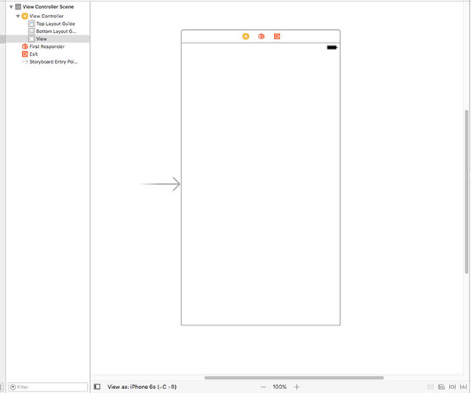
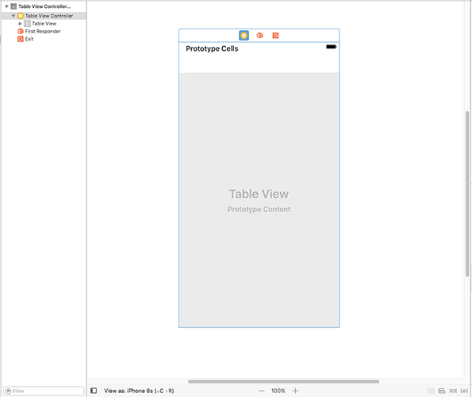

# Concevoir notre interface

<!-- YOUTUBE: 0hMgOfF8tyQ -->

Notre application charge correctement toutes les images de tempête, mais elle ne fait rien d’intéressant avec elles - afficher leur nom dans la console de Xcode est utile pour le débogage, mais je peux vous promettre que ça ne fera pas une application que tout le monde a envi d'avoir !

Pour résoudre ce problème, notre prochain objectif est de créer une interface graphique affichant la liste des images afin que les utilisateurs puissent en sélectionner une. UIKit - le framework dédié à l'interface utilisateur d'iOS - dispose de nombreux outils intégrés sur lesquels nous allons pouvoir nous appuyer pour créer des applications évoluées qui ont l'apparence et le fonctionnement auxquels les utilisateurs s'attendent.

Pour cette application, le composant principal de notre interface utilisateur s'appelle `UITableViewController`. Il est basé sur `UIViewController` - le type d’écran de base fourni par Apple - mais il ajoute la possibilité d’afficher des données sous forme de tableau, de les faire défiler et de les sélectionner. `UITableViewController` est visible dans les applications Réglages, Mail, Notes, Santé et bien d’autres encore. Il est puissant, flexible et extrêmement rapide. Il n’est donc pas surprenant qu’il soit utilisé dans de nombreuses applications.

Notre écran `ViewController` existant est basé sur `UIViewController`, mais nous souhaitons qu'il soit à la place basé sur `UITableViewController`. Il y a très peu de choses à faire pour cela, mais vous allez découvrir une nouvelle partie de Xcode appelée Interface Builder (le constructeur d'interface).

Nous allons passer à Interface Builder dans un instant. Mais tout d’abord, nous devons apporter un changement minime au fichier ViewController.swift. Trouvez cette ligne :

    class ViewController: UIViewController {

C’est la ligne qui dit "crée un nouvel écran appelé `ViewController` et construis-le à partir de `UIViewController`, l'écran de base fourni par Apple". Je souhaite que vous modifiez cette ligne comme suit :

    class ViewController: UITableViewController {

Ce n'est qu'une petite différence, mais elle est importante : cela signifie que `ViewController` hérite désormais des fonctionnalités de `UITableViewController` et non plus de `UIViewController`, ce qui nous permet d'accéder librement à de très nombreuses fonctionnalités, comme vous allez le voir dans un instant.

En coulisse, `UITableViewController` est toujours basé sur `UIViewController` - c'est ce qu'on appelle une "hiérarchie de classes" et ça constitue un moyen courant de créer rapidement des fonctionnalités.

Nous avons modifié le code de `ViewController` afin qu'il hérite de `UITableViewController`, mais nous devons également modifier l'interface utilisateur pour qu'elle corresponde à ce changement. Les interfaces utilisateur peuvent entièrement être écrites avec du code si vous le désirez - et de nombreux développeurs le font - mais elles sont généralement créées à l'aide d'un éditeur graphique appelé Interface Builder. Nous devons dire à Interface Builder (généralement appelé "IB") que `ViewController` est un contrôleur de vue sous forme de tableau (UITableViewController), de sorte qu'il corresponde à la modification que nous venons d'apporter dans le code.

Jusqu'à présent, nous avons uniquement travaillé dans le fichier ViewController.swift, mais j'aimerais maintenant que vous utilisiez le navigateur de projet (le volet de gauche) pour sélectionner le fichier Main.storyboard. Les storyboards contiennent l'interface utilisateur de votre application et vous permettent de visualiser une partie ou l'intégralité de celle-ci sur un seul écran.

Lorsque vous sélectionnez Main.storyboard, vous passez automatiquement sur Interface Builder et vous devriez voir apparaître l’image ci-dessous :

Cet écran blanc correspond à celui qui s'affiche l'application est exécutée. Si vous déposez de nouveaux composants dans cet espace, ils seront visibles lors de l'exécution de l'application. Cependant, nous ne voulons pas faire cela - en fait, nous ne voulons pas du tout de cet écran, nous allons donc le supprimer.

Le meilleur moyen d’afficher, de sélectionner, de modifier et de supprimer des éléments dans Interface Builder est d’utiliser le volet document outline (structure du document). Toutefois, il est fort probable qu’il soit masqué. La première chose à faire est donc de l’afficher. Dans la barre des menus, cliquez sur Editor puis Show Document Outline (afficher la structure du document) - c’est normalement la troisième option en partant du haut. Si vous voyez à la place Hide Document Outline (Masquer la structure du document), cela signifie que le volet est déjà affiché à l'écran.

La structure du document affiche tous les éléments présents dans tous les écrans de votre storyboard. Vous devriez déjà voir "View Controller Scene", alors veuillez le sélectionner puis appuyer sur la touche retour arrière (Backspace) de votre clavier pour supprimer cet élément.

Au lieu de l'ancien `UIViewController` complètement vide, nous voulons un nouveau `UITableViewController` plus élaboré qui va correspondre aux modifications que nous avons apportées à notre code. Pour en créer un, appuyez sur Cmd + Maj + L pour afficher la bibliothèque d'objets (Object Library). Si vous n'aimez pas les raccourcis clavier, vous pouvez à la place aller dans le menu View et choisir Libraries > Show Library.

La bibliothèque d’objets flotte au-dessus de la fenêtre de Xcode et contient une sélection d'éléments graphiques que vous pouvez faire glisser et réorganiser selon votre envie. Elle contient un grand nombre d'éléments, il peut donc être utile de saisir quelques lettres dans le champ de recherche "Objects" pour affiner la sélection.

**Astuce :** Si vous souhaitez que la bibliothèque d'objets reste ouverte après avoir fait glisser un élement, appuyez sur les touches Alt + Cmd + Maj + L pour créer une fenêtre qui peut être déplacée et redimensionnée quand elle apparaît à l'écran.

Pour le moment, l'élément que nous souhaitons ajouter à notre storyboard s'appelle Table View Controller (Contrôleur de vue de type tableau). Si vous tapez "table" dans le champ de recherche, vous verrez Table View Controller, Table View et Table View Cell. Ce sont tous des éléments différents, alors assurez-vous de choisir Table View Controller - son icône est identifiable par son fond jaune.

Cliquez sur Table View Controller, puis faites-le glisser dans le grand espace où se trouvait le contrôleur de vue précédent. Lorsque vous lâchez le contrôleur de vue dans l'espace vide du storyboard, il se transforme en un écran qui ressemble à ce qui suit :

## Touches finales de l'interface utilisateur

Avant d'en avoir fini avec Interface Builder, nous devons faire quelques petits changements.

Premièrement, nous devons dire à Xcode que le Table View Controller du storyboard est le même que celui que nous avons dans le code du fichier ViewController.swift. Pour ce faire, appuyez sur Alt + Cmd + 3 pour activer l'identity inspector (inspecteur d'identité) ou, dans la barre des menus, allez dans View > Inspectors > Show Identity Inspector. Recherchez tout en haut la liste déroulante nommée "Class". "UITableViewController" est sélectionné par défaut et est écrit en gris clair. Sélectionnez "ViewController" en cliquant sur la flèche du menu déroulant.

Deuxièmement, nous devons dire à Xcode que ce Table View Controller est celui qui devrait être affiché en premier lorsque l'application est exécutée. Pour ce faire, appuyez sur Alt + Cmd + 4 pour activer l'attributes inspector (inspecteur de propriétés) ou, dans la barre des menus, sélectionnez View > Inspectors > Show Attributes Inspector. Recherchez la case à cocher “Is Initial View Controller” et assurez-vous qu'elle est cochée.

Troisièmement, je veux que vous utilisiez le volet affichant la structure du document (Document Outline) pour regarder à l'intérieur de notre nouveau Table View Controller. Vous devriez voir qu'il contient l'élément "Table View" (vue affichant un tableau), qui à son tour contient "Table View Cell" (une cellule). Une cellule est chargée d’afficher une ligne de données dans un tableau et nous allons afficher le nom d'une image dans chaque cellule.

Veuillez sélectionner "Table View Cell" puis, dans l'inspecteur de propriétés (Attributes Inspector), entrez le texte "Picture" dans la zone de texte marquée Identifier (Identifiant). Pendant que vous y êtes, changez l'option Custom (Personnalisé) du menu déroulant Style situé juste au-dessus en Basic (Basique).

Enfin, nous allons placer le Table View Controller dans un autre contrôleur de vue que nous n’avons pas besoin de configurer et dont nous n'avons pas à nous inquiéter, mais c’est un élément d’interface utilisateur que nous rencontrons fréquemment dans iOS et je pense que vous allez le reconnaître immédiatement. C'est ce qu'on appelle un Navigation Controller (contrôleur de navigation) et vous pouvez le voir en action dans les applications Réglages et Mail. C'est lui qui fournit la fine barre grise en haut de l'écran et qui est responsable de l'animation qui fait glisser l'écran de droite à gauche lorsque vous vous déplacez dans les différents écrans sur iOS.

Pour placer notre Table View Controller dans un Navigation Controller, il nous suffit d'accéder au menu Editor et de choisir Embed In > Navigation Controller. Interface Builder va déplacer le contrôleur de vue existant vers la droite et ajouter un Navigation Controller juste à côté - vous devriez maintenant voir une barre grise au-dessus de la Table View. Il déplacera également la propriété "Is Initial View Controller" sur le Navigation Controller.

À ce stade, vous en avez assez fait pour vouloir jeter un coup d'oeil sur les résultats de votre travail : appuyez maintenant sur le bouton Play de Xcode ou appuyez sur les touches Cmd + R si vous voulez passer pour un pro. Une fois que votre code s'exécute, vous voyez maintenant, à la place de l'écran tout blanc et vide, un tableau vide. Si vous cliquez et faites glisser votre souris, vous voyez qu'il défile et rebondit comme vous pouvez vous y attendre, même si de toute évidence il n’y a pas encore de données. Vous devriez également voir une barre de navigation grise en haut ; ça sera important plus tard.

## Afficher beaucoup de lignes

L'étape suivante consiste à faire apparaître des données dans notre tableau. Plus précisément, nous souhaitons qu’il affiche la liste des images "nssl" - un nom d'image par ligne. Le type de données `UITableViewController` fourni par Apple propose des comportements par défaut pour beaucoup de choses, mais il indique qu'il n'y a aucune ligne dans le tableau.

Notre écran `ViewController` hérite de `UITableViewController` et permet d'outre passer le comportement par défaut de la Table View fournie par Apple et ainsi la personnaliser quand cela est nécessaire. Vous avez seulement besoin de remplacer les morceaux de codes que vous souhaitez.

Pour que le tableau affiche nos lignes, nous devons redéfinir deux comportements : le nombre de lignes à afficher et le contenu de chacune d'elles. Cela se fait en écrivant deux méthodes portant un nom bien spécifique, mais quand vous êtes nouveau en Swift, elles peuvent paraître un peu étranges la première fois que vous les voyez. Pour que tout le monde puisse suivre, je vais y aller doucement - ce n’est que le tout premier projet après tout !

Commençons par la méthode qui définit le nombre de lignes devant apparaître dans le tableau. Ajoutez ce code juste après la *fin* de la méthode `viewDidLoad()` - si vous commencez à taper "numberof", vous pouvez alors utiliser la complétion automatique de code de Xcode pour effectuer la majeure partie du travail à votre place :

    override func tableView(_ tableView: UITableView, numberOfRowsInSection section: Int) -> Int {
        return pictures.count
    }

Note : cette méthode doit se trouver *après* la *fin* de la méthode `viewDidLoad()`, ce qui signifie après son accolade fermante.

Cette méthode contient trois fois le mot "tableViev", ce qui est plutôt déroutant au début, alors détaillons ce que cela signifie :

-   Le mot clé `override` signifie que la méthode a déjà été définie et que nous voulons modifier le comportement existant par un nouveau. Si vous ne la modifiez pas, la méthode par défaut sera exécutée et dans ce cas, il sera indiqué qu'il n'y a pas de lignes.
-   Le mot clé `func` indique le début d'une nouvelle fonction ou d'une nouvelle méthode ; Swift utilise le même mot clé pour les deux. Techniquement, une méthode est une fonction qui apparaît à l'intérieur d'une classe, tout comme notre `ViewController`, mais sinon il n’y a pas de différences.
-   Le nom de la méthode vient ensuite: `tableView`. Cela ne semble pas très utile, mais la façon dont Apple définit le nom de ses méthodes a pour but de garantir que les informations qui leur sont transmises - les paramètres - sont nommés de manière cohérente. Dans ce cas, la première chose qui est transmise est la Table View qui a déclenché le code. Comme vous l'avez peut-être compris, une Table View correspond à un tableau, celui qui va contenir tous les noms de nos images dans notre projet et dont nous pourrons faire défiler le contenu, et qui constitue un composant essentiel d'iOS.
-   Comme promis, l'étape suivante est `tableView: UITableView`, qui est la Table View qui a déclenché le code. Nous observons que ce paramètre contient deux informations à la fois : `tableView` qui est le nom que nous pouvons utiliser pour référencer le tableau dans la méthode, et `UITableView` qui correspond à son type de données - qui décrit ce que c'est.
-   Vient ensuite la partie la plus importante de la méthode : `numberOfRowsInSection section: Int`. Ceci décrit ce que fait réellement la méthode. Nous savons qu'elle inclut une Table View car c'est le nom de la méthode, mais la partie `numberOfRowsInSection` est l'action réelle : ce code sera déclenché lorsqu'iOS voudra savoir combien de lignes se trouvent dans le tableau. La partie `section` est présente car les tableaux peuvent être divisés en sections, comme l'application Contacts qui sépare les noms par leur première lettre. Nous n’avons qu’une section, donc nous pouvons ignorer ce paramètre. La partie "Int" précise que "ce paramètre doit être un entier", ce qui signifie un nombre entier comme 3, 30 ou 35678.
-   Enfin, `-> Int` signifie que “cette méthode doit retourner un entier”, qui devrait être le nombre de lignes à afficher dans le tableau.

Il me manque encore une chose à vous expliquer : c’est un peu déroutant à ce stade de votre parcours en Swift. Avez-vous remarqué le `_` ? C’est le signe underscore. J'espère que vous vous souvenez que cela signifie que le premier paramètre n'est pas transmis à l'aide d'un nom. Il s'agit d'un vestige d'Objective-C, où le nom du premier paramètre était généralement intégré directement dans le nom de la méthode.

Dans notre cas, la méthode s'appelle `tableView()` car son premier paramètre est la Table View avec laquelle vous travaillez. Cela n’aurait pas beaucoup de sens d’écrire `tableView(tableView: someTableView)`, aussi utiliser un underscore signifie que l'on peut plutôt écrire `tableView(someTableView)`.

Je ne vais pas prétendre que c'est facile de comprendre comment sont nommées et comment fonctionnent les méthodes en Swift, mais la meilleure chose à faire est de ne pas trop vous inquiéter si vous n'avez pas compris pour le moment, car après quelques heures passées à écrire du code, ça deviendra naturel.

Au minimum, vous devez savoir que ces méthodes sont identifiées par leur nom (`tableView`) et les noms de leur(s) paramètre(s). Les paramètres sans nom sont simplement déclarés avec un underscore : `_`. Donc, pour lui donner son nom complet, la méthode que vous venez d'écrire s'appelle `tableView (_: numberOfRowsInSection:)` - pas facile à lire je sais, c'est pourquoi la plupart des gens ne parlent habituellement que de la partie importante, par exemple "la méthode `numberOfRowsInSection`."

Nous n'avons écrit qu'une seule ligne de code dans la méthode, qui était `return pictures.count`. Cela signifie "retourne le nombre de noms d'images contenus dans notre tableau `pictures`", nous demandons donc que notre tableau retourne autant de lignes qu'il y a de photos.

## File d'attente de cellules

Nous avons déjà écrit la première des deux méthodes pour compléter cette étape de l'application. La seconde consiste à spécifier à quoi doit ressembler chaque ligne. Elle suit une convention d'appellation similaire à celle de la méthode précédente. Ajoutez ce code maintenant :

    override func tableView(_ tableView: UITableView, cellForRowAt indexPath: IndexPath) -> UITableViewCell {
        let cell = tableView.dequeueReusableCell(withIdentifier: "Picture", for: indexPath)
        cell.textLabel?.text = pictures[indexPath.row]
        return cell
    }

Décomposons-le de nouveau en plusieurs parties pour que vous puissiez voir exactement comment cela fonctionne :

Premièrement, `override func tableView(_ tableView: UITableView` est identique à la méthode précédente : le nom de la méthode est simplement `tableView()`, et il passera une Table View comme premier paramètre. Le `_` signifie qu’il n’est pas nécessaire de spécifier le nom du paramètre en externe, car il correspond au nom de la méthode.

Deuxièmement, `cellForRowAt indexPath: IndexPath` est la partie importante du nom de la méthode. Celle-ci s'appelle `cellForRowAt` et sera appelée lorsque vous aurez besoin de fournir une ligne. La ligne à afficher est spécifiée dans le paramètre: `indexPath`, qui est de type `IndexPath`. Ce type de données contient à la fois un numéro de section et un numéro de ligne. Nous n'avons qu'une seule section, nous pouvons donc l'ignorer et utiliser simplement le numéro de ligne.

Et troisièmement, `-> UITableViewCell` signifie que cette méthode doit retourner une Table View Cell (une cellule). Si vous vous rappelez, nous en avons créé une dans Interface Builder et lui avons donné l'identifiant “Picture”. Nous souhaitons donc l'utiliser.

Voici un petit peu de magie d'iOS : si vous regardez l’application Réglages, vous verrez qu’elle ne peut contenir qu’une douzaine de lignes à l’écran, à tout moment, en fonction de la taille de votre téléphone.

Pour économiser du processeur (CPU) et de la mémoire vive (RAM), iOS ne crée que le nombre de lignes dont il a besoin pour fonctionner. Lorsqu'une ligne se déplace en haut de l'écran, iOS l'enlève et la place dans une file d'attente, prête à être recyclée dans une nouvelle ligne qui entre par le bas. Cela signifie que vous pouvez faire défiler des centaines de lignes à la seconde et qu'iOS peut se comporter "paresseusement" et éviter de créer de nouvelles cellules dans sa Table View - il suffit de recycler les cellules existantes.

Cette fonctionnalité est intégrée à iOS et c’est exactement ce que notre code fait à ligne suivante :

    let cell = tableView.dequeueReusableCell(withIdentifier: "Picture", for: indexPath)

Cela crée une nouvelle constante appelée `cell` en supprimant de la file d'attente une cellule recyclée pour notre tableau. Nous devons lui donner l'identifiant du type de cellule que nous voulons recycler, nous entrons donc le même nom que celui que nous avons donné dans Interface Builder : “Picture”. Nous transmettons également l'indexPath demandé ; cela est utilisé en interne par la Table View.

Cela nous renverra une Table View Cell (cellule) avec laquelle nous pouvons travailler pour afficher des informations. Vous pouvez concevoir vos propres cellules personnalisées si vous le souhaitez (nous en parlerons beaucoup plus tard !), mais nous utilisons le style Basic intégré qui comporte un text label (un label contenant du texte). C’est là que la deuxième ligne intervient : elle donne au label de la cellule le nom d'une image contenu dans "pictures". Voici à nouveau le code :

    cell.textLabel?.text = pictures[indexPath.row]

Ici, `cell` a une propriété appelée `textLabel`, mais elle est facultative : il peut y avoir un label, ou pas (notamment si vous aviez conçu votre propre cellule personnalisée). Plutôt que d’écrire des vérifications pour savoir s’il existe ou non un label, Swift nous laisse utiliser un point d’interrogation - `textLabel?` - pour signifier “fais le uniquement s’il existe un label, sinon ne fais rien.”

Nous voulons que le label corresponde au nom de la bonne image de notre tableau `pictures`, et c’est exactement ce que fait le code. `indexPath.row` contiendra le numéro de la ligne à charger, nous allons donc l'utiliser pour lire le nom de l'image correspondante dans `pictures` et le placer dans le label de la cellule.

La dernière ligne de la méthode est `return cell`. Rappelez-vous, cette méthode s'attend à ce qu'une Table View Cell soit retournée. Nous devons donc renvoyer celle que nous avons créée.

Avec ces deux petites méthodes en place, vous pouvez exécuter à nouveau votre code et voir à quoi il ressemble. Si tout va bien, vous devriez désormais voir 10 cellules, chacune avec un nom d’image différent. Si vous cliquez sur l'un d'eux, la cellule deviendra grise, mais il ne se passera rien d'autre. Réglons ça maintenant !
