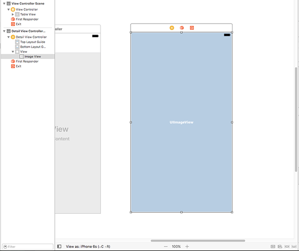
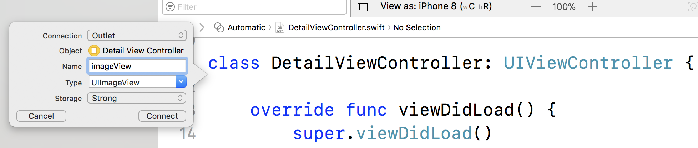

# Concevoir un écran affichant une image

<!-- YOUTUBE: paMpdmJcpRg -->

À ce stade de notre application, nous avons une liste d'images pour en choisir une, mais bien que nous puissions appuyer sur leur nom, il ne se passe rien. Notre prochain objectif est de concevoir un nouvel écran qui apparaîtra lorsque l'utilisateur appuie sur une ligne. Nous allons lui faire afficher en plein écran la photo sélectionnée, qui apparaîtra en glissant automatiquement lorsqu'on tappe sur le nom de l'image.

Cette tâche peut être divisée en deux tâches plus petites. Premièrement, nous devons créer du nouveau code qui sera responsable de cet écran. Deuxièmement, nous devons dessiner l'interface utilisateur de cet écran dans Interface Builder.

Commençons par la partie facile : créer le nouveau code respondable de l’écran affichant l'image. Dans la barre de menus, cliquez sur File puis New > File. Une fenêtre contenant de nombreuses options apparaît. Dans cette liste, choisissez iOS > Cocoa Touch Class, puis cliquez sur Next.

Vous serez invité à donner un nom au nouvel écran et à indiquer à iOS de quoi il doit hériter. Veuillez entrer "DetailViewController" pour son nom dans le champ "Class" et "UIViewController" pour "Subclass of" (Sous-classe de). Assurez-vous que "Also create XIB file" (Créer également un fichier XIB) n'est pas coché, puis cliquez sur Next et Create pour ajouter le nouveau fichier.

Voilà, le premier travail est effectué - nous avons un nouveau fichier qui contiendra du code pour l’écran affichant l'image.

La deuxième tâche demande un peu plus de réflexion. Retournez dans Main.storyboard, et vous verrez nos deux contrôleurs de vue existants : le Navigation View Controller à gauche et le Table View Controller à droite. Nous allons maintenant ajouter un nouveau contrôleur de vue, un nouvel écran, qui sera notre écran chargé d'afficher l'image.

Tout d’abord, ouvrez la bibliothèque d’objets et recherchez "View Controller". Faites-le glisser dans l'espace situé à droite de vos contrôleurs de vue existants. Vous pouvez le placer n’importe où, mais c’est mieux d’organiser vos écrans pour qu’ils se suivent logiquement de gauche à droite.

Maintenant, si vous regardez dans le volet Document Outline, vous voyez apparaître une deuxième scène : "View Controller Scene", il y en a donc une pour la vue contenant le tableau avec le nom des images et une autre pour la vue qui affichera l'image. Si vous ne savez à quel contrôleur de vue chacune d'elles correspond, cliquez simplement sur le nouvel écran - dans le grand espace vide blanc qui vient d'être créé - et il devrait sélectionner la bonne scène dans le volet Document Outline.

Lorsque nous avons précédemment créé notre cellule, nous lui avons attribué un identifiant afin de pouvoir l'utiliser dans le code. Nous devons faire la même chose pour ce nouvel écran. Lorsque vous l'avez sélectionné il y a quelques instants, il a dû mettre en surbrillance "View" dans le volet Document Outline. Au-dessus se trouve "View Controller" avec une icône jaune à côté de celui-ci - veuillez cliquer maintenant dessus pour sélectionner le contrôleur de vue complet.

Pour donner un nom à ce contrôleur de vue, accédez à l'onglet Identity Inspector dans le volet de droite en appuyant sur Cmd + Alt + 3 ou en utilisant le menu. Maintenant, entrez "Detail" dans le champ "Storyboard ID". C’est tout, nous pouvons maintenant appeler ce contrôleur de vue "Detail" dans le code. Tant que vous y êtes, cliquez sur la flèche de la liste déroulante de Class, puis sélectionnez "DetailViewController" pour que notre interface utilisateur soit connectée au nouveau code créé précédemment.

Passons maintenant à la partie intéressante : nous voulons que cet écran affiche l’image sélectionnée par l’utilisateur, belle et grande, nous devons donc utiliser un nouveau composant d’interface utilisateur appelé `UIImageView`. Comme vous pouvez le voir à partir du nom, celui-ci fait partie de UIKit (d'où le "UI"), et est chargé de l'affichage des images - parfait !

Regardez dans la bibliothèque d'objets pour trouver Image View ; vous trouverez peut-être qu'il est plus facile de réutiliser le champ de recherche. Cliquez et faites glisser le composant Image View de la bibliothèque d'objets sur l'écran chargé d'afficher l'image, puis relâchez-le. Maintenant, faites glisser ses bords pour qu'il remplisse tout l'écran.

Cet Image View n'a pas de contenu pour le moment, il est donc rempli d'un fond bleu pâle et du mot `UIImageView`. Nous ne lui attribuerons aucun contenu pour le moment, car c’est quelque chose que nous ferons lors de l’exécution du programme. Au lieu de cela, nous devons lui indiquer comment se dimensionner tout seul dans notre écran, qu'il s'agisse d'un iPhone ou d'un iPad.

Cela peut sembler étrange au début, après tout vous venez de le positionner et le redimensionner pour qu'il remplisse entièrement l'écran, et il a la même taille que le contrôleur de vue, donc ça devrait être suffisant, non ? Et bien pas tout à fait. Pensez-y : votre application peut être exécutée sur de nombreux appareils fonctionnant sous iOS, tous de tailles différentes. Comment l’image doit-elle réagir lorsqu’elle est affichée sur un iPhone 6 Plus ou même sur un iPad ?

iOS a une réponse pour cela. Et c'est une réponse brillante qui, à bien des égards, fonctionne comme par magie pour faire ce que vous voulez. Elle s'appelle Auto Layout (mise en page automatique) : elle vous permet de définir des règles pour la mise en page de vos vues et garantit automatiquement que ces règles sont respectées.

Mais - et c'est un gros mais ! - il y a deux règles que vous devez toutes les deux respecter :

- Vos règles de mise en page doivent être complètes. Autrement dit, vous ne pouvez pas spécifier uniquement une position X pour quelque chose, vous devez également spécifier une position Y. Si cela fait longtemps que vous n'êtes pas allé à l'école, "X" est la position à partir du bord gauche de l'écran et "Y" la position à partir du haut de l'écran.
- Vos règles de mise en page ne doivent pas rentrer en conflit. En d'autres termes, vous ne pouvez pas spécifier qu'une vue doit se situer à 10 points du bord gauche, 10 points du bord droit et faire 1 000 points de large. L'écran de l'iPhone 5 ne fait que 320 points de large, ce qui rend votre mise en page impossible d'un point de vue mathématique. Auto Layout essaiera de remédier à ces problèmes en enfreignant les règles jusqu'à ce qu'il trouve une solution, mais le résultat final n'est jamais ce que vous voulez.

Vous pouvez créer des règles pour Auto Layout - appelées *contraintes* - entièrement dans Interface Builder. Ce dernier vous avertira si vous ne respectez pas les deux règles. Il vous aidera même à corriger vos erreurs en vous suggérant des corrections. Remarque : les corrections suggérées *peuvent* être corrects, ou ne pas l'être - allez-y prudemment !

Nous allons maintenant créer quatre contraintes : une pour le haut, une pour le bas, une pour la gauche et une autre pour la droite afin qu'Image View s'agrandisse de manière à remplir tout l'écran, quelle que soit sa taille. Il existe de nombreuses façons d’ajouter des contraintes pour Auto Layout, mais le moyen le plus simple pour le moment consiste à sélectionner l'Image View, puis d'aller dans la barre des menus et cliquer sur Editor > Resolve Auto Layout Issues > Reset To Suggested Constraints.

Cette option est affichée deux fois dans le menu car il existe deux options légèrement différentes, mais dans notre cas, peu importe l’option choisie. Si vous préférez les raccourcis clavier, appuyez sur Maj + Alt + Cmd + = pour effectuer la même chose.

Visuellement, votre mise en page sera pratiquement identique une fois que vous aurez ajouté les contraintes, mais il existe deux différences subtiles. Premièrement, une fine ligne bleue entoure `UIImageView` dans le View Controller, qui est la façon pour Interface Builder de vous montrer que les règles pour Image View sont correctes.

Deuxièmement, dans le volet Document Outline, vous verrez une nouvelle entrée "Constraints" sous Image View. Les quatre contraintes qui ont été ajoutées sont masquées sous cet élément "Constraints". Si vous êtes curieux, vous pouvez le développer pour afficher les contraintes individuellement.

Avec les contraintes ajoutées, il reste encore une chose à faire avant d’avoir terminé avec Interface Builder : connecter notre nouvel Image View au code. Vous voyez, avoir un objet Image View dans le contrôleur de vue ne suffit pas - si nous voulons en fait *utiliser* l'Image View dans le code, nous devons créer une propriété pour lui dans le code qui est attachée au contrôleur de vue dans le storyboard.

Cette propriété est comme le tableau `pictures` que nous avons créé précédemment, mais elle a une syntaxe un peu plus "intéressante" en Swift que nous devons expliquer. Encore plus astucieux, elle est créée à l’aide d’un outil de conception d’interface utilisateur vraiment bizarre qui va faire chauffer votre cerveau si vous avez utilisé d’autres environnements de développement graphiques (IDE).

Entrons dans le vif du sujet, je vais vous expliquer comment cela fonctionne. Xcode a une disposition d'affichage spéciale appelée Assistant Editor, qui divise l'éditeur de Xcode en deux : la vue que vous aviez précédemment en haut et une vue associée en bas. Dans ce cas, il va nous montrer Interface Builder en haut, et le code du Detail View Controller en-bas.

Xcode décide quel code afficher en fonction de l'élément sélectionné dans Interface Builder. Assurez-vous donc qu'Image View est toujours sélectionné et cliquez dans la barre des menus sur View > Assistant Editor > Show Assistant Editor. Vous pouvez également utiliser le raccourci clavier Alt + Cmd + Return si vous préférez.

Xcode peut afficher Assistant Editor sous la forme de deux volets verticaux plutôt que deux volets horizontaux. Je trouve les volets horizontaux plus faciles, c’est-à-dire l'un au-dessus de l'autre. Vous pouvez basculer entre ces deux modes en allant dans View > Assistant Editor et en choisissant soit Assistant Editor On Right soit Assistant Editor On Bottom.

Quel que soit le mode que vous préférez, vous devriez voir maintenant le Detail View Controller d'Interface Builder dans un volet, et dans l'autre volet, le code source de DetailViewController.swift. Xcode sait qu'il faut charger DetailViewController.swift car vous avez modifié la classe pour que cet écran soit "DetailViewController" juste après avoir modifié son ID de storyboard.

Passons maintenant à la partie bizarre de l'interface utilisateur. Voici ce que je veux que vous fassiez :

1. Assurez-vous qu'Image View est sélectionné.
2. Maintenez la touche Ctrl de votre clavier enfoncée.
3. Appuyez sur le bouton de la souris sur Image View et maintenez-le enfoncé. Ne le relâchez pas.
4. Tout en maintenant les touches Ctrl et le bouton de la souris enfoncés, faites glisser Image View vers votre code - dans l'autre volet de l'éditeur.
5. Lorsque vous déplacez le curseur de votre souris, une ligne bleue devrait s’étirer en partant d'Image View vers votre code. Étirez cette ligne de sorte qu'elle pointe entre `class DetailViewController: UIViewController {` et `override func viewDidLoad() {`.
6. Lorsque vous vous trouvez entre les deux, une ligne bleue horizontale devrait apparaître, ainsi qu’une info-bulle disant "Insert Outlet Or Outlet Connection". Lorsque vous voyez cela, relâchez Ctrl et le bouton de votre souris. (Peu importe lequel vous relâchez en premier.)

Si vous suivez ces étapes, une bulle devrait apparaître avec cinq champs : Connection, Object, Name, Type et Storage.

Par défaut, les options devraient être "Outlet" pour connection, "Detail View Controller" pour Object, rien pour Name, "UIImageView" pour Type et "Strong" pour la dernière option. Si vous voyez "Weak" à la place de "Strong", veuillez changer en "Strong" - Xcode se souviendra de ce paramétrage à partir de maintenant.

Laissez-les toutes comme elles sont à l'exception de Name - j'aimerais que vous saisissiez "imageView" à cet endroit. Lorsque vous avez terminé, cliquez sur le bouton Connect. Xcode insère une ligne de code dans DetailViewController.swift. Vous devriez voir ceci :

    class DetailViewController: UIViewController {
        @IBOutlet var imageView: UIImageView!

        override func viewDidLoad() {
            super.viewDidLoad()

À la gauche de la nouvelle ligne de code, là où sont affichés les numéros des lignes, se trouve un cercle gris entouré d'un trait. Si vous déplacez le curseur de votre souris dessus, vous voyez l'élément Image View se mettre en surbrillance dans le storyboard. Ce petit cercle est le moyen par lequel Xcode vous indique que la ligne de code est connectée à l'Image View dans votre storyboard.

Nous avons donc fait glisser l'objet Image View depuis Interface Builder, en maintenant Ctrl enfoncé, directement dans notre fichier Swift, et Xcode a écrit une ligne de code pour nous. Certains morceaux de ce code sont nouveaux, alors décomposons toute la ligne :

- `@IBOutlet` : Cet attribut est utilisé pour indiquer à Xcode qu'il existe une connexion entre cette ligne de code et Interface Builder.
- `var` : Ceci déclare une nouvelle variable ou propriété variable.
- `imageView` : Il s'agissait du nom de la propriété attribué à `UIImageView`. Notez la manière dont les majuscules sont utilisées : les variables et les constantes doivent commencer par une minuscule, puis utiliser une majuscule au début des mots suivants. Par exemple, `myAwesomeVariable`. Ceci est appelé parfois camel case.
- `UIImageView!` : Ceci déclare que la propriété est de type `UIImageView`, et nous voyons à nouveau le symbole `!`, indiquant qu'il s'agit d'un optionnel implicitement déballé. Cela signifie que `UIImageView` peut être présent ou absent, mais nous sommes certains qu’il sera définitivement présent lorsque nous voudrons l’utiliser.

Si vous avez du mal à comprendre les optionnels implicitement déballés, ne vous inquiétez pas, c'est compliqué ! Ce qui suit pourrait rendre ce concept un peu plus clair. Vous voyez, lorsque le contrôleur de vue Detail View Controller est en cours de création, sa vue n’a pas encore été chargée : il s’agit simplement d'un bout de code exécuté par le processeur.

Lorsque les opérations de base sont terminées (par exemple, en allouant suffisamment de mémoire pour tout contenir), iOS continue et charge la mise en page à partir du storyboard, puis connecte toutes les propriétés (Outlets) du storyboard au code.

Ainsi, lorsque Detail View Controller est créé pour la première fois, l'objet `UIImageView` n'existe pas car il n'a pas encore été créé - mais nous avons besoin d'un espace mémoire pour lui. À ce stade, la propriété est `nil` ou simplement un peu de mémoire vide. Mais quand la vue aura été chargée et les outlets auront été connectés, `UIImageView` pointera vers un vrai `UIImageView`, pas `nil`, nous pourrons donc commencer à l'utiliser.

En bref : sa vie commence par `nil`, puis est définie sur une valeur avant que nous ne l'utilisions. Nous sommes donc certains qu'il ne sera jamais `nil` avant que nous voulions l'utiliser - un cas d'école d'optionnel implicitement déballé. Si vous ne comprenez toujours pas les optionels implicitement déballés, ce n'est pas grave - continuez et tout deviendra clair au fil du temps.

Notre écran affichant l'image est terminé. Nous en avons terminé avec Interface Builder pour l’instant et nous pouvons revenir au code. Cela signifie également que nous en avons terminé avec Assistant Editor. Vous pouvez donc revenir à l’éditeur en plein écran en sélectionnant View > Standard Editor > Show Standard Editor.
