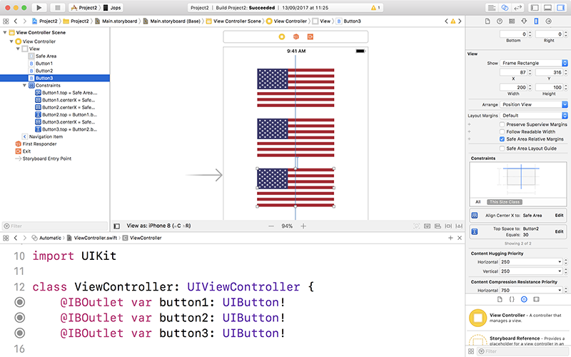

# Concevoir la mise en page de votre interface utilisateur

Lorsque je travaille sur mes propres projets, je trouve que la conception de l'interface utilisateur est le moyen le plus simple de commencer un projet. C'est amusant, ça vous permet de voir immédiatement si votre idée est réalisable et ça vous oblige également à penser comment les utilisateurs vont utiliser votre application pendant que vous travaillez. Ce projet n’est pas compliqué, et nous allons commencer par Interface Builder.

Comme dans le projet 1, le modèle Single View App (Application avec vue unique) vous fournit un `UIViewController`, appelé `ViewController`, et un storyboard appelé Main.storyboard qui contient la mise en page de notre contrôleur de vue unique. Sélectionnez ce storyboard pour ouvrir Interface Builder et vous verrez un grand espace vide prêt pour exprimer votre génie.

Dans notre jeu, nous allons montrer aux utilisateurs trois drapeaux, avec le nom du pays à deviner indiqué dans la barre de navigation en haut. Quelle barre de navigation ? Eh bien, il n'y en a pas, ou du moins pas encore. Nous devons en ajouter une, comme nous l’avons fait dans le projet précédent.

Nous avons couvert *beaucoup de concepts* dans le projet 1, vous avez donc probablement oublié comment faire cela, mais ça va aller : les projets Single View App ne proposent pas de contrôleur de navigation en standard, mais il est trivial d'en ajouter un : cliquez à l'intérieur du contrôleur de vue, puis allez dans le menu Editor et cliquez sur Embed In > Navigation Controller.

Avec le nouveau contrôleur de navigation en place, faites défiler le storyboard pour voir à nouveau notre contrôleur de vue vide et placez-y trois `UIButton`. Il s'agit d'un nouveau type de vue, mais comme vous pouvez l'imaginer, il ne s'agit que d'un bouton sur lequel les utilisateurs peuvent appuyer. Chacun d'entre eux devrait mesurer 200 de large par 100 de haut. Vous pouvez définir précisément ces valeurs à l'aide de l'inspecteur de tailles situé dans le coin supérieur droit de la fenêtre de Xcode.

Auparavant, dans iOS 6 et les versions antérieures, ces `UIButtons` avaient une couleur de fond blanche et des bords arrondis, ce qui rendait visible le fait qu'ils soient tappables, mais depuis iOS 7, les boutons sont complètement plats avec juste du texte. Pas de soucis cependant, nous les rendrons plus intéressants bientôt.

Vous pouvez accéder directement à l'inspecteur de tailles en appuyant sur le raccourci clavier Alt + Cmd + 5 ou en accédant au menu View et en choisissant Inspectors > Show Size Inspector. Ne vous souciez pas des positions X, mais les positions Y doivent être à 100 pour le premier drapeau, 230 pour le second et 360 pour le troisième. Ces valeurs permettent de les espacer de manière égale dans le contrôleur de vue.

Dans l'image ci-dessous, vous pouvez voir l'inspecteur de tailles, qui constitue le moyen le plus rapide et le plus simple de positionner et de dimensionner les vues si vous savez exactement où vous voulez les placer.

L'étape suivante consiste à introduire la mise en forme automatique afin que nous puissions définir la disposition de notre interface sous forme de règles pouvant être adaptées en fonction du périphérique de l'utilisateur. Les règles dans ce cas ne sont pas compliquées, mais j'espère commencer à vous montrer à quel point la mise en page automatique est intelligente.

Nous allons créer nos règles de mise en page automatique différemment de celles du projet 1. Ce n'est pas parce qu'une façon est meilleure qu'une autre, mais simplement pour que vous puissiez voir les différentes possibilités et choisir celle qui vous convient le mieux.

Sélectionnez le bouton du haut, maintenez la touche Ctrl du clavier enfoncée puis faites glisser vers le haut vers l'extérieur du bouton, c'est-à-dire sur la zone blanche du contrôleur de vue. Lorsque vous le ferez, la zone blanche deviendra bleue pour indiquer qu’elle sera utilisée pour la mise en page automatique.

Lorsque vous relâchez le bouton de la souris, une liste des contraintes possibles à appliquer s'affiche. Dans cette liste, nous nous soucions de deux choses : "Top Space to Safe Area" (Espace haut jusqu'à la zone sûre) et "Center Horizontally in Safe Area" (Centrer horizontalement dans la zone sûre).

Vous avez deux options pour créer plusieurs contraintes, comme ceci : vous pouvez soit en sélectionner une puis Ctrl-glisser à nouveau et sélectionner l'autre, ou vous pouvez maintenir la touche Maj enfoncée avant de sélectionner un élément du menu pour pouvoir en sélectionner plus d'un à la fois. C’est-à-dire que, tout en maintenant la touche Ctrl enfoncée, faites glisser le bouton directement vers l’espace vide, au-dessus du bouton, dans le contrôleur de vue, relâchez le bouton de la souris puis la touche Ctrl  pour que le menu apparaisse, puis maintenez la touche Maj enfoncée et choisissez "Top Space to Safe Area" et "Center Horizontally in Safe Area". Lorsque cela est fait, cliquez à l'extérieur de la fenêtre affichant la liste des contraintes pour confirmer cette sélection.

Le premier drapeau est terminé, alors avant d'aller plus loin, donnons-lui vie en ajoutant un exemple de contenu afin que vous puissiez voir à quoi il ressemble.

Dans le projet 1, nous avons ajouté des images au projet en faisant simplement glisser un dossier appelé "Content" dans notre projet Xcode. C'est très bien et vous pouvez continuer à le faire pour vos autres projets, mais je souhaite vous présenter une autre option appelée *asset catalogs*. Il s'agit d'une façon optimisée d'importer et d'utiliser des images dans des projets iOS, et elle est aussi facile à utiliser qu'un dossier contenant des images.

Dans votre projet Xcode, sélectionnez le fichier appelé Assets.xcassets. Ce n'est pas vraiment un fichier, mais bien notre catalogue de ressources par défaut de Xcode. Si vous n'avez pas encore téléchargé les fichiers de ce projet, veuillez le faire maintenant depuis GitHub (<https://github.com/twostraws/HackingWithSwift>).

Sélectionnez les 36 images des drapeaux dans les fichiers du projet et faites-les glisser dans la fenêtre de Xcode, juste en-dessous de "AppIcon" dans le catalogue de ressources. Cela créera 12 nouvelles entrées dans le catalogue des ressources, une pour chaque pays.

Même si je déteste les distractions, celle-ci est importante : les ressources dans iOS ont des tailles 2x et 3x, soit deux fois et trois fois la taille de la mise en page créée dans Interface Builder. Cela peut sembler étrange, mais c’est un peu la magie d'iOS qui ôte beaucoup de travail aux développeurs.

Les premiers appareils sous iOS avaient des écrans non-Rétina. Cela signifiait une résolution d'écran de 320x480 pixels et que vous pouviez placer les choses exactement là où vous le vouliez - en demandant 10 pixels en partant de la gauche et 10 en partant du haut, et c'est ce que vous obteniez.

Avec l'iPhone 4, Apple a introduit les écrans Rétina dont le nombre de pixels est le double de ceux des écrans précédents. Plutôt que de vous faire concevoir deux fois toutes vos interfaces, Apple a automatiquement échangé les tailles de pixels en "points", des pixels virtuels. Sur les appareils sans écran Rétina, une largeur de 10 points est devenue 10 pixels, mais sur les appareils avec écran Rétina, elle est devenue 20 pixels. Cela signifie que tout a la même taille et la même forme sur les deux appareils, avec une seule mise en page.

Bien sûr, l’intérêt des écrans Rétina réside dans le fait d'avoir plus de pixels, donc tout semble plus net - tout redimensionner en plus grand n’était pas suffisant. Apple a donc fait un pas de plus : si vous créez un fichier hello.png de 200x100, vous pouvez également inclure un fichier nommé hello@2x.png de taille 400x200 - exactement le double - et iOS chargera le bon fichier. Donc, vous écrivez hello.png dans votre code, mais iOS sait chercher et charger hello@2x.png sur les appareils avec écran Rétina.

Plus récemment, Apple a introduit les écrans Rétina HD ayant une résolution 3x, en suivant la même convention d'appellation : hello.png pour les appareils non-Rétina, hello@2x.png pour les apapreils Rétina et hello@3x.png pour les appareils Rétina HD. Vous n'écrivez toujours que "hello.png" dans votre code et vos interfaces utilisateur, et iOS fait le reste.

Vous pensez peut-être que cela semble terriblement lourd - pourquoi un appareil non-Rétina devrait-il télécharger des applications contenant du contenu @2x et @3x qu'il ne peut pas afficher ? Heureusement, l’App Store utilise une technologie appelée app thinning (amincissement d’application) qui fournit automatiquement uniquement le contenu que chaque appareil est capable d'afficher : elle supprime les autres ressources lors du téléchargement de l’application, évitant ainsi tout gaspillage d’espace.

A partir d’iOS 10, aucun appareil avec écran non-Rétina n’est pris en charge. Par conséquent, si vous ne supportez que des appareils sous iOS 10 ou ultérieur, vous devez uniquement inclure les images @2x et @3x. J’ai inclus les images 1x pour ce projet au cas où vous souhaiteriez également l’utiliser sur des versions d'iOS plus anciennes.

Tout cela est important car lorsque nous avons importé les images dans notre catalogue de ressources, elles ont été automatiquement placées dans des compartiments 1x, 2x et 3x. C'est parce que j'ai correctement nommé les fichiers : france.png, france@2x.png, france@3x.png, etc. Xcode a reconnu ces noms et a organisé correctement toutes les images.

Une fois les images importées, vous pouvez continuer et les utiliser dans le code ou dans Interface Builder, comme vous le feriez s'il s'agissait de fichiers perdus dans un dossier. Alors, retournez dans votre storyboard, choisissez le premier bouton et sélectionnez l'inspecteur de propriétés (Alt + Cmd + 4). Vous verrez que le bouton porte le titre "Button" pour le moment (il s'agit d'un champ de texte situé juste en dessous de "Title: Plain" (Titre : Ordinaire), veuillez donc supprimer ce texte. Maintenant, cliquez sur la flèche à côte du menu déroulant Image et choisissez "us".

Dès que vous attribuez une image au bouton, ses contraintes sont complètes : il a une position Y parce que nous avons défini une contrainte, il a une position X parce qu'il est centré horizontalement, et il a une largeur et une hauteur qu'il a hérité de celles de l'image que nous lui avons attribuée. Allez-y et attribuez le drapeau américain aux deux autres boutons pendant que vous y êtes.

Pour compléter nos contraintes de mise en forme automatique, nous devons aussi affecter des contraintes aux boutons du milieu et du bas. Sélectionnez le bouton du milieu, puis maintenez la touche Ctrl enfoncée tout en faisant glisser le curseur sur le premier bouton - et non sur le contrôleur de vue. Allez-y et vous verrez "Vertical Spacing" (Espacement vertical) et "Center Horizontally" (Centrer horizontalement)". Choisissez les deux. Maintenant, choisissez le troisième bouton et faites Ctrl-glisser sur le second bouton, puis choisissez à nouveau "Vertical Spacing" et "Center Horizontally".

À ce stade, notre mise en forme automatique est presque terminée, mais vous remarquerez que même si nous avons choisi de centrer les drapeaux horizontalement, ils semblent tous coincés à l'endroit où ils ont été placés. C'est parce que vous devez demander à Interface Builder de mettre à jour tous les cadres (frames) de vos boutons afin qu'ils correspondent aux règles de disposition automatique que vous venez de créer.

C'est assez facile à faire : sélectionnez les trois boutons, puis allez dans le menu Editor et choisissez Resolve Auto Layout Issues (Résoudre les problèmes de mise en page automatique) > Update Frames (Mettre à jour les cadres). Encore une fois, vous verrez que cette option apparaît deux fois dans le menu, mais les deux font la même chose ici donc vous pouvez sélectionner l’une ou l’autre. Cette commande met à jour les cadres (positions et tailles) de chaque bouton afin qu'ils correspondent aux contraintes de disposition automatique définies.

La dernière étape, avant d’en avoir terminé pour l’instant avec Interface Builder, consiste à ajouter des outlets pour nos trois boutons contenant les drapeaux afin que nous puissions les référencer dans le code. Activez Assistant Editor en appuyant sur Alt + Cmd + Return ou en sélectionnant View > Assistant Editor > Show Assistant Editor. Maintenant, tout en maintenant la touche Ctrl enfoncée, faites glisser le premier drapeau vers votre code afin de créer un outlet appelé `button1`, puis le deuxième drapeau pour créer `button2`, et le troisième pour créer `button3`.

Nous y reviendrons plus tard, mais pour l'instant, nous en avons terminé avec Interface Builder. Sélectionnez le fichier ViewController.swift et revenez à l'éditeur standard (c'est-à-dire, appuyez sur Cmd + return pour désactiver Assistant Editor) afin que nous puissions nous occuper du code.
