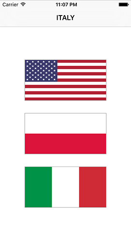

# Devinez quel drapeau : nombres aléatoires

Pour le moment, notre code choisit les trois premiers éléments du tableau countries et les place dans les trois boutons de notre contrôleur de vue. C'est très bien pour commencer, mais nous devons vraiment choisir des pays aléatoires à chaque fois. Il y a deux façons de faire cela :

1. Choisissez trois nombres aléatoires et utilisez-les pour lire les drapeaux du tableau.
2. Mélangez l'ordre du tableau, puis sélectionnez les trois premiers éléments.

Les deux approches sont valables, mais la première demande un peu plus de travail car nous devons nous assurer que les trois chiffres sont différents - ce jeu serait encore moins amusant si les trois drapeaux étaient identiques !

La deuxième approche est plus facile à réaliser, car Swift a des méthodes intégrées pour mélanger les tableaux : `shuffle()` pour le mélange du tableau lui-même et `shuffled()` pour renvoyer un nouveau tableau mélangé.

Au début de la méthode `askQuestion()`, juste avant d'appeler la première méthode `setImage()`, ajoutez cette ligne de code :

    countries.shuffle()

Cela mélangera automatiquement l'ordre des pays dans le tableau, ce qui signifie que `countries[0]`, `countries[1]` et `countries[2]` feront référence à des drapeaux différents chaque fois que la méthode `askQuestion()` sera appelée. Pour l'essayer, appuyez sur Cmd + R pour exécuter votre programme plusieurs fois afin de voir différents drapeaux à chaque fois.

La prochaine étape consiste à déterminer quelle doit être la réponse correcte et, pour ce faire, nous allons créer une nouvelle propriété pour notre contrôleur de vue appelée `correctAnswer` (Réponse correcte). Mettez ceci tout en-haut, juste au-dessus de `var score = 0` :

    var correctAnswer = 0

Cela nous donne une nouvelle propriété de type Integer qui stockera s'il s'agit du drapeau 0, 1 ou 2 qui contient la réponse correcte.

Pour choisir celui qui contient la bonne réponse, vous devez utiliser à nouveau le système aléatoire de Swift, car nous devons choisir un nombre aléatoire pour obtenir la bonne réponse. Tous les types numériques de Swift, tels que `Int`, `Double` et `CGFloat`, ont une méthode `random(in:)` qui génère un nombre aléatoire dans un intervalle. Donc, pour générer un nombre aléatoire compris entre 0 et 2 inclus, vous devez placer cette ligne juste en-dessous des trois lignes `setImage()` dans `askQuestion()` :

    correctAnswer = Int.random(in: 0...2)

Maintenant que nous avons la bonne réponse, il nous suffit de mettre son texte dans la barre de navigation. Cela peut être fait en utilisant la propriété `title` de notre contrôleur de vue, mais nous devons ajouter une dernière chose : nous ne voulons pas écrire "france" ou "uk" dans la barre de navigation, car ça fait moche. Nous pourrions mettre la première lettre en majuscule, et cela fonctionnerait très bien pour la France, l'Allemagne, etc., mais pas vraiment pour "Us" et "Uk", qui devraient plutôt être "US" et "UK".

La solution ici est simple : mettre toute la chaîne de caractères en majuscules. Ceci est fait en utilisant la méthode `uppercased()` de n'importe quelle chaîne de caractères, il suffit donc de lire la chaîne dans le tableau countries à la position de `correctAnswer`, puis de la mettre en majuscule. Ajoutez ceci à la fin de la méthode `askQuestion()`, juste après que `correctAnswer` soit définie :

    title = countries[correctAnswer].uppercased()

Ceci fait, vous pouvez lancer le jeu et il est maintenant presque jouable : vous obtiendrez trois drapeaux différents à chaque fois, et le drapeau sur lequel le joueur doit taper aura son nom affiché en haut.

Bien sûr, il manque un élément : l'utilisateur peut appuyer sur les drapeaux, mais en fait ils ne font rien. Réglons cela…
