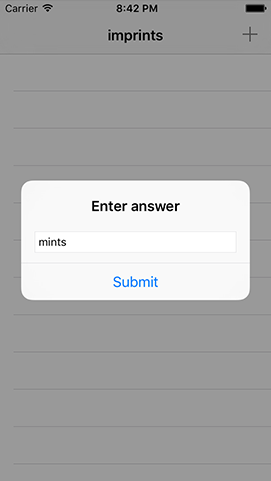

# Choisissez un mot, n’importe quel mot : UIAlertController

Ce jeu invite l'utilisateur à saisir un mot pouvant être composé à partir du mot composé de huit lettres affiché en haut de l'écran. Par exemple, si le mot de huit lettres est "agencies", l'utilisateur peut saisir "cease". Nous allons résoudre ceci avec `UIAlertController`, car c'est un choix judicieux qui me permet également de vous enseigner quelque chose de nouveau. Je suis tout au sujet des arrière-pensées!

Ajoutez ce code à `viewDidLoad()`, juste après la ligne contenant `super` :

    navigationItem.rightBarButtonItem = UIBarButtonItem(barButtonSystemItem: .add, target: self, action: #selector(promptForAnswer))

Cela a créé un nouveau bouton dans la barre située en haut de l'écran (UIBarButtonItem) en utilisant l'élément système "add" (ajout), et l'a configuré pour exécuter une méthode appelée `promptForAnswer()` lorsque nous tapons dessus - méthode que nous n'avons pas encore créée. Vous obtiendrez une erreur de compilation pendant quelques minutes vous lisez sur. Cette nouvelle méthode affichera un `UIAlertController` avec un espace pour permettre à l'utilisateur d'entrer une réponse. Lorsque l'utilisateur cliquera sur le bouton Submit (Soumettre) du contrôleur d'alerte, la réponse sera vérifiée pour s'assurer de sa validité.

Avant de vous donner le code, laissez-moi vous expliquer ce que vous devez savoir.

Vous voyez, nous sommes sur le point d'utiliser une closure et les choses vont se compliquer un peu. Pour rappel, ce sont des morceaux de code qui peuvent être traités comme une variable - nous pouvons envoyer la closure quelque part, où elle est stockée et exécutée plus tard. Pour que cela fonctionne, Swift prend une copie du code et capture toutes les données auxquelles il fait référence, afin de pouvoir les utiliser ultérieurement.

Mais il y a un problème : que se passe-t-il si la closure fait référence au contrôleur de vue ? Un cycle de référence puissant peut alors se produire: le contrôleur de vue possède un objet possédant une fermeture appartenant au contrôleur de vue et rien ne peut être détruit.

Je vais essayer (et probablement échouer !) de vous donner un exemple métaphorique, alors s'il vous plaît, restez avec moi. Imaginez que vous avez construit deux robots de nettoyage, un rouge et un bleu. Vous avez dit au robot rouge : "Continue de nettoyer jusqu'à ce que le robot bleu s'arrête" et vous avez dit au robot bleu "Continue de nettoyer jusqu'à ce que le robot rouge s'arrête."

Quand arrêteraient-ils de nettoyer ? La réponse est "jamais", car aucun d'eux ne fera le premier pas.

C'est le problème auquel nous sommes confrontés avec un cycle de référence fort : l'objet A possède l'objet B, et l'objet B possède une closure référençant l'objet A. Et lorsque les closures sont créées, elles capturent tout ce qu'elles utilisent, par conséquent l'objet B possède donc l'objet A.

Les cycles de référence forts étaient difficiles à trouver, mais vous serez heureux de savoir que Swift les rend triviaux. En fait, Swift facilite tellement que vous utiliserez sa solution même lorsque vous n’êtes pas sûr d’un cycle, tout simplement parce que vous pourriez en faire autant.

Alors préparez-vous s'il vous plaît : nous allons réellement examiner pour la première fois les closures. La syntaxe va faire mal. Et lorsque vous la comprenez enfin, vous rencontrerez des exemples en ligne qui vous feront à nouveau mal au cerveau.

Prêt ? Voici la méthode `promptForAnswer()` :

    @objc func promptForAnswer() {
        let ac = UIAlertController(title: "Enter answer", message: nil, preferredStyle: .alert)
        ac.addTextField()

        let submitAction = UIAlertAction(title: "Submit", style: .default) { [unowned self, ac] (action: UIAlertAction) in
            let answer = ac.textFields![0]
            self.submit(answer: answer.text!)
        }

        ac.addAction(submitAction)
        present(ac, animated: true)
    }

Ce code ne pourra pas encore être compilé, alors ne vous inquiétez pas si vous voyez des erreurs - nous les corrigerons bientôt. Mais d’abord, regardons de ce que le code ci-dessus fait. Il introduit un certain nombre de nouvelles choses, mais avant de vous les expliquer, éliminons les choses faciles.

- La méthode doit être appelée à partir d'une action `UIBarButtonItem`, nous devons donc le marquer avec `@objc`. J'espère que vous commencez à sentir quand cela est nécessaire, mais ne vous inquiétez pas si vous oubliez - Xcode se plaindra toujours très fort si `@objc` est requis et qu'il n'est pas présent !
- Création d'un nouveau `UIAlertController`: nous l’avons fait dans le projet 2.
- La méthode `addTextField()` ajoute simplement un champ de saisie de texte modifiable à `UIAlertController`. Nous pourrions en faire plus, mais c'est suffisant pour le moment.
- La méthode `addAction()` est utilisée pour ajouter une action `UIAlertAction` à un `UIAlertController`. Nous l'avons également utilisé dans le projet 2.
- La méthode `present()` est également issue du projet 2. Il est clair que ce projet était génial !

Cela laisse la tâche difficile : la création de `submitAction`. Ces quelques lignes de code montrent pas moins de cinq nouvelles choses à apprendre, qui sont toutes importantes. Je vais les classer par ordre de difficulté croissante, en commençant par `UITextField`.

Vous avez déjà vu `UILabel` : il s'agit d'une simple sous-classe de `UIView` qui affiche une chaîne de texte non modifiable à l'écran. `UITextField` est similaire, sauf que la chaîne de caractères est éditable. Nous avons ajouté un champ de texte unique à `UIAlertController` à l'aide de sa méthode `addTextField()`, et nous lisons maintenant la valeur qui a été insérée.

La prochaine étape est quelque chose que l'on appelle *trailing closure syntax*. Je sais, je sais : vous n'avez même pas encore appris les closures régulières, et vous devez déjà en apprendre plus sur trailing closures ! Et bien, elles sont liées, et les trailing closures ne sont pas difficiles, alors donnez-leur une chance.

Voici une partie d'une ligne de code du projet 2 :

    UIAlertAction(title: "Continue", style: .default, handler: askQuestion)

Cela provient d'une situation similaire : nous utilisons `UIAlertController` et `UIAlertAction` pour ajouter des boutons sur lesquels l'utilisateur peut taper. À l'époque, nous utilisions une méthode distincte (`askQuestion()`) pour éviter d'avoir à expliquer les closures trop tôt, mais vous pouvez voir que je passe `askQuestion` au paramètre` handler` de `UIAlertAction`.

Les closures peuvent être un peu considérées  comme des fonctions anonymes. Autrement dit, plutôt que de transmettre le nom d'une fonction à exécuter, nous ne faisons que transmettre un bloc de code. Donc, nous pourrions conceptuellement réécrire cette ligne comme ceci:

    UIAlertAction(title: "Continue", style: .default, handler: { CLOSURE CODE HERE })

Mais cela a un problème critique: c'est moche ! Si vous exécutez beaucoup de code dans la closure, il est étrange d'avoir l'appel d'une fonction sur une ligne prendre un paramètre sur 10 lignes.

Swift a donc une solution, appelée trailing closure syntax. Chaque fois que vous appelez une méthode qui s'attend à une closure comme paramètre final (et il y en a beaucoup), vous pouvez complètement éliminer ce paramètre final et le passer à la place entre les accolades. Ceci est optionnel et automatique, et transformerait notre code comme ceci :

    UIAlertAction(title: "Continue", style: .default) {
        CLOSURE CODE HERE
    }

Tout ce qui est entre les accolades fait partie de la closure, et est transmis lors de la création de `UIAlertAction` en tant que dernier paramètre. Bien !

Ensuite, `(action: UIAlertAction) in`. Si vous vous souvenez du projet 2, nous avions dû modifier la méthode `askQuestion()` afin qu'elle accepte un paramètre `UIAlertAction` indiquant quel bouton a été utilisé, comme ceci :

    func askQuestion(action: UIAlertAction!) {

Nous n'avions pas d'autre choix que de le faire, car le paramètre `handler` de` UIAlertAction` attend une méthode qui se prend elle-même en tant que paramètre, et nous avons également ajouté une valeur "nil" par défaut afin que nous puissions l'appeler nous-mêmes - d'où le `!`. Et c'est ce qui se passe ici : nous donnons à `UIAlertAction` un code à exécuter lorsqu'il est tappé, et il veut savoir que ce code accepte un paramètre de type `UIAlertAction`.

Le mot clé `in` est important : tout ce qui précède décrit la closure ; tout ce qui suit *est* la closure. Donc `(action: UIAlertAction) in` signifie qu'il accepte un paramètre de type `UIAlertAction`.

J'ai utilisé cette façon d'écrire la closure parce qu'elle ressemble beaucoup à celle utilisée dans le projet 2. Cependant, Swift sait quel type de closure il faut, nous pourrions donc la simplifier un peu : à partir de ceci...

    (action: UIAlertAction) in

...en cela :

    action in

Dans notre projet actuel, nous pourrions encore la simplifier davantage : nous ne faisons aucune référence au paramètre `action` à l'intérieur de la closure, ce qui signifie que nous n'avons pas du tout besoin de lui donner un nom. En Swift, pour laisser un paramètre sans nom, utilisez simplement un underscore (caractère de soulignement), comme ceci :

    _ in

Les quatrième et cinquièmement vont être abordés ensemble : `unowned` et `self`.

Swift "capture" toutes les constantes et variables qui sont utilisées dans une closure, en fonction des valeurs du contexte environnant de la fermeture. Autrement dit, si vous créez un entier, une chaîne de caractères, un tableau et une autre classe en dehors de la closure, et que vous les utilisez à l'intérieur de la closure, Swift les capture.

Ceci est important, car la closure fait référence aux variables et peut même les modifier. Mais je n'ai pas encore dit ce que "capturer" signifie réellement, et c'est parce que cela dépend du type de données que vous utilisez. Heureusement, Swift cache tout cela pour que vous n'ayez pas à vous en soucier...

...sauf pour les cycles de référence forte que j'ai mentionnés. *Ceux* dont vous devez vous soucier. C'est là où les objets ne peuvent même pas être détruits, car ils sont tous étroitement liés les uns aux autres - connu sous le nom de *référencement fort*.

La solution de Swift est de vous permettre de déclarer que certaines variables ne sont pas retenues aussi étroitement. C'est un processus en deux étapes, et c'est tellement facile que vous vous retrouvez à le faire pour tout, au cas où. Si Xcode pense que vous allez un peu trop loin, un avertissement vous avertira que vous puissiez vous détendre un peu.

Tout d'abord, vous devez indiquer à Swift les variables pour lesquelles vous ne voulez pas de références fortes. Cela se fait de deux manières: `unowned` (sans propriétaire) ou `weak` (faible). Celles-ci sont un peu équivalentes aux options optionnelles implicitement débalées (unowned) et aux optionnelles normales (weak) : une référence faiblement possédée peut être `nil`, vous devez donc la déballer ; une référence non possédée est une référence que vous certifiez ne pouvant pas être `nil` et n’a donc pas besoin d’être déballée, mais vous rencontrerez un problème si vous vous êtes trompé.

Dans notre code, nous utilisons ceci: `[unowned self, ac]`. Cela déclare `self` (le contrôleur de vue actuel) et `ac` (notre `UIAlertController`) à capturer en tant que références non possédées à l'intérieur de la closure. Cela signifie que la closure peut les utiliser, mais ne créera pas un cycle de référence fort, car nous avons clairement indiqué que la closure ne les possédait aucun d'eux.

Mais cela ne suffit pas pour Swift. Dans notre méthode, nous appelons la méthode `submit()` de notre contrôleur de vue. Nous ne l'avons pas encore créé, mais vous devriez être en mesure de voir qu'elle va prendre la réponse saisie par l'utilisateur et l'essayer dans le jeu.

Cette méthode `submit()` est externe au contexte actuel de la closure. Ainsi, lorsque vous l'écrivez, vous ne réaliserez peut-être pas qu'appeler `submit()` nécessite implicitement que `self` soit capturé par la closure. Autrement dit, la closure ne peut pas appeler `submit()` si elle ne capture pas le contrôleur de vue.

Nous avons déjà déclaré que `self` n'est pas détenu par la closure, mais Swift veut que nous sachions absolument ce que nous faisons : chaque appel à une méthode ou à une propriété du contrôleur de vue actuel doit être précédé de "`self.`", comme dans `self.submit()`.

Dans le projet 1, je vous ai dit qu'il y avait deux courants de pensée concernant l'utilisation de `self`, et j'ai dit : "Le premier groupe de personnes qui n'aime jamais utiliser `self`, à moins que cela ne soit nécessaire, car lorsque ça l'est, c'est réellement important et significatif, de sorte que l’utiliser dans des endroits où cela n’est pas nécessaire peut compliquer les choses."

La capture implicite de `self` dans les closures est cet endroit où utiliser `self` est essentiel et significatif : Swift ne vous laissera pas l’éviter ici. En limitant votre utilisation de `self` aux closures, vous pouvez facilement vérifier que votre code n’a pas de cycle de référence en cherchant `self` - il ne devrait pas y avoir trop de personnes à parcourir!

Je me rends compte que tout cela semble très dense, mais revoyons le code :

    let submitAction = UIAlertAction(title: "Submit", style: .default) { [unowned self, ac] (action: UIAlertAction) in
        let answer = ac.textFields![0]
        self.submit(answer: answer.text!)
    }

J'espère que vous pouvez commencer à voir comment il se décompose :

- Nous utilisons la syntaxe de trailing closure pour fournir du code à exécuter lorsque le bouton de l'alerte est sélectionnée.
- Ce code utilisera `self` et `ac` donc nous les déclarons comme `unowned` afin que Swift ne crée pas accidentellement un cycle de référence forte.
- La closure s'attend à recevoir un paramètre `UIAlertAction`. Nous l'écrivons donc à l'intérieur de l'accolade ouvrante.
- Tout ce qui suit `in` est le code réel de la closure.
- À l’intérieur de la closure, nous devons référencer les méthodes de notre contrôleur de vue en utilisant `self`, de manière à reconnaître clairement la possibilité d’un cycle de référence fort.

C’est compliqué et je ne vais pas prétendre le contraire, mais nous reviendrons enocre et encore sur ce sujet à l’avenir -  vous aurez plus que suffisamment de chances pour mieux le comprendre.
