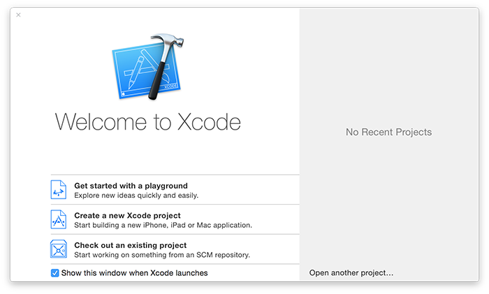

# Come installare Xcode e creare un playground

Xcode è un'applicazione per sviluppare di Apple. È gratis sul Mac App Store ed è richiesta per sviluppare sulle piattaforme Apple. Quindi, la tua prima azione è di [cliccare qui per installare Xcode dal Mac App Store](https://itunes.apple.com/us/app/xcode/id497799835?mt=12&at=10l8cn&ct=hws) – è un download molto grosso, quindi fallo partire ora e continua a leggere.

Mentre scarica, posso spiegarti le basi assolute:

- **iOS** è il nome del sistema operativo eseguito su tutti gli iPhone e iPad. È responsabile di tutte le operazioni di base sul dispositivo, come telefonare, disegnare sullo schermo, e avviare applicazioni.
- **macOS** è il nome del sistema operativo desktop di Apple, che è tecnologicamente il nonno di iOS, tvOS e anche watchOS.
- **watchOS** è il nome per il più piccolo sistema operativo di Apple, ed è responsabile di avviare applicazioni native e recapitare le notifiche dal cellulare.
- **Swift** è un moderno linguaggio di programmazione di Apple che ti consente di scrivere applicazioni per iOS, macOS, e altre piattaforme. Contiene le funzionalità per costruire programmi, ma non si occupa di niente come interfacce utente, audio o networking.
- **Swift 1.2** è il primo aggiornamento maggiore a Swift, modificando varie funzionalità del linguaggio e migliorandone altre.
- **Swift 2** è il secondo aggiornamento maggiore a Swift, ha introdotto le checked exceptions, e altri miglioramenti maggiori.
- **Swift 2.2** è stato un aggiornamento minore a Swift 2.0, deprecando alcune sintassi di fronte alla rimozioni in Swift 3.
- **Swift 3** è il terzo aggiornamento maggiore a Swift, e ha portato un grande numero di cambiamento nelle nomenclature per rendere il linguaggio più semplice e naturale da scrivere.
- **Swift 4** è il quarto aggiornamento maggiore a Swift, è focalizzato principalmente su nuove funzioni che aiutano il linguaggio ad essere più espressivo.
- **UIKit** è il toolkit di Apple per le interfacce utente. Contiene pulsanti, campi di testo, controlli per la navigazioni e molto altro, e lo controlli usando Swift.
- **AppKit** è il toolkit di Apple per le interfacce utente su macOS. Come UIKit contiene pulsanti, campi di testo e molto altro, è utilizzato su macOS anzichè iOS.
- **WatchKit** è il toolkit di Apple per le interfacce utente su watchOS. Mentre UIKit e AppKit hanno molto in comune, WatchKit è molto differente - e molto più semplice.
- **Cocoa Touch** è il nome comunemente usato per una vasta collezione di frameworks di Apple per iOS. Include UIKit per fare interfacce utente, ma la maggior parte delle persone direbbero che include anche SpriteKit per creare giochi 2D, SceneKit per creare giochi 3D, MapKit per le mappe, CoreGraphics per disegnare, Core Animation per animare, e molto altro.
- **Cocoa** è il nome usato per una collezione di framework di Apple per macOS. Strettamente parlando è fatto da AppKit per le interfacce utente, Foundation per funzionalità di base, e Core Data per oggetti a grafi, ma come per Cocoa Touch è spesso usato per intendere “tutto lo sviluppo su macOS.” 
- **NeXTSTEP** è un sistema operativo creato da un'azienda che Steve Jobs ha fondato chiamata NeXT. È stata comprata da Apple, Steve Jobs è stato rimesso al controllo della compagnia, e ha inserito la tecnologia di NeXTSTEP nel core della piattaforma di sviluppo di Apple.
- **iOS Simulator** è un tool installato con Xcode che si mostra e funziona esattamente come un iPhone o iPad reale. Ti permette di testare le applicazioni iOS molto velocemente senza dover usare un dispositivo reale.
- **I Playground** sono piccoli ambienti di sviluppo Swift che ti permettono di scrivere codice e vedere immediatamente i risultati. Con questi non costruisci app reali, ma sono ottimi per imparare. Li useremo in questa introduzione.
- **I crash** avvengono quando il tuo codice è sbagliato e l'applicazione non può ripristinarsi. Se un utente sta usando la tua applicazione, questa si chiudera e ritornerà la home screen. Se stai usando Xcode, vedrai un rapporto del crash.
- **Taylor Swift** non ha niente a che fare con il linguaggio di programmazione. Questo è un peccato, come puoi immaginare, ma proveremo a sistemare questo ammanco utilizzando le sue canzoni in questo tutorial. Mettiti il cuore in pace.

Questo è tutto - se Xcode non ha ancora finito di scaricare perché non guardi qualche video di Taylor Swift nell'attesa? Gli esempi in questo tutorial avranno sicuramente più senso dopo…

**Xcode installato? OK! Facciamolo…**

## Introduzione ai playground in Swift

Quando apri Xcode, vedrai qualcosa di simile alla figura qui sotto. Cerca il pulsante "Get started with a playground" in basso a sinistra e cliccalo. 

Xcode ti chiederà se vuoi creare un playground per iOS o macOS, per adesso non ci importa – questa introduzione tratta quasi esclusivamente il linguaggio, senza componenti delle interfacce utente. Per evitare problemi, lascia selezionata la piattaforma “iOS”. Vedrai una lista di template di playground da scegliere, per ora iniziamo scegliendo Blank.

Finalmente, Xcode ti chiederà di dare un nome al tuo playground – il nome di default "MyPlayground" va benissimo, quindi vai avanti e clicca Create.

Quello che vedrai è una finestra divisa in due. A sinistra vedrai questo:

    //: Playground - noun: a place where people can play

    import UIKit

    var str = "Hello, playground"

A destra, una volta che Xcode ha compilato e avviato il codice, vedrai questo: "Hello, playground". Nota che la compilazione e l'avvio del codice ci mette circa 10 secondi la prima volta ma è più veloce successivamente – Xcode deve avviare un mini simulatore internamente.

La suddivisione è importante perché divide il codice e i risultati. Il codice è nel pannello a sinistra ed è quello che userai per scrivere i tuoi lavori in Swift. I risultati sono nel pannello di destra, che mostra quello che fa il tuo codice. In questo caso, ti sta dicendo che abbiamo impostato correttamente il valore "Hello, playground."

Noterai anche che la prima riga del playground inizia con due slash, `//`. Quando Swift vede due slash in quel modo, ignora qualsiasi cosa si trovi dopo su quella linea. È comunemente usato per i commenti: note che scrivi nel codice per aiutarti più tardi a compredere cosa faccia.

Mentre scrivi, il playground eseguirà automaticamente il codice e mostrerà i risultati. Per esempio, se scrivi semplicemente `str`, vedrai due volte sulla destra "Hello, Playground" – una volta perché è stato impostato e la seconda perché stai stampando il valore.

I playground sono un ottimo modo per vedere i risultati immediatamente. Sono estremamente potenti, come vedrai nella prossima ora o due. Incominciamo a scrivere Swift!
