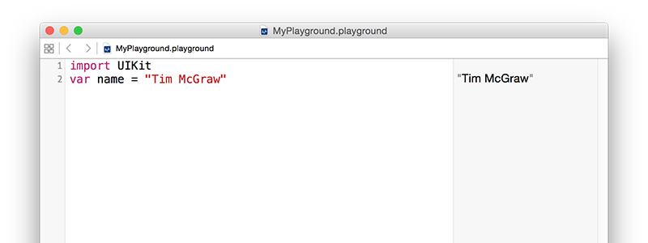

# Variabler og konstanter

Alle nyttige program må lagre data på et eller annet tidspunkt, og i Swift er det to måter å gjøre det på: variabler og konstanter. En variabel er en datalagring som kan få verdien sin endret når du ønsker det, og en konstant er en datalagring som du angir en gang, og som aldri kan endres. Så, variabler har verdier som kan variere, og konstanter har verdier som er konstante - enkelt, ikke sant?

Å ha begge disse alternativene kan virke meningsløst, når alt kommer til alt kan du jo bare opprette en variabel, og så aldri endre den - hvorfor trenger den å bli gjort til en konstant? Vel, det viser seg at mange programmerere er - sjokk! - mindre enn perfekt i programmering, og vi gjør feil.

En av fordelene ved å skille mellom konstanter og variabler er at Xcode vil fortelle oss om vi har gjort en feil. Hvis vi sier, "gjør denne datoen en konstant, fordi jeg vet at den aldri vil endre seg", og så 10 linjer senere prøver å endre den, så vil Xcode nekte å bygge appen vår.

Konstanter er også viktige fordi de lar Xcode ta beslutninger om hvordan den bygger appen din. Hvis den vet at en verdi aldri vil endres, kan den bruke optimaliseringer slik at koden din kjører raskere.

I Swift lager du en variabel ved hjelp av nøkkelordet `var`, slik som dette:

    var name = "Tim McGraw"

La oss sette dette inn i en playground, slik at du kan begynne å få tilbakemeldinger. Slett alt innholdet bortsett fra linjen med `import UIKit` (det er det som trekker inn Apples hoved iOS-rammeverk, og det trengs senere), og legg til den variabelen. Du bør se bildet nedenfor.

Fordi dette er en variabel, kan du endre den når du vil, men du bør ikke bruke nøkkelordet `var` hver gang - det brukes bare når du erklærer nye variabler. Prøv å skrive dette:

    var name = "Tim McGraw"  
    name = "Romeo"  

Altså, den første linjen oppretter variabelen `name` og gir den en startverdi, og den andre linjen oppdaterer variabelen `name` slik at verdien dens nå er "Romeo". Du vil se begge verdiene skrevet ut i resultatområdet på playgrounden.

Men, hva om vi hadde gjort den til en konstant i stedet for en variabel? Vel, konstanter bruker nøkkelordet `let` i stedet for `var`, så du kan endre din første linje med kode til å si `let name` i stedet for `var name`, slik som dette:

    import UIKit  
    let name = "tim mcgraw"  
    name = "Romeo"  

Men nå er det et problem: Xcode viser et rødt advarselssymbol ved siden av linje tre, og det burde ha strukket en bølgete understrek under `name`. Hvis du klikker på det røde advarselssymbolet, vil Xcode fortelle deg problemet: "Cannot assign to 'let' value 'name'" - som er Xcode-jargong for "du prøver å endre en konstant, og du kan ikke gjøre det."

Så, konstanter er en fin måte å gi et løfte til Swift, og til deg selv, om at en verdi ikke vil endre seg, fordi hvis du prøver å endre det så vil Xcode nekte å kjøre. Swift-utviklere har en sterk preferanse for å bruke konstanter hvor enn det er mulig, fordi det gjør koden din enklere å forstå. I de nyeste versjonene av Swift, vil Xcode faktisk fortelle deg om du gjør noe til en variabel og så aldri endrer den!

**Viktig merknad:** navn på variabler og konstanter må være unike i koden din. Du får en feil hvis du prøver å bruke samme variabelnavn to ganger, slik som dette:

    var name = "Tim McGraw"  
    var name = "Romeo"  

Hvis playgrounden finner en feil i koden, vil den enten gi en advarsel i en rød boks, eller den vil bare nekte å kjøre. Du vet om sistnevnte har skjedd, fordi teksten i resultatruten har blitt grå imotsetning til vanlig svart.

