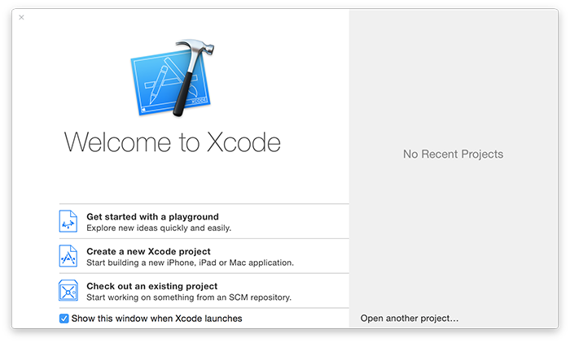

# Hoe installeer je Xcode and creëer je een _playground_

Xcode is Apple's programmeer applicatie voor software ontwikkelaars. Het is gratis verkrijgbaar in de Mac App Store, and het is nodig om te ontwikkelen voor Apple producten. Je eerst actie zal due zijn om [hier te klikken om Xcode te installeren van de Mac App Store](https://itunes.apple.com/us/app/xcode/id497799835?mt=12&at=10l8cn&ct=hws) – het is een flinke download, dus start deze alvast en lees dan verder.

Terwijl dat aan het downloaden is, kan ik je enkele absolute basisbegrippen uitleggen:

- **iOS** is de naam van het _operating system_ (OS) dat draait op alle iPhones en iPads. Het is verantwoordelijk voor alle basis handelingen op de telefoon, zoals telefoneren, tekenen op het scherm, en apps starten.
- **macOS** is de naam van Apple’s desktop operating system, dat tegelijkertijd de technologische voorouder is van iOS, tvOS, en zelfs watchOS.
- **watchOS** is de naam van Apple’s kleinste operating system, en is verantwoordelijk om _native_ applicaties te draaien en notificaties van je telefoon te tonen.
- **Swift** is Apple's moderne programmeertaal dat je apps laat schrijven voor iOS, macOS en andere platformen. Het bevat de basis om programma's te maken, maar doet niets met gebruikers interfaces, audio of netwerken.
- **Swift 1.2** was de eerste belangrijke update van Swift, waarbij diverse taal eigenschappen aangepast en verbeterd werden
- **Swift 2** was de tweede belangrijke update van Swift, waarbij uitzonderingen (exceptions) en andere belangrijke verbeteringen werden geintroduceerd.
- **Swift 2.2** was een kleine update van Swift 2.0, waarbij vooral wat woorden (syntax) als verouderd werd aangemerkt, voor de verwijdering later in Swift 3.
- **Swift 3** is de derde belangrijke update van Swift en bracht een enorme hoeveelheid veranderingen in de naamgeving zodat je de taal makkelijker en natuurlijker kunt schrijven.
- **Swift 4** is de vierde grote update van swift, en is meer gefocussed op nieuwe features die de taal meer mogelijkheden geeft.
- **UIKit** is Apple's gebruikers interface toolkit voor iOS. Het bevat zaken als knoppen, tekst velden, navigatie knoppen etc., en je bestuurt het met Swift.
- **AppKit** is Apple’s gebruikers interface toolkit voor macOS. Net zoals UIKit bevat het zaken als knoppen, tekst velden etc., maar meer gefocussed op macOS dan iOS.
- **WatchKit** is Apple’s gebruikers interface toolkit voor watchOS. Terwijl UIKit en AppKit veel op elkaar lijken, is WatchKit behoorlijk anders – en veel simpeler.
- **Cocoa Touch** is de naam die meestal gebruikt wordt voor Apple's uitgebreide collectie van _frameworks_ voor iOS. Het bevat UIKit voor gebruikers interfaces, maar veel mensen vinden dat het ook SpriteKit omvat om 2D games te maken, SceneKit voor 3D games, MapKit voor kaarten, Core Graphics om te tekenen, Core Animation voor animaties en nog veel meer.
- **Cocoa** is de naam die gebruikt wordt voor Apple’s framework collectie op macOS. Strict genomen bestaat het uit AppKit voor gebruikers interfaces, Foundation voor basis functionaliteit en Core Data voor het opslaan van objecten, maar net als Cocoa Touch bedoelt men meestal “alles voor macOS ontwikkeling.”
- **NeXTSTEP** is het operating system dat gemaakt werd door het door Steve Jobs opgerichte bedrijf NeXT. Het werd gekocht door Apple, waarna Jobs weer de baas werd van het bedrijf, en de NeXTSTEP technologie de basis werd van Apple's ontwikkel platform.
- **iOS Simulator** is een tool dat bij Xcode hoort dat eruit ziet en bijna net zo werkt als een echte iPhone of iPad. Het laat je heel snel iOS apps testen, zonder dat je een echt apparaat nodig hebt.
- **Playgrounds** zijn miniatuur Swift test omgevingen waarin je code kunt tikken en de resultaten onmiddelijk weergegeven worden. Je kunt er geen echte apps mee bouwen, maar het is geweldig om te leren. In deze introductie zullen we playgrounds gebruiken.
- **Crashes** gebeuren als er iets rampzalig mis gaat met je applicatie waar het niet meer uit komt. Als een gebruiker je app draait, zal het gewoon verdwijnen en zijn ze terug op hun thuis scherm. Als je runt vanuit Xcode, zie je en _crash report_
- **Taylor Swift** heeft niets te maken met de Swift programmeer taal. Zoals je je kunt voorstellen is dit jammer, maar ik zal het proberen goed te maken door enkele van haar nummers in deze handleiding te gebruiken. Als het je niet zint: pech.

Oké, dat is de basis – als Xcode nog niet klaar is met downloaden, waarom dan niet wat Taylor Swift videos bekijken terwijl je wacht? De voorbeelden in deze handleiding begrijp je dan een stuk beter…

**Xcode geinstalleerd? OK! Klaar voor de start…**

## Introductie van Swift playgrounds

Als je Xcode start, krijg je een scherm te zien zoals in de afbeelding hieronder. Zoek naar de "Get started with a playground" knop linksonder, en klik daarop. 

Xcode zal je vragen of je een iOS of macOS playground wilt maken, maar dat is hier niet van belang. Deze introductie gaat alleen over de Swift taal, zonder gebruikers interface componenten. Om problemen te voorkomen, laat “iOS” geselecteerd als platform. Je ziet vervolgens een lijst van playground voorbeeld documenten waar je uit kunt kiezen, maar we starten simpel, dus we kiezen _Blank_.

Op het laatst vraagt Xcode voor de naam van je playground – de standaard naam "MyPlayground" is prima, dus ga door door op Create te klikken.

Wat je zult zien, is een in tweeën gesplitst venster. Aan de linkerkant zie je dit:

    //: Playground - noun: a place where people can play

    import UIKit

    var str = "Hello, playground"

En aan de rechterkant, zodra Xcode het programma gebouwd heeft en de code uitvoert, zul je dit zien: "Hello, playground". Let op dat het bouwen en uitvoeren de eerste keer ongeveer 10 seconden kan duren, maar daarna sneller wordt - Xcode moet een mini-simulator in de achtergrond starten.

Deze splitsing is belangrijk, omdat het code en resultaat verdeelt. De code zit in de linker helft, en hier zul je later je eigen Swift code schrijven. De resultaten komen in de rechter helft, en dit toont wat je Swift code heeft gedaan. Hier vertelt het ons dat we succesvol de waarde "Hello, playground." hebben ingesteld.

Je ziet misschien ook dat de allereerste regel begint met twee schuine strepen, `//` _(slashes)_. Als Swift twee van die schuine strepen ziet, negeert het alles erachter op die regel. Dit wordt gebruikt voor commentaar: notities die je in je code schrijft om je later te helpen herinneren hoe het werkt.

Als je aan het tikken bent, zal de playground automatisch al je code uitvoeren en de resultaten vernieuwen. Bijvoorbeeld, als je net op een nieuwe regel `str` tikt op zichzelf, zul je  "Hello, Playground" twee keer aan de rechterkant zien. Eén keer omdat je het instelt, en één keer omdat je de waarde afdrukt.

Playgrounds zijn een geweldige manier om code uit te proberen en de resultaten onmiddelijk te zien. Ze zijn ook heel krachtig, zoals je het komende uur zal zien.

Laten we beginnen met Swift schrijven!
