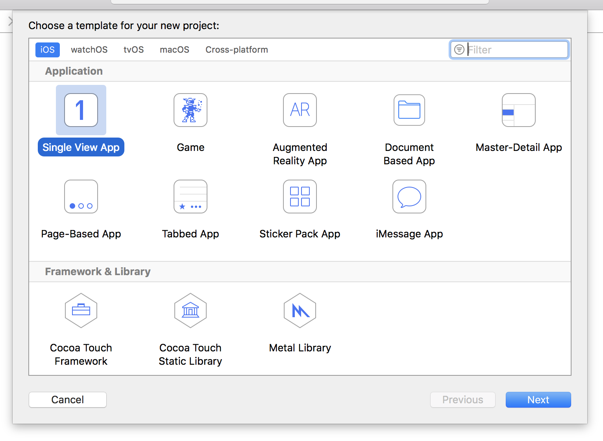

# Voorbereiding

In dit project zul je een applicatie maken waarin de gebruikers door een lijst van afbeeldingen kunnen scrollen, en er een kunnen selecteren. Het is bewust simpel, omdat er heel veel dingen zijn die je onderweg zult moeten leren. Dus riemen vast, het is een lange weg!

Start Xcode op en kies _“Create a new Xcode project”_ uit het welkom scherm. Kies _“Single View App”_ uit de lijst en klik op “Next”. Voor _Product Name_ voer je “Project1” in, daarna controleer je of Swift is geselecteerd als taal en Universal voor de apparaten.

Een van de velden die je kunt invullen is "Organization Identifier", wat een unieke code is voor jouw project. Meestal is dit je eigen persoonlijke domein naam achterstevoren. Bijvoorbeeld, ik zou **com.hackingwithswift** gebruiken als ik een app zou maken. Je moet erop letten dat je een bestaand domein gebruikt als je app op apparaten wilt installeren, maar anders kun je gewoon **com.example** gebruiken.

**Belangrijk:** Sommige Xcode's project templates hebben keuzevelden genaamd "Use Core Data", "Include Unit Tests" of "Include UI Tests". Zorg ervoor dat deze keuzes allemaal UIT staan voor dit project en bijna alle overige projecten in deze reeks – er is maar één project waar dit niet het geval is, en daar wordt het heel erg duidelijk gemaakt!

Klik nu opnieuw op _Next_ en je wordt gevraagd waar je het project wilt bewaren. Op je bureaublad is prima. Als dat gebeurd is, krijg je het voorbeeld project te zien dat Xcode voor je gemaakt heeft. Het eerste dat we moeten doen is controleren of alles goed opgezet is, en dat betekent de app runnen zoals die nu is.

Als je een project runt kun je kiezen wat voor apparaat de iOS Simulator moet nadoen, of je kunt ook een fysiek apparaat kiezen als je er een ingeplugd hebt. Deze opties staan onder het “Product > Destination” menu, en daar zul je iPad Air, iPhone 8, en zo voorts zien staan.

Er is ook een _shortcut_ voor dit menu: linksboven in het Xcode venster is een afspeel en stop knop, maar rechts daarvan zie je als het goed is Project1 en dan een apparaat naam staan. Als je op de apparaat naam klikt kun je een ander apparaat kiezen.

**Kies voor nu iPhone 8 en klik op de afspeel (driehoek) knop linksboven.** Dit zal je code _compileren_, wat betekent dat het wordt vertaald in instructies die iPhones begrijpen, daarna start het de simulator en runt het de app. Zoals je zult zien als je met deapp speelt, onze “app” toont gewoon een wit scherm – het doet helemaal niets, not niet.

Je zult heel vaak projecten starten en stoppen als je aan het leren bent, dus hier zijn drie basistips die je moet weten:

- Je kunt projecten runnen door command+R te tikken. Dit is hetzelfde als op de afspeel knop klikken.
- Je kunt een draaiend project stoppen met command+ als Xcode geselecteerd is.
- Als je wijzigingen hebt gemaakt in je huidige project, kun je gewoon command+R tikken. Xcode geeft een waarschuwing om de huidige run te beëindigen voordat het een andere start. Zorg ervoor dat je de "Do not show this message again" selecteert, zodat je in de toekomst hier niet mee lastig wordt gevallen.

Dit project laat gebruikers afbeeldingen zien, dus het is nodig om wat afbeeldingen te importeren. Download de bestanden voor dit project van GitHub (<https://github.com/twostraws/HackingWithSwift>), en kijk in de “project1-files” map. Hierin zie je een andere map genaamd “Content”, en deze map moet je regelrecht naar je Xcode project slepen, precies onder het bestand "Info.plist".

**Waarschuwing:** sommige verwarde mensen negeerden het woord  “download” hierboven en probeerde de bestanden direct van GitHub te slepen. *Dat werkt niet*. Je moet eerst de bestanden downloaden als een zip bestand, dat uitpakken en dan de bestanden vanaf de Finder in Xcode slepen.

Er komt een venster tevoorschijn waarin je gevraagd wordt hoe je de bestanden wilt toevoegen. Zorg ervoor dat “Copy items if needed” is aangevinkt, en ”Create groups” ook.
**Belangrijk: Selecteer niet "Create folder references" anders zal je project niet werken.**

Klik op Finish en je zult zien dat een gele Content map is toegevoegd in Xcode. Als je een blauwe map ziet, dan heb je  "Create groups" vergeten aan te klikken, en zul je in de problemen komen verderop in deze handleiding!

**HEEL ERG BELANGRIJKE WAARSCHUWING:** Sommige versies van Xcode kwamen met een ernstige bug bij het toevoegen van bestanden aan projecten, en jij hebt er misschien ook al last van gehad. Om een of andere reden lijkt Xcode bestanden toe te voegen aan het project, maar *niet* mee te nemen als het project gebouwd wordt. Dus ze konden net zo goed niet bestaan.

Om erachter te komen of jij hier ook last van hebt gehad, selecteer je een van de bestanden die je net toegevoegd hebt in de project navigator, bijvoorbeeld “nssl0033.jpg”. Tik nu  Alt+command+1 om de bestandsinfo –file inspector– te activeren aan de rechterkant van het Xcode venster, en zoek het aankruisvakje onder “Target Membership” – als het vakje naast Project1 niet aangevinkt is, dan ben je last gehad van de bug.

**Als je last hebt van deze bug:** gelukkig is het heel makkelijk om het te repareren. Nadat je bestanden hebt toegevoegd aan Xcode, selecteer ze in de project navigator, ga naar de bestandsinfo en selecteer het aankruisvak onder “Target Membership”. **Je moet dit doen voor alle bestanden die je in de toekomst toevoegd voor alle projecten in deze handleidingen** Excuses voor al het ongemak, maar het is een bug in Xcode en die kan ik niet wegtoveren.
