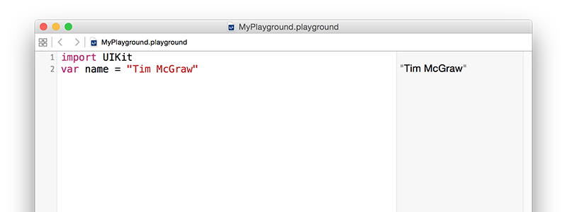

# Zmienne i stałe

Każdy przydatny program musi w pewnym momencie zacząć przechowywać dane, i Swift oferuje na to dwa rozwiązania: zmienne oraz stałe. Zmienna to magazyn danych, którego wartość możemy zmienić kiedy tego chcemy. Stała to magazyn danych, którego wartość ustawiamy raz i już nigdy nie możemy jej zmienić. Podsumowując, zmienne przechowują wartości, które mogą ulec zmianie, stałe przechowują wartości, których zmienić nie możemy - proste, prawda?

Posiadanie tych dwóch rozwiązań może wydawać się bezsensowne, przecież mógłbyś po prostu stworzyć zmienną i nigdy nie zmieniać jej wartości - dlaczego powinna być stałą? Cóż, jak się okazuje, wielu programistów - uwaga! - nie jest najlepszych w swoim fachu i popełnia błędy.

Jedną z zalet rozróżnienia na zmienne i stałe, jest to, że Xcode da nam znać gdy popełnimy błąd. Jeśli powiemy, "zapisz tę datę jako stałą bo wiem, że nigdy się nie zmieni" a następnie 10 linii później spróbujemy ją zmienić, Xcode nie zbuduje naszej aplikacji.

Stałe są również ważne, ponieważ pomagają Xcode'owi podejmować decyzje w jaki sposób ma budować Twoją aplikację. Jeśli Xcode wie, że dana wartość nigdy się nie zmieni, może zastosować optymalizacje by Twój kod wykonywał się szybciej.

W Swiftcie deklarujesz zmienne używając słowa kluczowego `var`, w taki sposób:

    var name = "Tim McGraw"

Otwórzmy nowy Playground, aby widzieć rezultaty naszej pracy. Usuń wszystko, oprócz linii `import UIKit` (ta instrukcja importuje podstawowy iOSowy framework, który przyda nam się później), i dodaj powyższą linię. Powinieneś widzieć to co na obrazku poniżej.

Ponieważ jest to zmienna, możesz zmienić jej wartość kiedy tylko chcesz. Nie oznacza to, że powinieneś używać słowa kluczowego `var` za każdym razem, tylko wtedy gdy chcesz zadeklarować nową zmienną. Spróbuj napisać to:

    var name = "Tim McGraw"
    name = "Romeo"

Pierwsza linia tworzy zmienną o nazwie `name` i przypisuje jej początkową wartość. Druga linia modyfikuje zmienną `name` na nową wartość "Romeo". Obie wartości powinny być widoczne w panelu po prawej stronie.

Co jeśli chcielibyśmy użyć stałej zamiast zmiennej? Cóż, stałe deklarowane są przy użyciu słowa kluczowego `let` zamiast `var`, więc wystarczy, że zmienimy pierwszą linię naszego kodu z `var name` na `let name`, jak w przykładzie poniżej:

    import UIKit
    let name = "Tim McGraw"
    name = "Romeo"

Ale teraz pojawił się problem: Xcode pokazuje czerwony symbol ostrzeżenia w linii numer trzy, i powinien również podkreślić słowo `name`. Jeśli klikniesz na czerwony symbol, zauważysz w czym jest problem: "Cannot assign to 'let' value 'name'" - co w języku Xcode'a oznacza "próbujesz zmienić wartość stałej, co jest niedozwolone".

Jak widzisz, stałe są świetnym sposobem na złożenie obietnicy językowi Swift i sobie, że deklarowana przez Ciebie wartość się nie zmieni. Jeśli spróbujesz ją zmienić, Xcode odmówi kompilacji. Deweloperzy piszący w języku Swift, preferują używać stałych gdy tylko jest to możliwe, ponieważ dzięki temu, Twój kod jest łatwiejszy do zrozumienia. De facto, w najnowszych wersjach języka Swift, Xcode podpowie Ci gdy używasz zmiennych a nigdy nie zmieniasz ich wartości.

**Ważne:** nazwy zmiennych i stałych muszą być unikalne w Twoim kodzie. Xcode pokaże błąd gdy spróbujesz użyć takiej samej nazwy dwa razy, jak w przykładzie poniżej:

    var name = "Tim McGraw"
    var name = "Romeo"

Jeśli playground znajdzie błąd w Twoim kodzie, to albo pokaże czerwony symbol błędu, albo odmówi kompilacji. Gdy wydarzy się sytuacja druga, poznasz ją po wyszarzonym tekście w panelu po prawej stronie.
