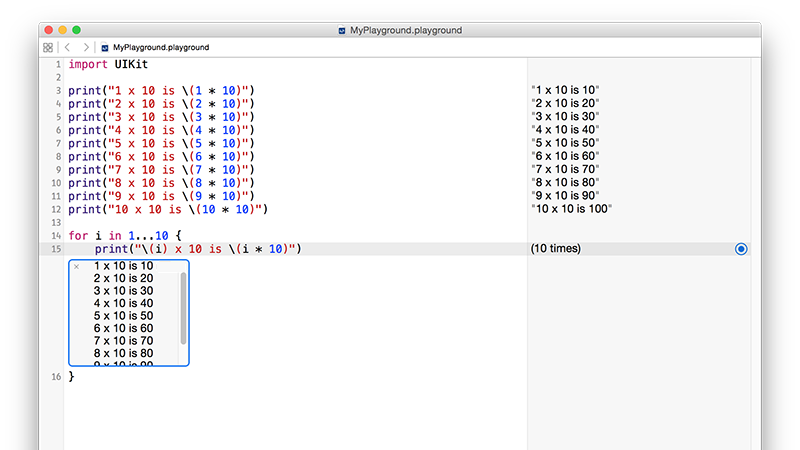

# Pętle

<!-- YOUTUBE: IJChAEFA5as -->

Komputery świetnie sobie radzą w wykonywaniu nudnych zadań miliardy razy w czasie, jaki zajęło Ci przeczytanie tego zdania. Jeżeli chodzi o powtarzanie zadań w kodzie, możesz skopiować i wkleić kod wiele razy lub użyć *pętli* - prostych programistycznych konstrukcji, które powtarzają blok kodu tak długo, jak warunek jest spełniony.

Aby to zademonstrować, chciałbym przedstawić specjalną funkcję do debugowania nazwaną `print()`: dajesz jej jakiś tekst do wypisania a ona go wypisuje. Jeżeli korzystasz z playground, tak jak my, zobaczysz, że tekst pojawi się w oknie wyników. Jeżeli używasz prawdziwej aplikacji w Xcode, zobaczysz, że tekst pojawi się w oknie dziennika. Tak czy inaczej, `print()` jest świetnym sposobem na zerknięcie na zawartość zmiennej.

Spójrz na ten kod:

    print("1 x 10 is \(1 * 10)")
    print("2 x 10 is \(2 * 10)")
    print("3 x 10 is \(3 * 10)")
    print("4 x 10 is \(4 * 10)")
    print("5 x 10 is \(5 * 10)")
    print("6 x 10 is \(6 * 10)")
    print("7 x 10 is \(7 * 10)")
    print("8 x 10 is \(8 * 10)")
    print("9 x 10 is \(9 * 10)")
    print("10 x 10 is \(10 * 10)")

Po zakończeniu działania tabliczka mnożenia przez 10 pojawi się w oknie wyników. Ale to nie jest wydajny kod, w rzeczywistości znacznie czystszym sposobem jest pętla po zakresie liczb przy użyciu operatora zakresu zamkniętego, który składa się z trzech kropek z rzędu: `...`

Używając operatora zakresu zamkniętego moglibyśmy przepisać całość w trzech liniach:

    for i in 1...10 {
        print("\(i) x 10 is \(i * 10)")
    }

W oknie wyników napisane jest tylko "(10 times)" przy naszej pętli, co oznacza, że pętla została uruchomiona 10 razy. Jeżeli chcesz wiedzieć co właściwie zrobiła pętla, kliknij na kwadrat tuż obok napisu "(10 times)". Zobaczysz, że okienko z napisem "10 x 10 is 100" pojawi się w kodzie i jeżeli klikniesz na nie prawym przyciskiem myszy powinieneś zobaczyć "Value History". Jeśli na to klikniesz, powinieneś zobaczyć poniższy obraz:

Pętla liczy od 1 do 10 (włączając 1 i 10), przypisuje tę liczbę do stałej `i` i wykonuje blok kodu między nawiasami.

Jeżeli nie potrzebujesz wiedzieć na jakim numerze się znajdujesz, możesz zamiast tego użyć podkreślenia. Na przykład, moglibyśmy wypisać słowa piosenki Taylor Swift, w ten sposób:

    var str = "Fakers gonna"

    for _ in 1 ... 5 {
        str += " fake"
    }

    print(str)

To wypisze "Fakers gonna fake fake fake fake fake" poprzez dodanie do stringa przy każdym obrocie pętli.

Gdy Swift nie musi przypisywać każdej liczby do zmiennej przy każdym obrocie pętli, może wykonać kod trochę szybciej. W rezultacie, jeżeli napiszesz `for i in…` a potem nie użyjesz zmiennej `i`, Xcode zasugeruje zmianę jej na `_`.

Istnieje wariant operatora zamkniętego zakresu, zwany operatorem zakresu półotwartego i łatwo je pomylić. Operator zakresu półotwartego wygląda tak: `..<` i przechodzi od jednej liczby do drugiej, *wyłączając* tę drugą. Na przykład, `1 ..< 5` policzy 1, 2, 3, 4.

## Przejście pętli po tablicy

Swift zapewnia bardzo prosty sposób na przejście pętlą przez wszystkie elementy tablicy. Ponieważ Swift już zna jaki typ danych zawiera tablica, przejdzie przez każdy jej element, przypisze go do stałej, którą wskażesz i wykona blok kodu. Na przykład, w ten sposób moglibyśmy wypisać listę świetnych piosenek:

    var songs = ["Shake it Off", "You Belong with Me", "Look What You Made Me Do"]

    for song in songs {
        print("My favorite song is \(song)")
    }

Możesz również użyć konstrukcji pętli `for i in` do przechodzenia pętlą przez tablice, ponieważ możesz użyć tej stałej do indeksowania tablicy. Moglibyśmy nawet jej użyć do indeksowania dwóch tablic, o tak:

    var people = ["players", "haters", "heart-breakers", "fakers"]
    var actions = ["play", "hate", "break", "fake"]

    for i in 0 ... 3 {
        print("\(people[i]) gonna \(actions[i])")
    }

Możesz się zastanawiać, do czego służy operator półotwartego zakresu, ale jest szczególnie przydatny do pracy z tablicami, ponieważ ich elementy liczone są od zera. Więc zamiast liczyć od 0 do 3 włącznie, możemy liczyć od 0 do liczby elementów w tablicy, *wykluczając* tę liczbę.

**Pamiętaj: tablice liczą od zera, więc jeżeli mają 4 elementy, maksymalnym indeksem jest 3, dlatego w pętli musimy użyć *wykluczenia***

Żeby policzyć ile elementów znajduje się w tablicy, użyj `someArray.count`. Moglibśmy więc przepisać nasz kod w ten sposób:

    var people = ["players", "haters", "heart-breakers", "fakers"]
    var actions = ["play", "hate", "break", "fake"]

    for i in 0 ..< people.count {
        print("\(people[i]) gonna \(actions[i])")
    }

## Pętle wewnętrzne

Jeśli chcesz, możesz umieścić pętle wewnątrz pętli, a nawet pętle, wewnątrz pętli, wewnątrz pętli - chociaż może się nagle okazać, że robisz coś 10 milionów razy, więc bądź ostrożny! 

Możemy połączyć dwie z naszych poprzednich pętli, żeby zrobić to:

    var people = ["players", "haters", "heart-breakers", "fakers"]
    var actions = ["play", "hate", "break", "fake"]

    for i in 0 ..< people.count {
        var str = "\(people[i]) gonna"

        for _ in 1 ... 5 {
            str += " \(actions[i])"
        }

        print(str)
    }

To wypisze "players gonna play play play play play", potem "haters gonna...". Cóż, wiesz o co chodzi.

Jedna ważna uwaga: chociaż programiści konwencjonalnie używają `i`, `j` i nawet `k` jako stałych pętli, możesz nazwać je jakkolwiek chcesz, `for personNumber in 0 ..< people.count` jest całkowicie poprawne.

## Pętle while

Jest trzeci rodzaj pętli, który zobaczysz, który powtarza blok kodu dopóki nie każesz mu przestać. Jest on używany do takich rzeczy, jak pętle gry, kiedy nie masz pojęcia jak długo gra potrwa - po prostu powtarzasz "sprawdź dotknięcia, animuj roboty, rysuj ekran, sprawdź dotknięcia..." i tak dalej, dopóki w końcu użytkownik nie dotknie przycisku, żeby zakończyć grę i wrócić do głównegu menu.

Te pętle nazywa się pętlami `while` i wyglądają tak:

    var counter = 0

    while true {
        print("Counter is now \(counter)")
        counter += 1

        if counter == 556 {
            break
        }
    }

Ten kod wprowadza nowe słowo kluczowe o nazwie `break`. Służy ono do opuszczenia pętli `while` lub `for` w wybranym przez Ciebie momencie. Bez niego powyższy kod nigdy by się nie skończył, ponieważ warunek do sprawdzenia to po prostu "true" i zawsze jest on prawdziwy. Bez tej instrukcji `break` pętla byłaby pętlą nieskończoną, która jest złą rzeczą.

Te pętle `while` działają najlepiej, gdy używasz nieznanych danych, takich jak pobieranie rzeczy z Internetu, odczyt z pliku takiiego jak XML, przeglądanie danych wejściowych użytkownika i tak dalej. Jest tak, ponieważ wiesz, kiedy zatrzymać pętlę dopiero po uruchomieniu jej wystarczającej liczby razy.

Istnieje odpowiednik polecenia `break` o nazwie `continue`. Podczas gdy przerwanie pętli (`break`) przerywa wykonywanie jej i przechodzi do kodu bezpośrednio po pętli, polecenie `continue` powoduje wyjście tylko z danej iteracji pętli - przeskoczy z powrotem na początek pętli i stamtąd będzie kontynuować.

Jako przykład rozważmy poniższy kod:

    var songs = ["Shake it Off", "You Belong with Me", "Look What You Made Me Do"]

    for song in songs {
        if song == "You Belong with Me" {
            continue
        }

        print("My favorite song is \(song)")
    }

To przechodzi pętlą przez trzy piosenki Taylor Swift, ale wypisze nazwy tylko dwóch. Powodem jest słowo kluczowe `continue`: kiedy pętla próbuje użyć piosenki "You Belong with Me", `continue` zostaje wywołane, co oznacza, że pętla od razu przeskakuje na początek - wywołanie `print()` nie zostaje nigdy wykonane i zamiast tego pętla przechodzi od razu do "Look What You Made Me Do" 
