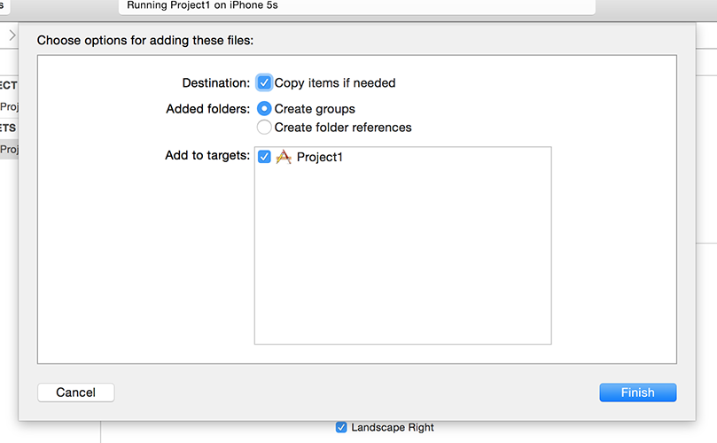

# Przygotowanie

W tym projekcie stworzysz aplikację, która pozwoli użytkownikom przewijać listę obrazków oraz otworzyć jeden z nich. Wydaje się to proste, ponieważ jest wiele innych rzeczy, których będziesz się musiał nauczyć wraz ze swoją dalszą przygodą - może być ona całkiem długa więc dobrze się przygotuj!

Otwórz Xcode i wybierz opcję "Create a new Xcode project" na ekranie powitalnym. Następnie wybierz "Single View App" z listy i przejdź dalej. W miejscu na nazwę projektu wpisz Project1 oraz upewnij się, że wybrałeś Swift jako język oraz Universal jako typ urządzeń.

Jedno z miejsc o którego uzupełnienie zostaniesz poproszony jest "Organization Identifier", który powinien być unikalny i najczęściej tworzony poprzez podanie Twojej własnej domeny zaczynając od rozszerzenia. Dla przykładu ja użyłbym tutaj **com.hackingwithswift**. Aby odpalić aplikację, musisz wpisać tutaj coś poprawnego, jeśli nie zamierzasz tego zrobić możesz wpisać tam **com.example**.

**Uwaga:** Niektóre z projektów Xcode'a mają zaznaczone domyślnie opcje "User Core Data", "Include Unit Tests" oraz "Include UI Tests". Upewnij się, że w Twoim przypadku są one odznaczone dla tego projektu (jak i w przypadku większości z kolejnych w tej serii - tylko jeden z nich będzie tego potrzebował i wtedy jasno Ci to zakomunikuję!).

Ponownie kliknij przycisk Next i wybierz miejsce zapisania projektu - biurko jest jak najbardziej dobrym miejscem. Po wykonaniu tych wszystkich kroków powinieneś zobaczyć przykładowy projekt który wygenerował Xcode. Pierwszą rzeczą którą zrobimy będzie upewnienie się, że wszystko skonfigurowałeś poprawnie, czyli że projekt się zbuduje.

Kiedy uruchamiasz projekt masz możliwość wybrania na jakim urządzeniu symulatora powinno się ono odpalić - możesz również wybrać urządzenie fizyczne jeśli aktualnie jest podpięte do komputera. Te opcje znajdziesz w liście Product > Destination gdzie możesz zaznaczyć iPada Air, iPhone'a 8 itd.

Opcje te możesz również zmienić w okolicach przycisków play/stop w lewym górnym rogu Xcode zaraz obok nazwy projektu. Kliknij i przekonaj się o tym sam.

**Dla testu wybierz iPhone'a 8, a następnie wciśnij przycisk Play w lewym górnym rogu.** Wykonanie tej operacji skompiluje twój kod źródłowy, czyli w skrócie zmieni ciąg znaków które napisałeś na coś co iPhone będzie w stanie zrozumieć. Po kompilacji zostanie włączony symulator i uruchomi się na nim aplikacja. Jak widzisz narazie jest ona wielkim białym ekranem - nie robi totalnie nic, ale to niedługo się zmieni.

Z czasem zauważysz, że bardzo często uruchamiasz i zatrzymujesz projekty w związku z czym mam dla Ciebie trzy porady:

- cmd+R uruchamia projekt.
- cmd+. zatrzymuje projekt.
- Jeśli dokonasz jakiejś zmiany w czasie działania projektu naciśnij cmd+R ponownie. Xcode zapyta Cię czy zatrzymać obecny proces i uruchomić nowy. Zaznacz "Do not show this message again" aby uniknąć tej informacji w przyszłości.

Ten projekt ma na celu wybranie obrazka do wyświetlenia więc musimy je do niego zaimportować. Pobierz pliki dla tego projektu z GitHuba (<https://github.com/twostraws/HackingWithSwift>) i znajdź  folder"project1-files". Wewnątrz niego znajduje się folder Content, który musisz przeciągnąć bezprośrednio do swojego projektu w Xcode - zaraz pod plikiem "Info.plist".

**Uwaga:** wielu ludzi ignoruje słowo "pobrać" i próbuje przenieść pliki bezpośrednio z GitHuba. *To nie zadziała*. Musisz pobrać pliki jako .zip, wypakować je, a następnie przeciągnąć je z Findera do Xcode'a.

Po przeciągnięciu plików pojawi się okno pytające w jaki sposób chcesz dodać te pliki: zaznacz "Copy items if needed" oraz "Create groups".
**Ważne: nie wybieraj opcji "Create folder references" bo wówczas Twój projekt nie zadziała**

Kliknij "Finish" i zobaczysz żółty folder "Content" pojawiający się w Code. Jeśli widzisz niebieski oznacza to, że nie zaznaczyłeś "Create groups" i będziesz miał problemy z podążaniem wgłąb tego samouczka.

**BARDZO WAŻNA UWAGA:** Kilka wersji Xcode'a zawierało w sobie krytyczny błąd, który wpływał na dodawane pliki do projektu co mogło dotknąć i Ciebie. Z pewnego powodu wydawało się, że Xcode dodawał pliki do projektu ale *pomimo tego* nie dodawał ich do miejsca gdzie projekt jest budowany co powodowało fakt, że nie istniały.

Aby przekonać się czy problem dotknał i Ciebie wybierz jeden z obrazów które przed chwilą dodałeś wewnątrz "project navigator"“nssl0033.jpg”. Następnie naciśnij alt+cmd+1 aby aktywować inspektora plików po prawej stronie Xcode'a i poszukaj checkboxa "Target Membership" - jeśli jest on odznaczony oznacza to, że wystąpił u Ciebie opisany błąd.

**Jeśli dotknął Cię powyższy błąd:** na szczęście naprawienie tego jest bardzo proste. Po dodaniu plików do Xcode zaznacz je w "project navigator", a następnie w inspektorze plików zaznacz opisany wyżej checkbox. **Będziesz musiał to robić dla wszystkich plików które będziesz dodawać do projektów podczas przerabiania tej książki** - przepraszam Cię bardzo za zamieszanie, jednak jest to błąd Xcode'a, a ja nie potrafię czarować. 

