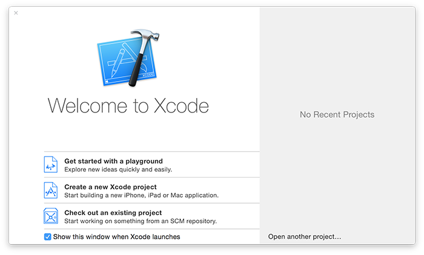

# Como instalar o Xcode e iniciar um playgroung

Xcode é a aplicação de programação da Apple para desenvolvedores [clique aqui para instalar o Xcode da App Store](https://itunes.apple.com/br/app/xcode/id497799835?mt=12&at=10l8cn&ct=hws) – o download é demorado, então comece já a baixar enquanto continua lendo.

Enquanto baixa, posso começar explicando o básico para você:

- **iOS** é o nome do sistema operacional de todos os iPhones e iPads. Ele é responsável por todas operações básicas do dispositivo, como ligações, desenhar as telas e executar aplicativos.
- **macOS** é o nome do sistema operacional dos computadores da Apple, que pode ser entendido, tecnologicamente, como o avô do iOS, tvOS e do watchOS.
- **watchOS** é o nome do menor sistema operacional da Apple, que é responsável por rodar aplicações nativas e mostrar as notificações vindas do celular.
- **Swift** é a linguagem de programação moderna da Apple que permite escrever apps para iOS, macOS e outras plataformas. Tem funcionalidades para criar programas, mas não é capaz de lidar com interfaces de usuário, áudio ou gerenciar dado na rede.
- **Swift 1.2** foi a primeira grande atualização do Swift, ajustando várias funcionalidades da linguagem e melhorando outras.
- **Swift 2** foi a segunda grande atualização da linguagem, apresentando a checagem de exceptions e outras melhorias.
- **Swift 2.2** foi uma prequena atualização do Swift descontinuando sintaxes que seriam futuramente removidas na versão 3.
- **Swift 3** é a terceira grande atualização do Swift que trouxe várias mudanças de nomenclatura para tornar a linguagem mais fácil e mais natural de se escrever.
- **Swift 4** é a quarta grande atualização do Swift com maior foco em trazer novas funcionalidades que tornassem a linguagem mais expressiva.
- **UIKit** é o toolkit da Apple de interface de usuário. Coisas como botões, campos de texto, controles de navegação, etc. estão inclusos nele e você controla usando Swift.
- **AppKit** é o toolkit da Apple de interface de usuário para o macOS. Assim como o UIKit tem coisas como botões, campos de texto, controles de navegação, etc., só que para o macOS ao invés de iOS.
- **WatchKit** é o toolkit da Apple de interface de usuário para watchOS. O watchKit é bem diferente do UIKit e AppKit, e bem mais simples também.
- **Cocoa Touch** é o nome dado para os frameworks da Apple para iOS. Está incluso o UIKit para interfaces, assim como SpriKit para jogos 2D, SceneKit para jogos 3D, MapKit para mapas, CoreGraphics para desenhar, Core Animation para animações e muito mais.
- **Cocoa** é o nome dado para os frameworks da Apple para macOS. Basicamente composto por AppKit para interface, Foundation para funcionalidades básicas e Core Data para grafo de objetos, mas assim como Cocoa Touch, normalmente se refere a todo desenvolvimento para macOS.
- **NeXTSTEP** é um sistema operacional criado por uma empresa, criada por Steve Jobs, chamada NeXT. Essa empresa foi comprada pela Apple, fazendo com que Jobs retomasse sua posição na Apple, colocando o NeXTSTEP dentro da plataforma de desenvolvimento da Apple.
- **iOS Simulator** é uma ferramenta que vem junto com o Xcode que parece e funciona igual um iPhone ou Ipad. Com ele você pode testar aplicativos rapidamente, sem precisar usar um dispositivo de fato.
- **Playgrounds** são mini ambientes de teste que permite você a escrever código em Swift e ver o resultado imediatamente. Você não cria apps de verdade no playground, mas são ótimos para aprender. Nessa introdução nós vamos usar playgrounds.
- **Crashes** acontecem quando o código dá errado desastrosamente e seu app não consegue se recuperar. Para o usuário que está executando o app, ele vai apenas desaparecer mostrando a tela inicial. Se estiver rodando no Xcode, você verá uma descrição do crash.
- **Taylor Swift** não tem nada a ver com a linguagem de programação Swift. É uma pena, mas eu vou tentar usar algumas músicas dela no tutorial para compensar.

De básico é isso. Se o Xcode ainda não tiver terminado de baixar, então por que não assistir alguns videos da Taylor Swift enquanto espera? Os exemplos nesse tutorial vão, com certeza, fazer muito mais sentido...

**Já instalou Xcode? Então beleza! Bora lá…**

## Introdução ao Swift playgrounds

Quando você abrir o Xcode, vai ver alguma coisa parecida com a imagem abaixo. Procure pelo botão "Get started with a playground" do lado esquerdo e clique nele.

O Xcode vai perguntar se quer criar um playground para iOS ou macOS, mas na verdade tanto faz agora - esse tutorial é quase específico de Swift, sem componentes de interface de usuário. Para evitar problemas selecione a plataforma "iOS". Você verá uma lista de templates de playground que pode escolher, mas vamos partir do início, então escolha Blank.

Por último, o Xcode vai pedir que você nomeie o seu playground - o nome padrão "MyPlayground" está bom, pode clicar em Create.

Você vai ver uma janela dividida em duas. Do lado esquerdo vai ver isso:

    //: Playground - noun: a place where people can play

    import UIKit

    var str = "Hello, playground"

E do lado direito, quando o Xcode terminar de buildar e rodar o código, você vai ver isso: "Hello, playground". Note que a primeira vez que o Xcode buildar e rodar vai demorar uns 10 segundos, mas depois é mais rápido - o Xcode roda um mini-simulador por trás dos panos.

Essa separação é importante, porque ela divide o código do resultado. O código fica do lado esquerdo e você edita ele com seu próprio código Swift a medida que avançamos. Os resultados ficam do lado direito mostrando o que seu código Swift está fazendo. Nesse caso, está te mostrando que atribuímos o valor "Hello, Playground" com sucesso.

Perceba também que a primeira linha do playground começa com duas barras, `//`. Quando o Swift encontra essas duas barras ele ignora todo o resto da linha. Isso é normalmente usado para comentários: notas que você escreve no seu próprio código para te ajudar a lembrar, no futuro, o que esse código faz. 

A medida que você vai digitando, o playground vai automaticamente executar o seu código e mostrar os resultados atualizados. Por exemplo se você simplesmente digitar `str` sozinho, você vai ver "Hello, Playground" duas vezes do lado direito - uma vez porque foi atribuído e outra porque está imprimindo o valor.

Os playgrounds são uma ótima maneira de testar código e ver o resultado imediatamente. Eles são extremamente poderosos também, como você vai conseguir ver adiante. Vamo começar a escrever uns códigos em Swift!
