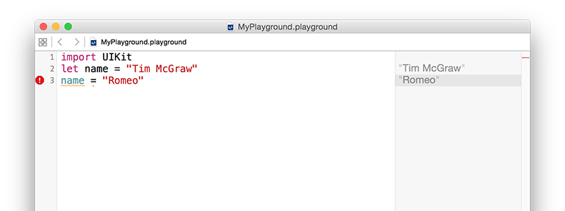

# Variáveis e constantes

Qualquer programa minimamente útil precisa guardar dados em algum momento, no Swift existem duas maneiras de fazer isso: variáveis e constantes. Variáveis são espaços de dado que você pode trocar o valor quando você quiser, e constantes São espaços de dado que você atribui um valor uma vez e não pode mais alterar. Em resumo, variáveis tem valores que variam e constantes tem valores que são constantes - fácil, né?! 

Parece bobeira existir as duas maneiras, no fim das contas dá pra criar uma variável e nunca mudar o seu valor - por que ela precisa ser uma constante? Bom, acontece que muitos programadores - Pasme! - não são perfeitos programando, e a gente comete erros.

Uma das vantagens de se separar constantes de variáveis é que o Xcode vai nos dizer se a gente cometer algum engano. Se decidir-mos "Crie esse dado como uma constante, porque eu sei que nunca vai mudar", e 10 linhas depois você tentar alterar o valor, o Xcode não vai buildar o app.

Constantes são importantes também porque elas deixam o Xcode tomar decisões sobre como buildar o seu app. Sabendo que um valor nunca será alterado, ele é capaz de aplicar otimizações para que seu código rode mais rápido.

Em Swift, a gente cria uma variável usando a palavra-chave `var`, desse jeito:

    var name = "Tim McGraw"

Vamos usar isso no playground para você começar a ver resultados. Apaga tudo que está lá, exceto a linha `import UIKit` (Esse é o trecho que importa o framework principal da Apple para iOS, e será necessário logo menos), e adicione essa variável. Veja a imagem abaixo:

Como isso é uma variável, dá pra mudar o valor dela a qualquer momento, mas não deve ficar escrevendo `var` toda hora - Isso é só pra quando você está declarando novas variáveis. Tenta fazer isso aqui:

    var name = "Tim McGraw"
    name = "Romeo"

A primeira linha cria a variável `name` e dá um valor inicial a ela, em sequência, na segunda linha, a variável `name` é atualizada para o novo valor "Romeo"

Mas, e se a gente declarasse uma constante ao invés de uma variável? Constantes, usam a palavra-chave `let` ao invés de `var`. Então mude a primeira linha do código para `let name` ao invés de `var name`, assim:

    import UIKit
    let name = "Tim McGraw"
    name = "Romeo"

Só que agora a gente tem um problema: Xcode está mostrando um alerta vermelho do lado da linha 3, e deve ter desenhado uma linha serrilhada debaixo de `name`. Se você clicar no símbolo do alerta, o Xcode vai te dizer o problema: "Cannot assign to 'let' value 'name'" - Que é a menaiera do Xcode de dizer "você está tentando trocar o valor de uma constante e você não pode fazer isso."

Resumindo, constante é uma maneira de prometer para você mesmo e ao Xcode que um valor não será alterado, porque se você tentar, o Xcode vai se negar a rodar o programa. Desenvolvedores Swift tem preferência por usar constantes sempre que possível porque, além de tudo, deixa o código mais inteligível. Na verdade, nas últimas versões do Swift, o Xcode vai te dizer se você atribuir uma variável e nunca alterar o valor dela.

**Observação importante:** Nomes para variáveis e constantes devem ser únicos no código. Você terá um erro se tentar usar um mesmo nome de variável duas vezes, desse jeito:

    var name = "Tim McGraw"
    var name = "Romeo"

Se o playground encontrar um erro no código, ele pode ou mostrar um erro num alerta vermelho, ou simplesmente se recusar a executar. Você saberá que o último aconteceu porque o resultado ficará cinza ao invés preto, como normalmente.
