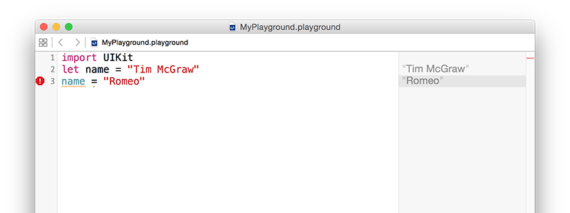

# Types of Data

Existem muitos tipos de dados, e Swift lida com todos individualmente. Você já viu um dos tipos mais importantes quando atribuiu um texto a uma variável, mas em Swift isto é chamado `String` – literalmente uma cadeia de caracteres.

*Strings* podem ser longas (ex. um milhão de letras ou mais), curtos (ex. 10 letras) ou até vazios (sem letras), não importa: todos são *strings* em Swift, e todos funcionam igualmente. Swift sabe que  `name` deve conter uma *string* porque você atribuiu uma *string* a ela quando criou: "Tim McGraw". Se você reescrevesse seu código como abaixo, ele pararia de funcionar:

    var name
    name = "Tim McGraw"

Desta vez o Xcode vai mostrar uma mensagem de erro que não fará muito sentido ainda: "Type annotation missing in pattern" (Anotação de tipo faltando um padrão). O que significa é, "Eu não consigo descobrir que tipo de dados a variável `name` tem porque você não me deu informação suficiente."

Neste ponto você tem duas opções: criar sua variável e atribuir seu valor em uma linha de código, ou usar o que chamamos de anotação de tipo, que é como você informa em Swift qual o tipo de dado que a variável irá armazenar posteriormente, mesmo que você não atribua o valor agora.

Você já viu como a primeira opção funciona, então vamos ver a segunda: anotação de tipo. Nós sabemos que `name` será uma *string*, então nós podemos falar isso em Swift escrevendo "dois pontos" e depois `String`, deste modo:

    var name: String
    name = "Tim McGraw"

Em projetos reais – em oposição aos *playgrounds* – isso funciona perfeitamente, porque em Swift sabe que tipo de dado `name` terá no futuro. *Playgrounds* são um caso especial, logo você ainda verá uma mensagem de erro.

**Nota:** algumas pessoas gostam de colocar um espaço antes e depois dos dois pontos, como `var name : String`, mas eles estão  *errados* e você deve evitar de mencionar que estão errados.

A lição aqui é que em Swift quer saber que tipo de dado cada variável ou constante terá. Sempre. Você não pode fugir, e é uma boa coisa porque provê o que chamamos de linguagem tipada – se você diz "esta variável terá uma string" e depois tenta colocar um coelho nela, Swift irá recusar.

Podemos testar isso agora introduzindo um outro tipo de dado importante, chamado **Int**, que é a abreviação de "integer" (inteiro). Inteiros são números redondos como 3, 30, 300, or -16777216. Por exemplo:

    var name: String
    name = "Tim McGraw"

    var age: Int
    age = 25

Isto declara uma variável como *string* e uma como inteiro. Note como `String` e `Int` possuem letras maiúsculas no início, enquanto `name` e `age` não tem – isso é uma convenção de escrita de código em Swift. A convenção de código não é estrita em Swift e ela não irá se importar (você pode escrever nomes como quiser!) mas importará para outros desenvolvedores. Neste caso, tipos de dados iniciam com uma letra maiúscula, enquanto variáveis e constantes não.

Now that we have variables of two different types, you can see type safety in action. Try writing this:

    name = 25
    age = "Tim McGraw"

In that code, you're trying to put an integer into a string variable, and a string into an integer variable – and, thankfully, Xcode will throw up errors. You might think this is pedantic, but it's actually quite helpful: you make a promise that a variable will hold one particular type of data, and Xcode will enforce that throughout your work.

**Before you go on, please delete those two lines of code causing the error, otherwise nothing in your playground will work going forward!**

## Float and Double

Let's look at two more data types, called `Float` and `Double`. This is Swift's way of storing numbers with a fractional component, such as 3.1, 3.141, 3.1415926, and -16777216.5. There are two data types for this because you get to choose how much accuracy you want, but most of the time it doesn't matter so the official Apple recommendation is always to use `Double` because it has the highest accuracy.

Try putting this into your playground:

    var latitude: Double
    latitude = 36.166667

    var longitude: Float
    longitude = -86.783333

You can see both numbers appear on the right, but look carefully because there's a tiny discrepancy. We said that `longitude` should be equal to -86.783333, but in the results pane you'll see -86.78333 – it's missing one last 3 on the end. Now, you might well say, "what does 0.000003 matter among friends?" but this is ably demonstrating what I was saying about accuracy.

Because these playgrounds update as you type, we can try things out so you can see exactly how `Float` and `Double` differ. Try changing the code to be this:

    var longitude: Float
    longitude = -86.783333
    longitude = -186.783333
    longitude = -1286.783333
    longitude = -12386.783333
    longitude = -123486.783333
    longitude = -1234586.783333

That's adding increasing numbers before the decimal point, while keeping the same amount of numbers after. But if you look in the results pane you'll notice that as you add more numbers before the point, Swift is removing numbers after. This is because it has limited space in which to store your number, so it's storing the most important part first – being off by 1,000,000 is a big thing, whereas being off by 0.000003 is less so.

Now try changing the `Float` to be a `Double` and you'll see Swift prints the correct number out every time:

    var longitude: Double

This is because, again, `Double` has twice the accuracy of `Float` so it doesn't need to cut your number to fit. Doubles still have limits, though – if you were to try a massive number like 123456789.123456789 you would see it gets cut down to 123456789.12345679.

## Boolean

Swift has a built-in data type that can store whether a value is true or false, called a `Bool`, short for Boolean. Bools don't have space for "maybe" or "perhaps", only absolutes: true or false. For example:

    var stayOutTooLate: Bool
    stayOutTooLate = true

    var nothingInBrain: Bool
    nothingInBrain = true

    var missABeat: Bool
    missABeat = false

## Using type annotations wisely

As you've learned, there are two ways to tell Swift what type of data a variable holds: assign a value when you create the variable, or use a type annotation. If you have a choice, the first is always preferable because it's clearer. For example:

    var name = "Tim McGraw"

…is preferred to:

    var name: String
    name = "Tim McGraw"

This applies to all data types. For example:

    var age = 25
    var longitude = -86.783333
    var nothingInBrain = true

This technique is called *type inference*, because Swift can infer what data type should be used for a variable by looking at the type of data you want to put in there. When it comes to numbers like -86.783333, Swift will always infer a `Double` rather than a `Float`.

For the sake of completeness, I should add that it's possible to specify a data type and provide a value at the same time, like this:

    var name: String = "Tim McGraw"

