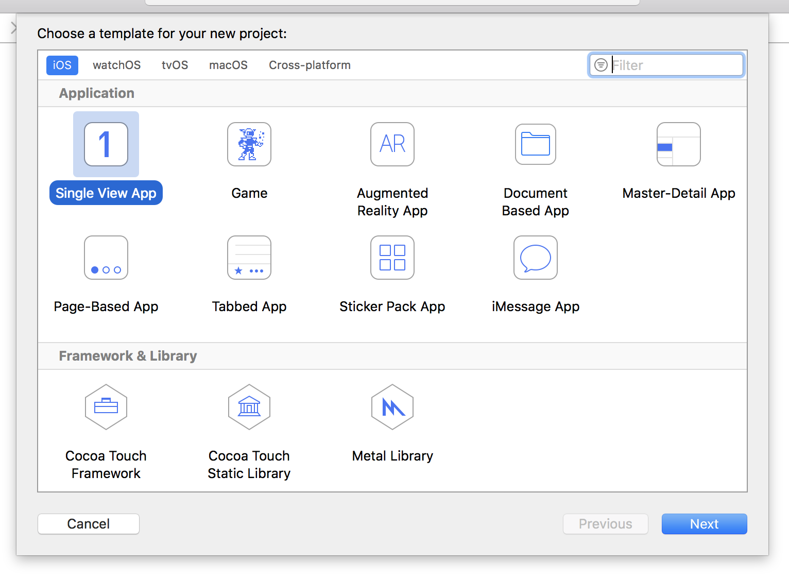

# Preparando

Neste projeto você irá criar uma aplicativo que permite aos utilizadores percorrer uma lista de imagens selecionando uma  para mostrar. Este aplicativo é deliberadamente simples porque existem muitas outras coisas que você terá de aprender. Por isso, coloque o cinto de segurança que a viagem vai ser longa. 

Inicie o Xcode e selecione "Create a new Xcode project" da tela inicial. Selecione "Single View App" da lista e clique em "Next". Para "Product Name" insira Project1. Verifique que tem Swift selecionado como linguagem bem como Universal para devices.

Um dos vários campos que terão de ser preenchidos é "Organization Identifier", que é um identificador único, semelhante ao usado para domínios de sítios de internet, só que escritos ao contrário. Por exemplo, eu usaria **com.hackingwithswift** se estivesse criando um aplicativo. Você precisará de colocar algo válido aqui se você estiver correndo seu aplicativo num dispositivo, fora isso, você pode simplesmente usar **com.examle**.

**Nota Importante:**  Algumas planilhas de projeto Xcode têm caixas de seleção dizendo "Use Core Data", "Include Unit Tests" e "Include UI Tests". Certifique-se, por favor, que essas caixas não estão selecionadas para este projeto nem para os restantes desta série. Apenas existe um projeto onde serão usados e você será devidamente alertado na altura certa.

Agora clique em Next outra vez e você será interrogado onde quer salvar o projeto. Na Secretátia serve perfeitamente. Assim que acabar você irá ver um exemplo de projeto que o Xcode fez para você. A primeira coisa que você terá de fazer é ter a certeza que tudo foi definido corretamente. Isso siginifica você correr o projeto tal e qual como ele se encontra. 

Quando você corre o projeto, você pode escolher qual o dispositivo o simulador de iOS pretende ser. Pode também selecionar um dispositivo físico, caso tenha algum conectado. Estas opções estão listadas no menu Product -> Destination e você poderá ver iPad Air, iPhone 8, entre outros.

Existe ainda o atalho para este menu: no canto superior esquerdo da tela do Xcode, está o botão de play e stop. À sua direita poderá ler Project1 seguido do nome do dispositivo. Você pode clicar no nome do dispositivo para selecionar outro diferente.

**Por agora selecione iPhone 8, e clique no botão play triangular localizado no canto superior esquerdo.** Isso irá compilar seu código, que não é nada mais que o processo de conversão de código em instruções que os iPhones possam entender. Depois disso, o simulador irá ser lançando correndo o seu aplicativo. Como você irá ver, ao interagir com o simulador, o nosso aplicativo apenas mostra uma imensa tela branca. Não faz absolutamente nada, pelo menos por enquanto.

Como você irá executar e parar projetos muitas vezes enquanto aprende, existem três dicas básicas que você precisa de entender: 

- Você pode correr seu projeto apertando Cmd+R. Isto é o equivalente ao clicar o botão de play.
- Você pode parar de correr seu projeto apertando Cmd+. quando o Xcode está selecionado.
- Se você fizer alterações a um projeto que está correndo, só tem que apertar Cmd+R novamente. O Xcode irá soltar um alerta perguntando se deseja parar a execução corrente antes de iniciar a próxima. Certifique-se que seleciona a opção "Do not show this message again" evitando ser incomodado novamente com esta mensagem. 

Este projeto consite em deixar os utilizadores selecionar imagens a visualizar. Para tal, você necessita de baixar algumas imagens. Baixe os ficheiros para este projeto no GitHub (<https://github.com/twostraws/HackingWithSwift>) e procure pela pasta "project1-files”. Abra. Você irá encontrar outra pasta com o nome de Content. Eu te peço para arrastar esse arquivo Content diretamente para o seu projeto no Xcode, abaixo de onde diz "Info.plist". 

**Aviso:** Algumas pessoas confusas ignoraram a palavra "baixar" e tentaram arrastar os ficheiros diretamente do Github. *Isso não vai funcionar*. Você precisa de baixar os ficheiros como um arquivo zip, descompactar, e depois sim, arrastar do Finder para o Xcode.

Uma tela irá aparecer perguntando so você deseja adicionar os ficheiros: Certifique-se que "Copy items if needed" e "Create groups" estão selecionados. **Importante: Não selecione "Create folder references", caso contrário, o seu projeto não irá funcionar.**

Clique Finish e você verá a pasta Content amarela aperecer no seu Xcode. Se por acaso essa nova pasta for azul significa que você não selecionou "Create Groups" e você terá problemas em seguir o resto deste tutorial.

**AVISO MUITO IMPORTANTE:** Muitas versões do Xcode vêm com um bug crítico que afetam a adição de arquivos a projetos e possivelmente você já se confrontou com essa situação. Por alguma razão o Xcode aparenta adicionar arquivos mas ele *não* os adiciona quando o projeto é compilado, portanto, eles podem não existir. 

Para descobrir se você foi afetado com esta situação, selecione uma das imagens que você acabou de adicionar no project navigator, exemplo "nssl0033.jpg". Agora aperte Alt+Cmd+1 para ativar o file inspector à direita da tela do Xcode e procure a caixa de seleção em baixo de "Target Membership" - Se você verificar que não se encontra selecionado para Project1 significa que você foi afetado por este bug.

**Se este bug te afeta:** Felizmente a resolução é super simples. Depois de você adicionar os arquivos ao Xcode, selecione o project navigator, vá a file inspector e verifique a caixa de seleção em baixo de Target Membership. **Você terá de continuar repetindo isto para todos os futuros  arquivos adicionados a projetos mencionados neste livro**. Me desculpa esta trapalhada, mas é um bug do Xcode e eu não consigo fazê-lo desaparecer  magicamente.
