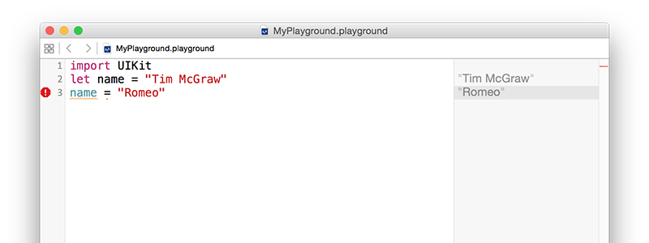

# Variáveis e constantes

<!-- YOUTUBE: NbthZRnz1C4 -->

Todos os programas úteis necessitam, a um dado momento, de guardar dados e, em Swift, existem duas formas para o fazer: variáveis e constantes. Uma variável armazena dados que podem ser alterados quando quisermos, e uma constante armazena dados que após definidos não podem ser alterados. Assim, as variáveis contém valores que podem variar, e as constantes são constantes - fácil, certo?

Ter estas duas opções pode parecer aparentemente não fazer sentido, no fundo podíamos apenas criar uma variável e nunca a alterar - porque necessitamos de a tornar constante? Bem, parece que nós programadores, não somos - surpreendentemente - perfeitos, e somos passíveis de cometer erros.

Uma das vantagens de utilizar constantes e variáveis é que o Xcode irá informar-nos se cometermos um erro. Se, por exemplo, dissermos "torna esta data constante, porque ela nunca vai mudar" e dez linhas mais tarde tentarmos alterá-la, ele irá recusar-se a compilar a aplicação.

As constantes são também importantes pois permitem ao Xcode tomar decisões acerca da forma como compila a aplicação. Se este souber que o valor não irá ser alterado, é capaz de aplicar otimizações para que a execução do código seja mais rápida.

Em Swift, a declaração de uma variável é feita utilizando a palavra reservada `var` da seguinte forma:

    var name = "Tim McGraw"

Continuemos no playground para que possas começar a obter *feedback*. Elimina tudo o que temos atualmente no playground exceto a linha `import UIKit` ( esta linha é a responsável por incorporar a *framework* iOS core da Apple e será necessária mais tarde), e declara a variável. Deverás ver a imagem abaixo.

Uma vez que é uma variável, podes alterá-la quando quiseres, mas não deves utilizar a palavra `var` em todas elas –  esta é apenas usada no momento da declaração. Tenta escrever o seguinte: 

    var name = "Tim McGraw"
    name = "Romeo"

Assim, a primeira linha declara a variável `name` e atribui-lhe um valor inicial, a segunda linha atualiza a variável `name` para que o seu valor passe a ser "Romeo". Irás ver ambos os valores na área de resultados do *playground*.

Mas, e se tivéssemos criado uma constante em vez de uma variável? Bem, as constantes utilizam a palavra reservada `let`, em vez de `var`. Experimenta alterar a primeira linha para que passe a dizer `let name` em vez de `var name`, da seguinte forma:  

    import UIKit
    let name = "Tim McGraw"
    name = "Romeo"

Mas, agora temos um problema: o Xcode está a apresentar um simbolo de alerta de erro a vermelho na linha três, e deve ter adicionado um sublinhado em baixo. Se clicares no símbolo de erro, o Xcode dir-te-á o problema: "Cannot assign to 'let' value 'name'" – que é a forma do Xcode te dizer "estás a tentar alterar uma constante e isso não é permitido."

Assim, as contantes são uma excelente forma de fazer uma espécie de promessa ao Swift e a nós próprios de que a variável não irá ser alterada, porque se o tentarmos fazer o Xcode recusar-se-á a executar. Os programadores Swift defendem a utilização de constantes sempre que possível uma vez que torna o código mais fácil de ler e de interpretar. Aliás, nas últimas versões do Swift, o Xcode já sugere que tornemos as variáveis constantes, caso as criemos e nunca as tentemos alterar!

**Nota importante:** os nomes das variáveis e constantes devem ser únicos no código. Utilizar o mesmo nome para uma variável duas vezes irá dar origem a um erro. Experimenta: 

    var name = "Tim McGraw"
    var name = "Romeo"

Se o *playground* encontrar um erro no código, ele irá ou sinalizá-lo com um alerta numa caixa vermelha, ou simplesmente recusar-se a executar. Irás reparar se isto ocorrer uma vez que o texto no painel de resultados irá tornar-se cinza, em vez do habitual preto.
