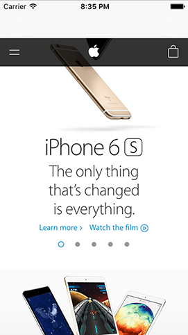

# Criar um simples navegador com uma WKWebView

<!-- YOUTUBE: pLiT5DdjEbM -->

Nos dois primeiros projetos usámos o *Interface Builder* para fazer grande parte do nosso *layout*, mas desta vez o nosso *layout* será tão simples que o vamos fazer inteiramente em código. É que, enquanto nos projetos anteriores adicionámos botões e imagens à nossa vista, neste projeto a *web view* vai ocupar a vista toda, logo mais vale que esta seja a *main view* do nosso *view controller*.

Até agora temos vindo a usar o método `viewDidLoad()` para configurar a nossa vista assim que o *layout* é carregado. Desta vez precisamos de fazer *override* ao carregamento efetivo da vista uma vez que não queremos esta coisa vazia no nosso *storyboard*, queremos o nosso próprio código. Irá ser na mesma embebido num *navigation controller*, mas o resto está por nossa conta.

O iOS tem duas formas diferentes de trabalhar com *web views*, mas a que iremos usar para este projeto denomina-se de `WKWebView`. Esta faz parte da *framework Webkit* e não do *UIKit*, mas podemos importá-la adicionado esta linha no topo do ViewController.swift:

    import WebKit

Quando criamos a *web view*, temos de a guardar numa propriedade para que a possamos referenciar mais tarde. Assim sendo, adiciona esta propriedade à classe:

    var webView: WKWebView!

Por último, adiciona este método *antes* do `viewDidLoad()`:

    override func loadView() {
        webView = WKWebView()
        webView.navigationDelegate = self
        view = webView
    }

Este código irá, por agora, gerar um erro de compilação, mas iremos corrigi-lo mais adiante.

**Nota:** Não necessitas de colocar o método `loadView()` antes do `viewDidLoad()`, na realidade podes colocá-lo em qualquer sítio entre `class ViewController: UIViewController {` e a última chaveta do ficheiro. No entanto, aconselho-te a estruturar os teus métodos de forma organizada e, uma vez que o `loadView()` é chamado antes do `viewDidLoad()`, faz sentido que no código a sequência também seja esta.

Adiante. Há apenas três coisas com as quais temos de nos preocupar uma vez que, nesta fase, já deves compreender porque necessitamos da palavra reservada `override`. (Pista: já existe uma implementação por defeito que permite carregar o *layout* a partir do *storyboard*.)

Começamos por criar uma instância do componente *web browser* da Apple - `WKWebView` - e assignamo-la à propriedade `webView`. Em terceiro lugar, tornamos a nossa vista (a vista raiz do *view controller*) essa *web view*.

Sim, saltei a segunda linha, porque esta introduz um novo conceito: delegação - *delegation*. A delegação representa aquilo que denominamos de padrão de *software* ou *programming pattern* - uma forma de escrever código que é muito usada em iOS, e por uma boa razão: é fácil de compreender, fácil de usar e extremamente flexível.

Um delegado - *delegate* - é algo que age no lugar de outrem, respondendo efetivamente a questões ou eventos em vez deste. No nosso exemplo, estamos a usar uma WKWebView: o renderizador poderoso e flexível da Apple, mas, por mais inteligente que a `WKWebView` seja, esta não sabe (ou quer saber) de como a aplicação se deve comportar, uma vez que isso diz respeito ao nosso código.

A solução de delegação é brilhante: podemos informar a`WKWebView` que queremos ser notificados quando algo interessante acontece. No nosso código definimos a propriedade `navigationDelegate` da *web view* como `self` - ou seja, o *view controller* atual - o que significa algo como "informa-me quando houver uma nova página de navegação."

Ao fazermos isto, tens de ter em conta dois aspetos:

1. Tens de garantir que te conformas ao protocolo. O que é uma forma bonita de dizer "se estás a dizer que tens condições para ser o meu delegado, aqui estão os métodos que tens de implementar." No caso do `navigationDelegate`, todos os métodos são opcionais, o que significa que não *necessitamos* de implementar qualquer método.
2. Quaisquer métodos que implementemos irão ter controlo sobre o comportamento da `WKWebView`. Da mesma forma, qualquer método que optemos por não implementar irá utilizar o comportamento por defeito da `WKWebView`.

Antes de avançarmos temos de corrigir aquele erro de compilação. Quando queres definir um *delegate*, tens de te conformar ao protocolo que corresponde a esse *delegate*. É verdade que todos os métodos do protocolo `navigationDelegate` são opcionais, mas o Swift ainda não sabe disso. Tudo o que ele sabe é que estamos a prometer que somos um bom candidato a *delegate* para a *web view*, no entanto, ainda não implementámos o protocolo.

É simples de corrigir, mas vou divergir para introduzir algo novo, uma vez que o momento é oportuno. Primeiro, corrige isto: encontra esta linha:

    class ViewController: UIViewController {

e altera-a para esta:

    class ViewController: UIViewController, WKNavigationDelegate {

Esta é a correção. Mas o que quero discutir é a forma como o `ViewController` agora parece herdar duas coisas, o que não é possível em Swift. Como sabes, quando dizemos 
 `class A: B` estamos a definir uma nova classe `A` que acrescenta funcionalidades às funcionalidades de uma outra classe `B`. No entanto, quando dizemos `class A: B, C` estamos a dizer que herda de `UIViewController` (o primeiro item da lista), *e* promete implementar o protocolo `WKNavigationDelegate`.

A ordem aqui é muito importante: a classe pai (superclasse) vem sempre primeiro, e todos os protocolos a implementar em seguida, separados por vírgulas. Aqui, estamos a dizer que apenas conformamos a um único protocolo (`WKNavigationDelegate`) mas podemos especificar quantos quisermos.

Assim, o significado completo desta linha é "cria uma nova subclasse de `UIViewController` chamada `ViewController` e diz ao compilador que nós prometemos sermos um bom candidato a `WKNavigationDelegate`."

Este programa já quase faz algo de útil, mas antes de executarmos vamos adicionar três novas linhas. Coloca as seguintes linhas no método `viewDidLoad()`, imediatamente após a chamada a `super`:

    let url = URL(string: "https://www.hackingwithswift.com")!
    webView.load(URLRequest(url: url))
    webView.allowsBackForwardNavigationGestures = true

A primeira linha cria um novo tipo de dados denominado de `URL`, que é a forma do Swift guardar a localização de ficheiros. Já estás provavelmente familiarizado com URLs por serem usados *online*, tais como <https://www.hackingwithswift.com>, mas também são muito importantes para guardar nomes de ficheiros - são muito flexíveis!

Apesar de estarmos habituados a URLs como strings de texto, o Swift guarda os URLs num tipo de dados específico `URL`, que adiciona algumas funcionalidades extra. Assim, a primeira linha de código cria um novo `URL` a partir da string “https://www.hackingwithswift.com”. Estou a usar hackingwithswift.com como *website* de exemplo, mas podes alterar para algo que gostes.

**Aviso: tens de te assegurar que usas https:// para as tuas páginas web, porque o iOS não permite aplicações que enviem ou recebam dados de forma insegura**. Se pretenderes alterar este comportamento podes ler este artigo que escrevi especificamente acerca de *App Transport Security*: </example-code/system/how-to-handle-the-https-requirements-in-ios-9-with-app-transport-security>.

A segunda linha faz duas coisas: cria um novo objeto `URLRequest` a partir desse URL, e passa-o à nossa *web view* para ser carregado.

Pode parecer-te inútil esta ofuscação por parte da Apple, mas as `WKWebViews` não carregam páginas *web* a partir de strings como www.hackingwithswift.com, ou mesmo a partir de um `URL` criado a partir dessas strings. Tens de transformar essa string num `URL` e depois colocar esse `URL` num `URLRequest`, e só depois a `WKWebView` *o* irá carregar. Felizmente não é relativamente fácil de fazer!

**Aviso:** O teu URL tem de estar completo e válido para este processo funcionar. Isto significa que não podes esquecer a parte **https://**.

A terceira linha, ativa uma propriedade da *web view* que permite aos utilizadores usarem *swipe* a partir do canto esquerdo ou direto para andar para a frente ou para trás na navegação web. Esta é uma funcionalidade do navegador Safari utilizada por muitos utilizadores, por isso é bom mantê-la por perto.

É finalmente altura de correr a aplicação, por isso pressiona Cmd+R e deverás ver a nossa página web. Parte 1 concluída!

