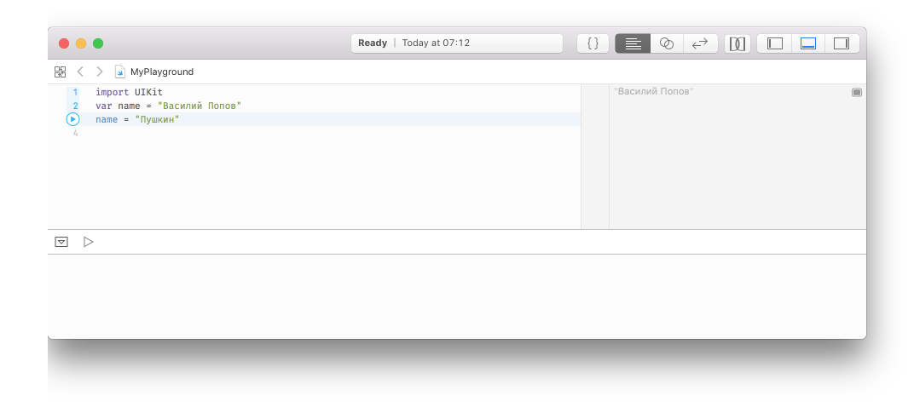
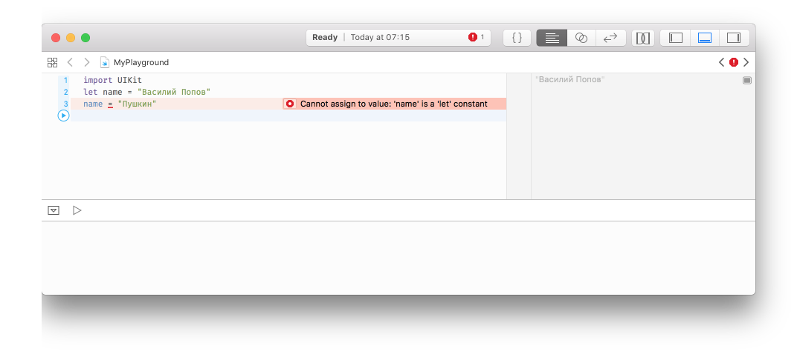

# Переменные и константы

Каждой полезной программе необходимо оперировать данными. В Swift есть два способа сделать это, использовать переменные или константы. Переменная — это хранилище для ваших данных, которые могут быть изменены в любой момент времени. Константа — это хранлище для данных, которые никогда не изменяются после того как вы их задали единожды. Таким образом переменные хранят изменяемые значения, а константы хранят постоянные значения — просто, не так ли?

Существование двух подходов может показаться бессмысленным на первый взгляд, в конце концов вы можете просто создать переменную и больше никогда не изменять её. Зачем делать её константной? Что ж, оказывается многие программисты (шок!) далеко не идеальны в программировании и делают ошибки.

Одно из преимуществ разделения констант и переменных в том, что Xcode подскажет нам если мы сделали ошибки. Если, например, мы скажем: "сделай эту дату константой, потому что я знаю что она никогда не поменяется", а потом, десятью строками ниже, попробуем изменить её, то Xcode откажется собрать ваше приложение.

Константы также важны, потому что позволяют Xcode принимать решения как собирать ваше приложение. Если он знает что значение никогда не меняется, он сможет применить некоторые оптимизациии чтобы сделать ваш код быстрее.

В Swift вы создаете переменную используя ключевое слово `var`, например так:

```swift
var name = "Василий Попов"
```

Попробуйте скопировать этот код в playground, чтобы посмотреть как это работает. Удалите всё из редактора текущего playground начиная от строки `import UIKit` (эта строка добавляет возможность использовать один из ключевых фреймворков Apple и понадобиться нам позже, сейчас он не требуется), и создайте свою первую переменную. Вы должны увидеть картинку похожую на эту:



Поскольу это переменная, вы можете изменить её как только захотите. Вам не требуется использовать ключевое слово `var` каждый раз когда вы хотите изменить переменную, оно используется единожды когда вы объявляете новую переменную. Попробуйте написать далее:

```swift
var name = "Василий Попов"
name = "Пушкин"
```

Разберёмся что мы написали. Первая строка создает переменную `name` (`имя`) и задает ей начальное значение. Затем вторая строка обновляет значение переменной `name`, таким образом, что новое значение — "Пушкин". Вы увидите оба значения выведенными в области результатов вашего playground.

А теперь, давайте узнаем, что произойдет если мы сделаем эту переменную константой? Для объявления констант используется ключевое слово `let` вместо `var`. Измените первую строку с `var name` на `let name`, вот так:

```swift
let name = "Василий Попов"
name = "Пушкин"
```

Теперь у нас проблема: Xcode подсвечивает третью линию красным символом предупреждения, и подчёркивает символ `=` красной линией. Если вы кликните по красному символу предупреждения, Xcode скажет вам в чем проблема: "Cannot assign to value: 'name' is a 'let' constant" ("Невозможно присвоить значение: 'name' это константа, объявленная как 'let'") — что в переводе на обычный язык обозначает: "вы пытаетесь изменить константу, но вы не можете этого сделать"



Именно поэтому константы это отличный инструмент для контроля за изменениями переменной, потому что если вы попробуете изменить константу, то Xcode откажется запустить ваше приложение. Разработчики, использующие Swift, всегда стараются использовать константы где это возможно, потому что это облегчает понимание вашего кода. Более того, в последних версиях Swift, Xcode скажет вам если вы объявили какую-то переменную, но не изменяли её в дальнейшем, и попросит объявить такую переменную как константу!

**Важное замечание:** переменные и константы должны быть уникальными. Вы получите ошибку если попробуете переиспользовать имя переменной при объявлении несколько раз. 

    var name = "Василий Попов"
    var name = "Пушкин"

Если в исходном коде вашего playground будет найдена ошибка, Xcode подсветит соответствующую строку красным цветом или просто откажется запускать ваше приложение. Вы сможете понять что ваше приложение не запустилось, когда увидите что текст на панели результатов стал серым вместо нормального, чёрного.