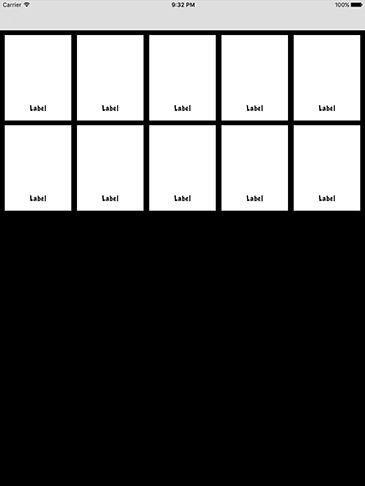

# UICollectionView data sources

Práve sme modifikovali user interface tak, aby považoval `ViewController` za collection view controller. Zatiaľ sme ale neimplementovali žiadne z data source metód potrebných pre správne fungovanie. Funguje to presne ako table views, takže budeme dotázaní “koľko je tam objektov?” a “čo je v objekte číslo 1?” a preto potrebujeme zodpovedať tieto otázky.

Pre začiatok, skompletizujme tú najjednoduchšiu implementáciu, ktorá našej aplikácii umožní fungovať. Pridajme tieto dve metódy:

    override func collectionView(_ collectionView: UICollectionView, numberOfItemsInSection section: Int) -> Int {
        return 10
    }

    override func collectionView(_ collectionView: UICollectionView, cellForItemAt indexPath: IndexPath) -> UICollectionViewCell {
        let cell = collectionView.dequeueReusableCell(withReuseIdentifier: "Person", for: indexPath) as! PersonCell
        return cell
    }

Ešte sme sa na tento kód nepozreli, takže by som ho chcel podrobnejšie rozpísať pred tým než sa presunieme ďalej:

-   `collectionView(_:numberOfItemsInSection:)` Toto musí vrátiť integer a oznamuje collection view koľko objektov chceme zobraziť v layoute. Ja som v tomto príklade použil hodnotu 10, ale čoskoro začneme používať poley.
-   `collectionView(_:cellForItemAt:)` Toto musí vrátiť objekt typu `UICollectionViewCell`. Už sme prototip bunky navrhli v Interface Builder-i a nastavili jej class-u `PersonCell`, takže potrebujeme tento objekt vytvoriť a vrátiť.
-   `dequeueReusableCell(withReuseIdentifier:for:)` Toto vytvorí collection view cell na základe špecifikovaného identifikátoru, v tomto prípade "Person" pretože sme túto hodnotu už skôr vpísali v Interface Builder-i. Ale tak ako table views sa táto metóda najskôr pokúsi zrecyklovať collection view cells, takže akonáhle sa nejaká bunka presunie mimo obrazovku bude znovu použitá aby sme nemuseli vytvárať novú.

Poznamenajme, že potrebujeme typecast-núť našu collection view cell ako `PersonCell` pretože budeme chcieť pristúpiť k jej `imageView` a `name` outlet-om.

Obe tieto metódy pochádzajú z collection views, ale myslím že nám pripadajú veľmi podobné tým z table view, ktoré sme doteraz používali – mohli by sme sa presunúť do projektu 1 pre porovnanie!

Stlačíme Cmd+R pre spustenie nášho projektu, a uvidíme ako jednotlivé veci začínajú spolu fungovať: prototip bunky, ktorú sme navrhli v Interface Builder-i sa zobrazí 10 krát a môžeme si ich všetky prezrieť skrolovaním hore a dole. Ako môžeme vidieť na obrazovku sa nám zmestia dve bunky, čo robí collection view rozdielnym od table view. Navyśe, ak pootočíme zariadenie do landscape módu, uvidíme ako sa automaticky (a nádherne) animuje pohyb buniek tak, aby zabrali celú šírku obrazovky.

