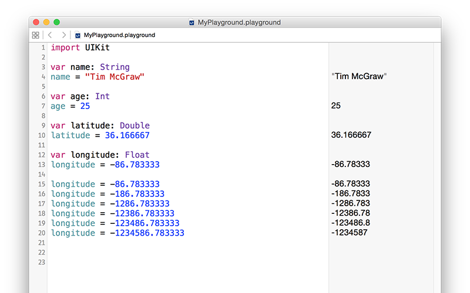

# Veri Tipleri

Birçok veri tipi vardır ve Swift hepsi ile ayrı ayrı başedebilir. Bir değişkene metin ekleyerek en önemli tiplerden birini zaten gördünüz. Bu tip Swift dilinde `String` olarak adlandırılır; tam karşılığıyla karakterler dizisi.

String'ler uzun olabilir (örneğin bir milyor harf veya daha fazla), kısa olabilir (örneğin 10 harf) veya boş bile olabilir (hiç harf yok), önemli değil. Swift için hepsi aynı ve aynı şekilde çalışır. Swift `name` sözcüğünün bir metin saklayacağını biliyor, çünkü onu yaratırken "Tim McGraw" sözcüklerini atadık. Eğer kodu şuna göre yeniden yazsaydın, çalışmayı durdururdu:

    var name
    name = "Tim McGraw"

Bu kez XCode, henüz sana bir anlam ifade etmeyen bir hata mesajı verirdi: "Type annotation missing in pattern" (Tip belirteci eksik). Bu şu anlama gelir: " `name` sözcüğünün hangi veri tipinde olduğunu anlayamadım, çünkü bana yeterli bilgi vermemişsin."

Bu noktada iki seçeneğin var: Ya oluşturduğun değişken ve ona verdiğin ilk değer aynı satırda olacak, veya Swift'e hemen değer atamasan bile sonrasında değişkenin hangi veripini tutacağını, tip belirteci denilen şeyi kullanarak söyleyeceksin.

İlk seçeneğin nasıl göründüğünü zaten biliyorsun, o yüzden ikincisine bakalım: Tip belirteçleri. Biliyoruz ki,  `name` sözcüğü bir String olacak, o zaman aşağıdaki gibi iki nokta üst üsteden sonra `String` yazarak bunu Swift'e söyleyebiliriz:

    var name: String
    name = "Tim McGraw"

Gerçek uygulama projelerinde –oyun alanına göre zıt bir şekilde– bu güzel bir şekilde işleyebilir, çünkü Swift gelecekte `name` sözcüğünün hangi veri tipinde olacağını biliyor. Oyun alanları hafifçe özel bir durum, dolayısıyla oyun alanında hata almaya devam edeceksin.

**Not:** Bazı geliştiriciler şu şekilde yaparak `var name : String` iki nokta üst üsteden sonra ve önce birer boşluk bırakıyor, ama bu *yanlış* ve narin iş ortaklıklarında bunu dillendirmekten kaçınmalısınız.

Buradaki ders, Swift tüm değişkenlerin veya sabitlerin tutacağı veri tipini her zaman bilmek istediğidir. Her zaman. Bundan kaçamazsın. Ama bu zaten iyi bir şeydir çünkü veri tipi güvenliğini sağlar; eğer "bu bir String veri içerecek" dersen, ama sonra içine tavşan koymaya kalkışırsan, Swift bunu reddedecektir.

Bunu bir diğer önemli veri tipi ve integer'in (tam sayı) kısaltması olan **Int** tanıtırken deneyebiliriz. Tam sayılar 3, 30, 300 veya -16777216 gibi yuvarlak sayılardır. Örneğin:

    var name: String
    name = "Tim McGraw"

    var age: Int
    age = 25

Yukarıdakiler bir metin tutan bir değişkeni ve tam sayı olan diğer değişkeni gösteriyor. `String` ve `Int` belirteçlerinin ikisinin de büyük harfle başladığına dikkat edin. Halbuki `name` ve `age` küçük harfle başlıyor; Swift dilinde geleneksel kodlama bu şekildedir. Kodlama geleneği Swift için bir anlam ifade etmez (isimleri istediğiniz gibi yazabilirsiniz!), ama bu diğer geliştiriciler için önemlidir. Bu durumda, veri tipleri büyük harfle başlarken, değişken ve sabit isimleri küçük harfle başlar.

Şimdi iki farklı tip değişkenimiz var. Tip güvenliğini burada görebilirsiniz. Şunu yazmayı deneyin:

    name = 25
    age = "Tim McGraw"

Bu kodla, bir metin değişkeni içine tam sayı, bir tam sayı değişkeni içine de metin değişkeni koymayı deniyorsunuz. Şükürler olsun ki, XCode hata veriyor. Bunu belki aşırı titiz bulabilirsiniz, ama bu aslında oldukça kullanışlı: Bir anlaşma yaptın ve değişken tek bir özel veri tipi tutuyor ve XCode projeniz boyunca bunu aklında tutuyor.

**Devam etmeden, lütfen hataya yol açan bu iki satırı silin, aksi taktirde oyun alanınızda sonradan yazacağınız hiçbir şey çalışmayacak!**

## Float and Double (Kesirli ve Ondalıklı)

`Float` ve `Double` olarak anılan şu iki veri tipine bakalım. 3.1, 3.141, 3.1415926 ve -16777216.5 gibi kesirli sayıları Swift'in tutma yoludur. Ne kadar duyarlı olması gerektiğine göre iki tane veri tipi var bu konuda. Ama çoğunlukla, hangisini kullandığın önemli değil. Duyarlılığı en yüksek olduğu için resmi Apple tavsiyesi `Double` kullanılması yönünde.

Oyun alanınıza şunları yazın:

    var latitude: Double
    latitude = 36.166667

    var longitude: Float
    longitude = -86.783333

Her iki sayıyı da sağda görebilirsiniz, ama dikkatle bakarsanız, aralarında küçük farklar olduğunu görürsünüz. `longitude` değişkeni -86.783333 sayısına eşit olması gerektiğini söyledik, ama sonuç panelinde -86.78333 rakamını görüyorsunuz. Sondaki 3 rakamı yok. Şimdi "arkadaşlar arasında 0.000003 ne önemi var?" diyebilirsiniz, ama bu duyarlılık hakkında söylediğim şeyin ustaca bir gösterimidir.

Oyun alanlarında yazdığımız hemen güncellendiği için, `Float` ve `Double` arasındaki farkı tam olarak görebileceğiniz birşeyler deneyebiliriz. Kodu şu şekilde değiştirmeyi deneyiniz:

    var longitude: Float
    longitude = -86.783333
    longitude = -186.783333
    longitude = -1286.783333
    longitude = -12386.783333
    longitude = -123486.783333
    longitude = -1234586.783333

Noktadan sonraki sayılar aynı kalmak üzere, ondalık kısımdan önceki sayıların artması bu. Ama eğer sonuç paneline bakarsanız, noktadan önce ne kadar rakam eklerseniz, noktadan sonra o kadar rakamı Swift siliyor. Bu, ne kadar sayı tutabileceğinin sınırlandırılmasıyla ilgili; sayının noktadan önceki kısmı en önemli kısmı. 1,000,000 olmak büyük bir şeyse, 0.000003 olmak da o kadar küçük.

Şimdi `Float` sözcüğünü `Double` ile değiştirmeyi deneyin. Göreceksiniz ki, Swift her defasında doğru sayının çıktısını verecek:

    var longitude: Double

Tekrar söylemek gerekirse  `Double`, `Float`tan daha fazla duyarlıdır. Dolayısıyla sayınızı, sığdırabilmek için kesmenize gerek yoktur; 123456789.123456789 gibi büyük bir sayıyı denerseniz, 123456789.12345679 olarak kesildiğini görebilirsiniz.

## Boolean

Swift, bir değişkenin doğru veya yanlış olduğunu tutan, Boolean'ın kısaltması olan `Bool` adında bir veri tipine sahiptir. Bool, "belki" veya "olabilir" gibi seçeneklere sahip değildir; sadece kesin olanlar: Doğru veya yanlış. Örneğin:

    var stayOutTooLate: Bool
    stayOutTooLate = true

    var nothingInBrain: Bool
    nothingInBrain = true

    var missABeat: Bool
    missABeat = false

## Tip belirteçlerini akıllıca kullanma

Öğrendiğiniz şekliyle, bir değişkenin tuttuğu veri tipini Swift diline anlatmanın iki yolu var: Bir değişkene daha oluşturulurken bir değer atamak veya tip belirteci kullanmak. Seçim şansınız varsa, ilki her zaman daha tercih edilebilir, çünkü daha açık. Örneğin:

    var name = "Tim McGraw"

…şuna tercih edilebilir:

    var name: String
    name = "Tim McGraw"

Bu tüm veri tipleri için böyledir. Örneğin:

    var age = 25
    var longitude = -86.783333
    var nothingInBrain = true

Bu teknik *tip çıkarsaması* olarak bilinir, çünkü Swift bir değişkenin içine koyduğunuz veriye bakarak, hangi veri tipinde olduğunu çıkarsayabilir. -86.783333 gibi bir rakam geldiğinde, Swift her zaman `Float` yerine `Double` veri tipini tercih edecektir.

Konuyu tamamlamak adına, veri tipinin ve değerin aynı anda verilebildiği şu seçeneği de eklemeliyim:

    var name: String = "Tim McGraw"

